Viite-sovelluksen käyttöohje
======================================================
Viite
-----------------------

Viite on Väylän tieosoitejärjestelmän ylläpitosovellus. Viitteellä hallitaan tieosoitejärjestelmän muutoksia ja se tarjoaa ajantasaisen kuvauksen tiestöstä Digiroadin (VVH:n) ajantasaisella linkkigeometrialla.

Seuraavasta linkistä pääsee Väylän extranetin Viite-sivulle (tällä hetkellä testiextranet käytössä, varsinainen extranet-osoite päivitetään myöhemmin), jossa kerrotaan Viitteen yleiskuvaus ja annetaan tiedotteita käyttäjille. Sivulla ylläpidetään myös dokumentaatiota Viitteestä. 

https://testiextranet.vayla.fi/extranet/web/fi/viite?kategoria=7457637 (testi) 

__Huom! Suosittelemme käyttämään selaimena Firefoxia tai Chromea.__

__Huom! Käyttöohjeen kuvia voi klikata isommaksi, jolloin tekstit erottuvat paremmin.__

#1. Miten päästä alkuun?
-----------------------

Viite-sovelluksen käyttöä varten tarvitaan Väylän tunnukset (A-, U-, LX-, K- tai L-alkuinen). Mikäli sinulla ei ole Väylän tunnuksia, pyydä ne yhteyshenkilöltäsi Väylästä.

Kaikilla Väylän tunnuksilla on pääsy Viite-sovellukseen katselukäyttäjänä.

Viite-sovellukseen kirjaudutaan osoitteessa: <a href="https://extranet.vayla.fi/viite/" target="_blank">https://extranet.vayla.fi/viite/</a>.

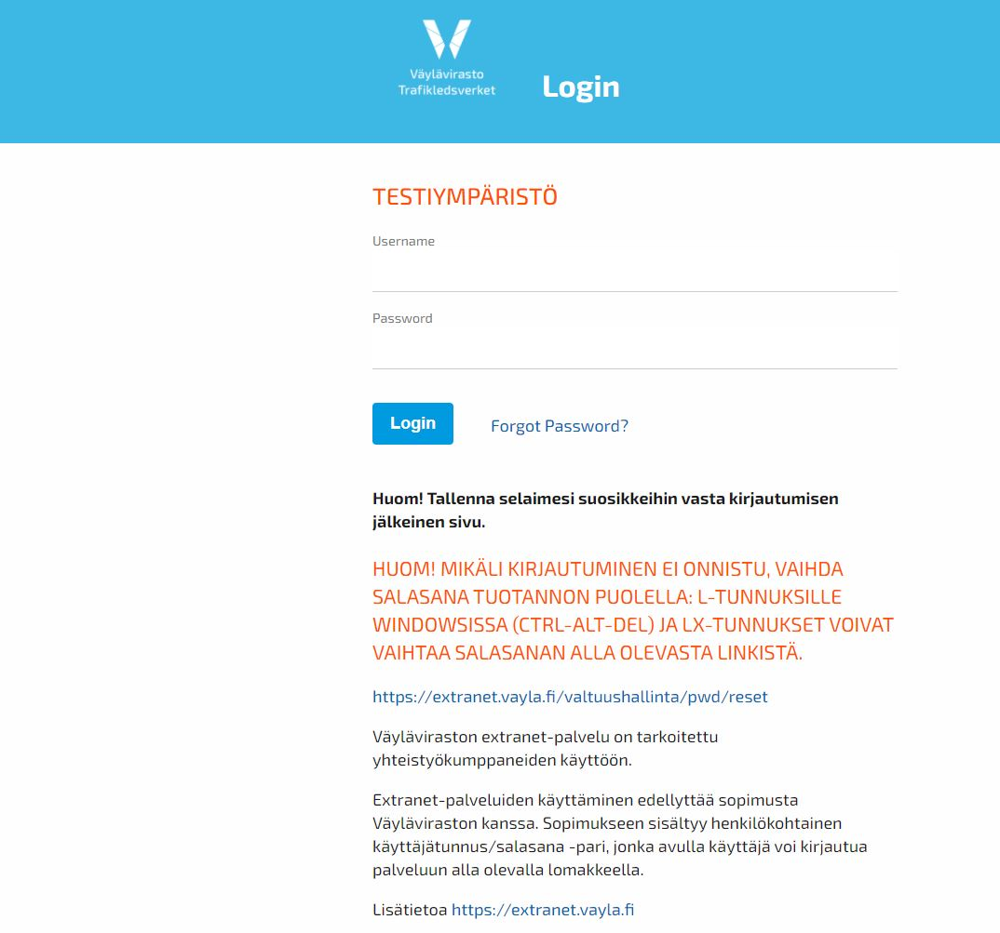

_Kirjautuminen Viite-sovellukseen._

Kirjautumisen jälkeen avautuu karttakäyttöliittymässä katselutila.

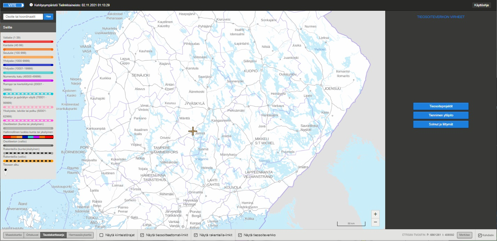

_Karttanäkymä kirjautumisen jälkeen._

Oikeudet on rajattu käyttäjän roolin mukaan.

- Ilman erikseen annettuja oikeuksia Väylän tunnuksilla pääsee katselemaan kaikkia tieosoitteita
- Tieosoiteprojektit, Tiennimen ylläpito sekä Solmut ja liittymät -painikkeet näkyvät vain käyttäjille, joilla on oikeudet muokata tieosoitteita

Jos kirjautumisen jälkeen ei avaudu karttakäyttöliittymän katselutilaa, ei kyseisellä tunnuksella ole pääsyä Väylän extranettiin. Tällöin tulee ottaa yhteyttä Väylässä tai ELYssä omaan yhteyshenkilöön.

1.1 Mistä saada opastusta?
--------------------------

Viite-sovelluksen käytössä avustaa Janne Grekula, janne.grekula@cgi.com.

####Ongelmatilanteet####

Sovelluksen toimiessa virheellisesti (esim. kaikki aineistot eivät lataudu oikein), menettele seuraavasti:

- Lataa sivu uudelleen näppäimistön F5-painikkeella.
- Tarkista, että selaimestasi on käytössä ajan tasalla oleva versio ja selaimesi on Mozilla Firefox tai Chrome
- Jos edellä olevat eivät korjaa ongelmaa, ota yhteyttä janne.grekula@cgi.com.

Tämä ohje käsittelee pääasiassa vain VIITE-sovelluksen käyttöä ei niinkään tieosoitejärjestelmää. Tarkemmat tiedot tieosoitejärjestelmästä löydät täältä: https://vayla.fi/documents/20473/143621/tieosoitejärjestelmä.pdf.

#2. Perustietoja Viite-sovelluksesta
--------------------------

2.1 Tiedon rakentuminen Viite-sovelluksessa
--------------------------

Viite-sovelluksessa tieosoiteverkko piirretään VVH:n tarjoaman Maanmittauslaitoksen keskilinja-aineiston päälle. Maanmittauslaitoksen keskilinja-aineisto muodostuu tielinkeistä. Tielinkki on tien, kadun, kevyen liikenteen väylän tai lauttayhteyden keskilinjageometrian pienin yksikkö. Tieosoiteverkko piirtyy geometrian päälle tieosoitesegmentteinä _lineaarisen referoinnin_ avulla. 

Tielinkki on Viite-sovelluksen lineaarinen viitekehys, jonka geometriaan sidotaan tieosoitesegmentit. Kukin tieosoitesegmentti tietää, mille tielinkille se kuuluu (tielinkin ID), sekä kohdan, josta se alkaa ja loppuu kyseisellä tielinkillä. Tieosoitesegmentit ovat siten tielinkin mittaisia tai niitä lyhyempiä tieosoitteen osuuksia. Käyttöliittymässä kuitenkin pienin valittavissa oleva osuus on tielinkin mittainen (kts. luvut 4.1 ja 7.1).

Kullakin tieosoitesegmentillä on lisäksi tiettyjä sille annettuja ominaisuustietoja, kuten tienumero, tieosanumero ja ajoratakoodi. Tieosoitesegmenttien ominaisuustiedoista on kerrottu tarkemmin kohdassa "Tieosoitteen ominaisuustiedot".

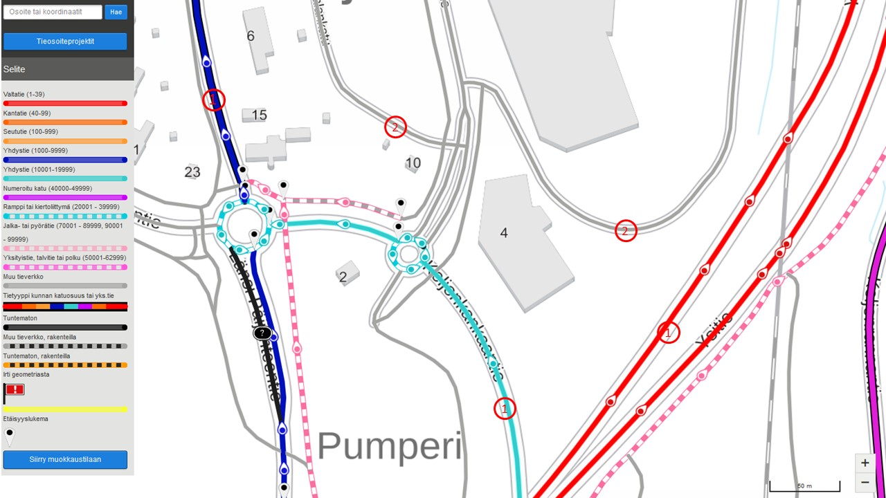

_Tieosoitesegmenttejä (1) ja muita tielinkkejä (2) Viitteen karttaikkunassa._

Tieosoitesegmentit piirretään Viite-sovelluksessa kartalle erilaisin värein (kts. luku 4. Tieosoiteverkon katselu). Muut tielinkit, jotka eivät kuulu tieosoiteverkkoon, piirretään kartalle harmaalla. Näitä ovat esimerkiksi tieosoitteettomat kuntien omistamat tiet, ajopolut, ajotiet.

Palautteet geometrian/tielinkkien virheistä voi laittaa Maanmittauslaitokselle, maasto@maanmittauslaitos.fi. Mukaan liitetään selvitys virheestä ja sen sijainnista (esim. kuvakaappaus).

#3. Karttanäkymän muokkaus
--------------------------

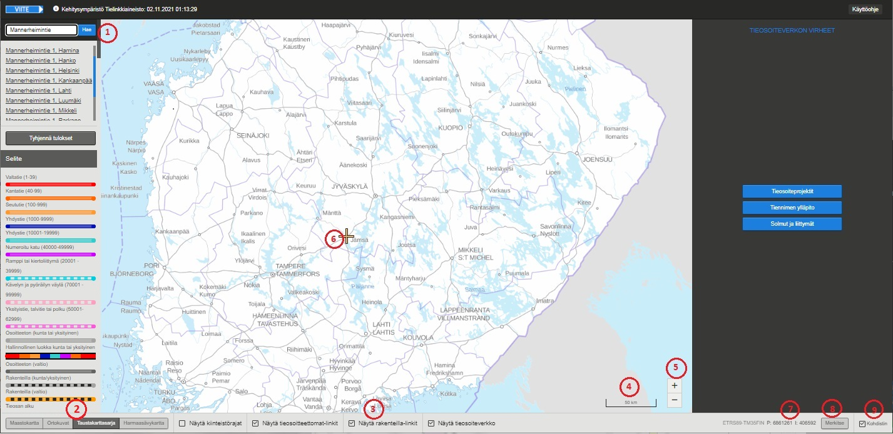

_Karttanäkymä._

####Kartan liikuttaminen####

Karttaa liikutetaan raahaamalla eli pitämällä hiiren vasempaa painiketta pohjassa ja liikuttamalla samalla hiirtä.

####Hakukenttä####

Käyttöliittymässä on hakukenttä (1), jossa voi hakea koordinaateilla ja katuosoitteella tai tieosoitteella. Haku suoritetaan kirjoittamalla hakuehto hakukenttään ja klikkaamalla Hae. Hakutulos tulee listaan hakukentän alle. Hakutuloslistassa ylimpänä on maantieteellisesti kartan nykyistä keskipistettä lähimpänä oleva kohde. Mikäli hakutuloksia on vain yksi, keskittyy kartta automaattisesti haettuun kohteeseen. Jos hakutuloksia on useampi kuin yksi, täytyy listalta valita tulos, johon kartta keskittyy. Tyhjennä tulokset -painike tyhjentää hakutuloslistan.

Tieosoitteella haku: Tieosoitteesta hakukenttään voi syöttää joko tienumeron tai tienumero + tieosanumeroyhdistelmän, esim. 2 tai 2 1. (Varsinainen tieosoitehaku tieosoitteiden ylläpidon tarpeisiin toteutetaan myöhemmin.)

Koordinaateilla haku: Koordinaatit syötetään muodossa "pohjoinen (7 merkkiä), itä (6 merkkiä)". Koordinaatit tulee olla ETRS89-TM35FIN -koordinaattijärjestelmässä, esim. 6975061, 535628.

Katuosoitteella haku: Katuosoitteesta hakukenttään voi syöttää koko osoitteen tai sen osan, esim. "Mannerheimintie" tai "Mannerheimintie 10, Helsinki".

####Taustakartat####

Taustakartaksi (2) voi valita vasemman alakulman painikkeista maastokartan, ortokuvat, taustakarttasarjan tai harmaasävykartan. Käytössä oleva harmaasävykartta ei tällä hetkellä ole kovin käyttökelpoinen.

####Näytettävät tiedot####
Käyttäjä voi halutessaan valita, näytetäänkö kartalla kiinteistörajat, Suravage-linkit tai tieosoiteverkko symboleineen (3). Valinnat saa päälle ja päältä pois valintaruutuja klikkaamalla. Näytä Suravage-linkit ja Näytä tieosoiteverkko -valinnat ovat automaattisesti päällä. Tieosoiteverkon symboleita ovat etäisyyslukemasymbolit ja suuntanuolet.

####Mittakaavataso ja mittakaava####

Käytössä oleva mittakaava näkyy kartan oikeassa alakulmassa (4).Kartan mittakaavatasoa muutetaan joko hiiren rullalla, kaksoisklikkaamalla, Shift+piirto -toiminnolla (alue) tai mittakaavapainikkeista (5). Mittakaavapainikkeita käyttämällä kartan keskitys säilyy. Hiiren rullalla, kaksoisklikkaamalla tai Shift+piirto -toimintoa käyttäen (alue) kartan keskitys siirtyy kohdistimen keskikohtaan.

####Kohdistin####

Kohdistin (6) kertoo kartan keskipisteen. Kohdistimen koordinaatit näkyvät karttaikkunan oikeassa alakulmassa (7). Kun karttaa liikuttaa, keskipiste muuttuu ja koordinaatit päivittyvät. Oikean alakulman valinnan (9) avulla kohdistimen saa myös halutessaan piilotettua kartalta.

####Merkitse piste kartalla####

Merkitse-painike (8) merkitsee sinisen pisteen kartan keskipisteeseen. Merkki poistuu vain, kun merkitään uusi piste kartalta.

#4. Tieosoiteverkon katselu
--------------------------

Geometrialtaan yleistetty tieosoiteverkko tulee näkyviin, kun zoomaa tasolle, jonka mittakaavajanassa on lukema 5 km. Tästä tasosta ja sitä lähempää piirretään kartalle valtatiet, kantatiet, seututiet, yhdystiet ja numeroidut kadut. Yleistämätön tieverkko piirtyy mittakaavajanan lukemalla 2 km. 100 metriä (100 metrin mittakaavajanoja on kaksi kappaletta) suuremmilla mittakaavatasoilla tulevat näkyviin kaikki tieverkon kohteet.

Tieosoiteverkko on värikoodattu tienumeroiden mukaan. Vasemman yläkulman selitteessä on kerrottu kunkin värikoodin tienumerot. Lisäksi kartalle piirtyvät etäisyyslukemasymbolit, kohdat, joissa vaihtuu tieosa tai ajoratakoodi. Tieverkon kasvusuunta näkyy kartalla pisaran mallisena nuolena.

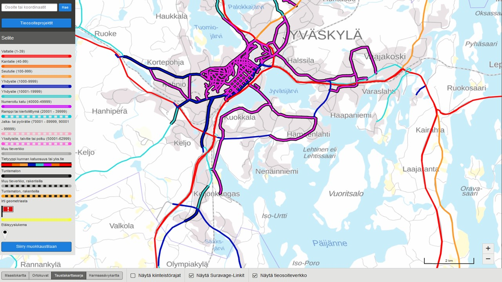

_Tieosoiteverkon piirtyminen kartalle, kun mittakaavajanassa on 2 km._

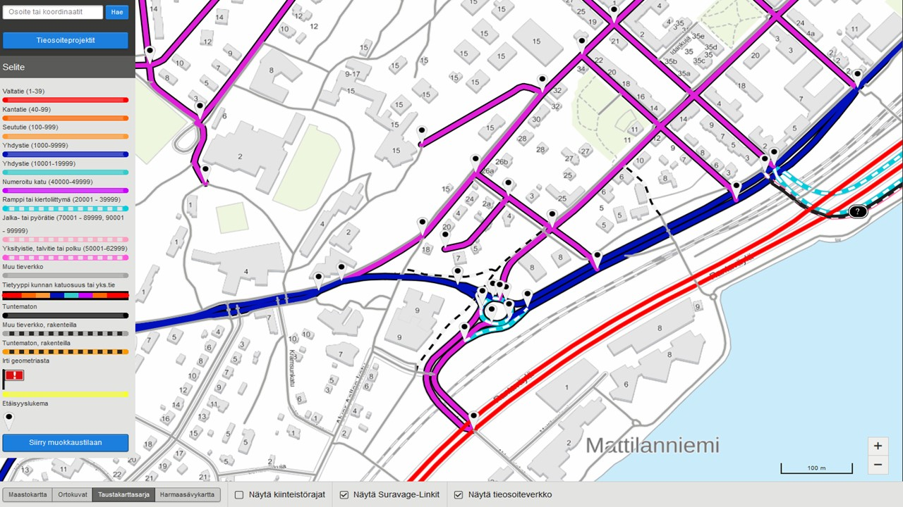

_Tieosoiteverkon piirtyminen kartalle, kun mittakaavajanassa on 100 m._

Tieosoitteelliset kadut erottuvat kartalla muista tieosoitesegmenteistä siten, että niiden ympärillä on musta reunaviiva.

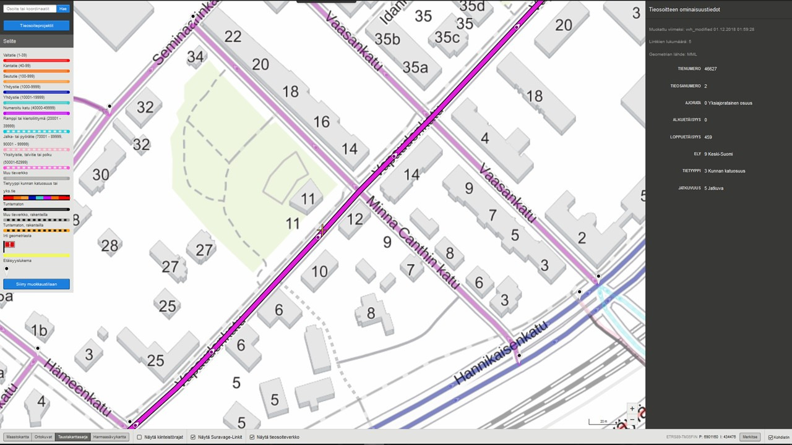

_Tieosoitteellinen katu, merkattuna mustalla reunaviivalla tienumeron värityksen lisäksi._

Kun hiiren vie tieosoiteverkon päälle, tulee kartalle näkyviin infolaatikko, joka kertoo kyseisen tieosoitesegmentin tienumeron, tieosanumeron, ajoratakoodin, alku- ja loppuetäisyyden sekä linkki-id:n.

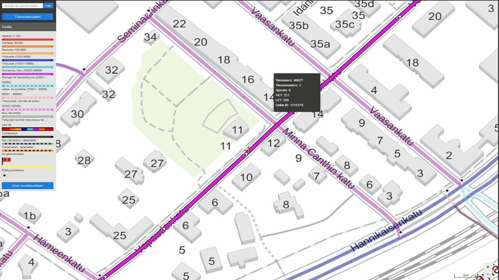

_Infolaatikko, kun hiiri on viety tieosoitesegmentin päälle._

4.1 Kohteiden valinta
--------------------------
Kohteita voi valita kartalta klikkaamalla. Kertaklikkauksella sovellus valitsee kartalla näkyvästä tieosasta osuuden, jolla on sama tienumero, tieosanumero ja ajoratakoodi. Valittu tieosa korostuu kartalla (1), ja sen tiedot tulevat näkyviin karttaikkunan oikean reunan ominaisuustietonäkymään (2).

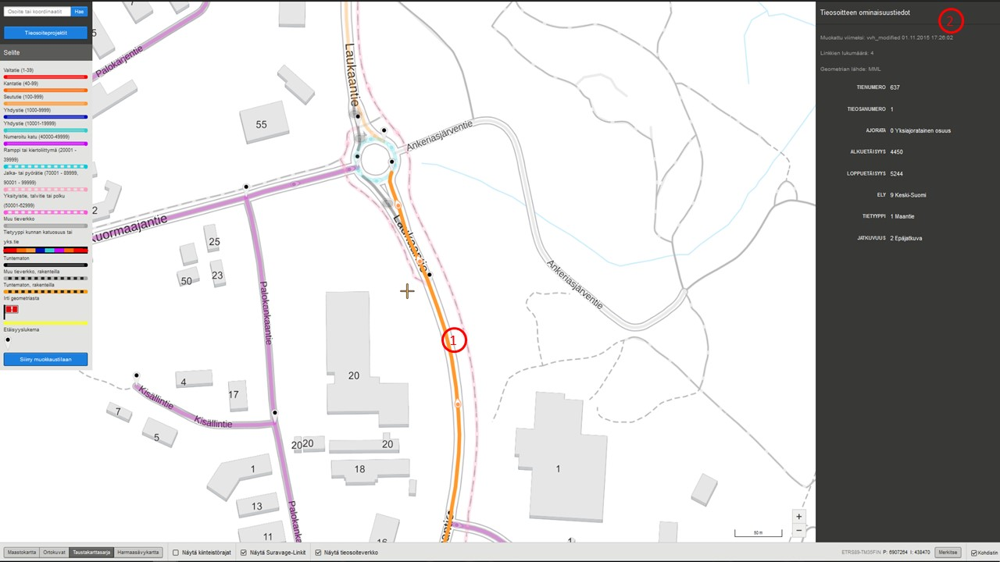

_Tieosan valinta._

Kaksoisklikkaus valitsee yhden tielinkin mittaisen osuuden tieosoitteesta. Valittu osuus korostuu kartalla (3), ja sen tiedot tulevat näkyviin karttaikkunan oikean reunan ominaisuustietonäkymään (4).

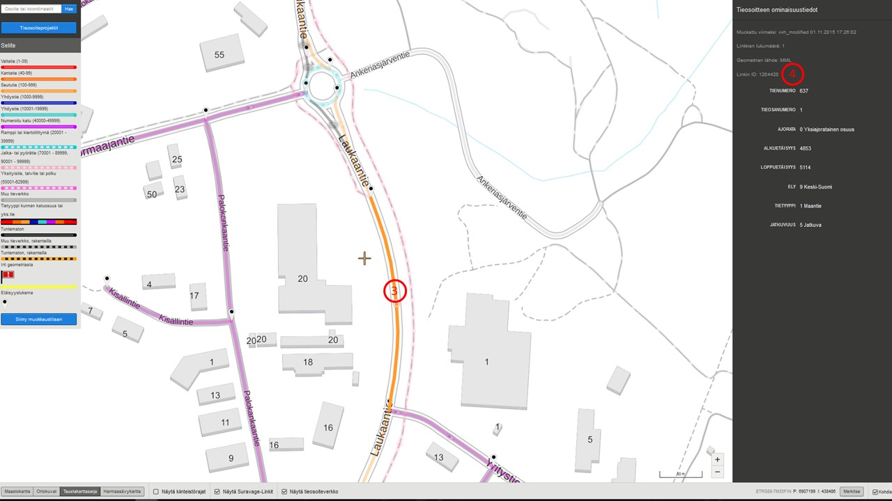

_Tielinkin mittaisen osuuden valinta._

##Tieosoitteen ominaisuustiedot##

Tieosoitteilla on seuraavat ominaisuustiedot:

|Ominaisuustieto|Kuvaus|Sovellus muodostaa|
|---------------|------|----------------|
|Muokattu viimeksi*|Muokkaajan käyttäjätunnus ja tiedon muokkaushetki.|X|
|Linkkien lukumäärä|Niiden tielinkkien lukumäärä, joihin valinta  kohdistuu.|X|
|Geometrian lähde|MML, Täydentävä tai Suravage.|X|
|Tienumero|Tieosoiteverkon mukainen tienumero. Lähtöaineistona Tierekisterin tieosoitteet 1.1.2019.||
|Tieosanumero|Tieosoiteverkon mukainen tieosanumero. Lähtöaineistona Tierekisterin tieosoitteet 1.1.2019.||
|Ajorata|Tieosoiteverkon mukainen ajoratakoodi. Lähtöaineistona Tierekisterin tieosoitteet 1.1.2019.||
|Alkuetäisyys**|Tieosoiteverkon etäisyyslukemien avulla laskettu alkuetäisyys. Etäisyyslukeman kohdalla alkuetäisyyden lähtöaineistona on Tierekisterin tieosoitteet 1.1.2019.|X|
|Loppuetäisyys**|Tieosoiteverkon etäisyyslukemien avulla laskettu loppuetäisyys. Etäisyyslukeman kohdalla loppuetäisyyden lähtöaineistona on Tierekisterin tieosoitteet 2.1.2018.|X|
|ELY|Liikenneviraston ELY-numero.|X|
|Tietyyppi|Muodostetaan Maanmittauslaitoksen hallinnollinen luokka -tiedoista, kts. taulukko alempana. Jos valitulla tieosalla on useita tietyyppejä, ne kerrotaan ominaisuustietotaulussa pilkulla erotettuna.|X|
|Jatkuvuus|Tieosoiteverkon mukainen jatkuvuus-tieto. Lähtöaineistona Tierekisterin tieosoitteet 1.1.2019.|X|

*) Muokattu viimeksi -tiedoissa vvh_modified tarkoittaa, että muutos on tullut Maanmittauslaitokselta joko geometriaan tai geometrian ominaisuustietoihin. Muokattu viimeksi -päivät ovat kaikki vähintään 29.10.2015, koska tuolloin on tehty Maanmittauslaitoksen geometrioista alkulataus VVH:n tietokantaan.

**) Tieosoiteverkon etäisyyslukemat (tieosan alku- ja loppupisteet sekä ajoratakoodin vaihtuminen) määrittelevät mitatut alku- ja loppuetäisyydet. Etäisyyslukemien välillä alku- ja loppuetäisyydet lasketaan tieosoitesegmenttikohtaisesti Viite-sovelluksessa.

__Tietyypin muodostaminen Viite-sovelluksessa__

Järjestelmä muodostaa Tietyyppi-tiedon automaattisesti Maanmittauslaitoksen aineiston pohjalta seuraavalla tavalla:

|Tietyyppi|Muodostamistapa|
|---------|---------------|
|1 Maantie|MML:n hallinnollinen luokka arvolla 1 = Valtio|
|2 Lauttaväylä maantiellä|MML:n hallinnollinen luokka arvolla 1 = Valtio ja MML:n kohdeluokka arvolla lautta/lossi|
|3 Kunnan katuosuus|MML:n hallinnollinen luokka arvolla 2 = Kunta|
|5 Yksityistie|MML:n hallinnollinen luokka arvolla 3 = Yksityinen|
|9 Ei tiedossa|MML:lla ei tiedossa hallinnollista luokkaa|

Palautteet hallinnollisen luokan virheistä voi toimittaa Maanmittauslaitokselle osoitteeseen maasto@maanmittauslaitos.fi. Mukaan selvitys virheestä ja sen sijainnista (kuvakaappaus tms.).

##Kohdistaminen tieosoitteeseen tielinkin ID:n avulla##

Kun kohdetta klikkaa kartalla, tulee selaimen osoiteriville näkyviin valitun kohteen tielinkin ID. Osoiterivillä olevan URL:n avulla voi myös kohdistaa käyttöliittymässä ko. tielinkkiin. URL:n voi lähettää sähköpostilla toiselle henkilölle, jolloin tämä pääsee käyttöliittymässä samaan paikkaan.

Esimerkiksi: https://extranet.vayla.fi/viite/#linkProperty/799497 näkyy kuvassa osoiterivillä (5). 799497 on tielinkin ID.

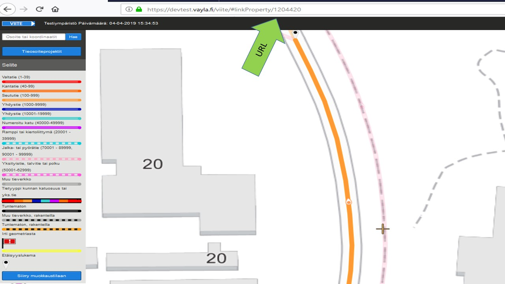

_Kohdistaminen tielinkin ID:llä._

#5. Automatiikka Viite-sovelluksessa
--------------------------
Viite-sovelluksessa on muutamia automatiikan tekemiä yleistyksiä tai korjauksia. Automatiikka ei muuta mitään sellaisia tietoja, jotka muuttaisivat varsinaisesti tieosoitteita. Automatiikan tekemät muutokset liittyvät siihen, että tieosoiteverkkoa ylläpidetään keskilinjageometrian päällä, ja tuon keskilinjageometrian ylläpidosta vastaa Maanmittauslaitos. Tietyt automaattiset toimenpiteet helpottavat tieosoiteverkon ylläpitäjää varsinaisessa tieosoiteverkon hallinnassa.

__Huom! Automatiikka ei koskaan muuta tieosan mitattua pituutta. Arvot tieosien ja ajoratojen vaihtumiskohdissa pysyvät aina ennallaan automatiikan tekemien korjausten yhteydessä.__

##5.1 Tieosoitesegmenttien yhdistely tielinkin mittaisiksi osuuksiksi##

Kun käyttäjä valitsee kartalla kohteita kaksoisklikkaamalla (luku 4.1), on pienin valittava yksikkö tielinkin mittainen osuus tieosoiteverkosta, koska tielinkki on pienin mahdollinen yksikkö Maanmittauslaitoksen ylläpitämällä linkkiverkolla.

Tätä varten järjestelmä tekee automaattista yhdistelyä:

- Ne kohteet, joiden tielinkin ID, tie, tieosa, ajorata ja alkupäivämäärä ovat samoja (yhtenevä tieosoitehistoria), on yhdistetty tietokannassa yhdeksi tielinkin mittaiseksi tieosoitesegmentiksi
- Ne kohteet, joiden tielinkin ID, tie, tieosa, ajorata ovat samoja, mutta alkupäivämäärä ei ole sama (erilainen tieosoitehistoria), ovat tietokannassa edelleen erillisiä kohteita, mutta käyttöliittymässä ne ovat valittavissa vain tielinkin mittaisena osuutena. Tällä varmistetaan, että käyttöliittymä toimii käyttäjän kannalta loogisesti.  Tielinkin mittainen osuus on aina valittavissa, mutta tieosoitehistoria säilytetään tietokantatasolla.

##5.2 Tieosoitesegmenttien automaattinen korjaus jatkuvasti päivittyvällä linkkigeometrialla##

Viite-sovellus päivittää automaattisesti tieosoitesegmentit takaisin ajantasaiselle keskilinjalle, kun Maanmittauslaitos on tehnyt pieniä tarkennuksia keskilinjageometriaan. Tässä luvussa on kuvattu tapaukset, joissa Viite-sovellus osaa tehdä korjaukset automaattisesti. Ne tapaukset, joissa korjaus ei tapahdu automaattisesti, segmentit irtoavat geometriasta ja ne on korjattava manuaalisesti operaattorin toimesta.

Automatiikka tekee korjaukset, kun

1. __Tielinkki pitenee tai lyhenee alle metrin:__ Viite-sovellus lyhentää/pidentää tieosoitesegmenttiä automaattisesti muutoksen verran.
2. __Maanmittauslaitos yhdistelee tielinkkejä, esimerkiksi poistamalla tonttiliittymiä maanteiden varsilta:__ Tieosoitesegmentit siirretään uudelle geometrialle automaattisesti Väyläverkon hallinnan (VVH) tarjoaman tielinkkien muutosrajapinnan avulla.

#6. Tieosoiteprojektin tekeminen
--------------------------

Uuden tieosoiteprojektin tekeminen aloitetaan klikkaamalla painiketta Tieosoiteprojektit (1) ja avautuvasta ikkunasta painiketta Uusi tieosoiteprojekti (2).

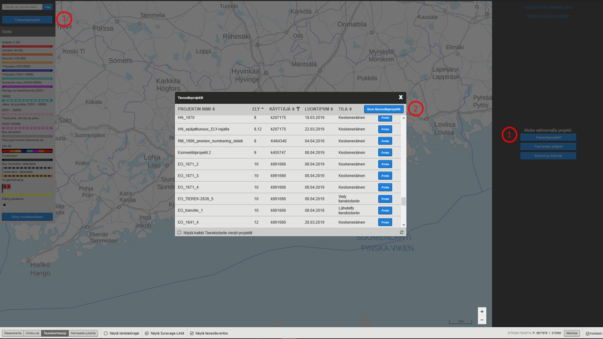

_Tieosoiteprojektit-painike ja Uusi tieosoiteprojekti -painike._

Näytön oikeaan reunaan avautuu lomake tieosoiteprojektin perustietojen täydentämistä varten. Jos käyttäjä on ollut katselutilassa,  sovellus siirtyy tässä vaiheessa automaattisesti muokkaustilaan.

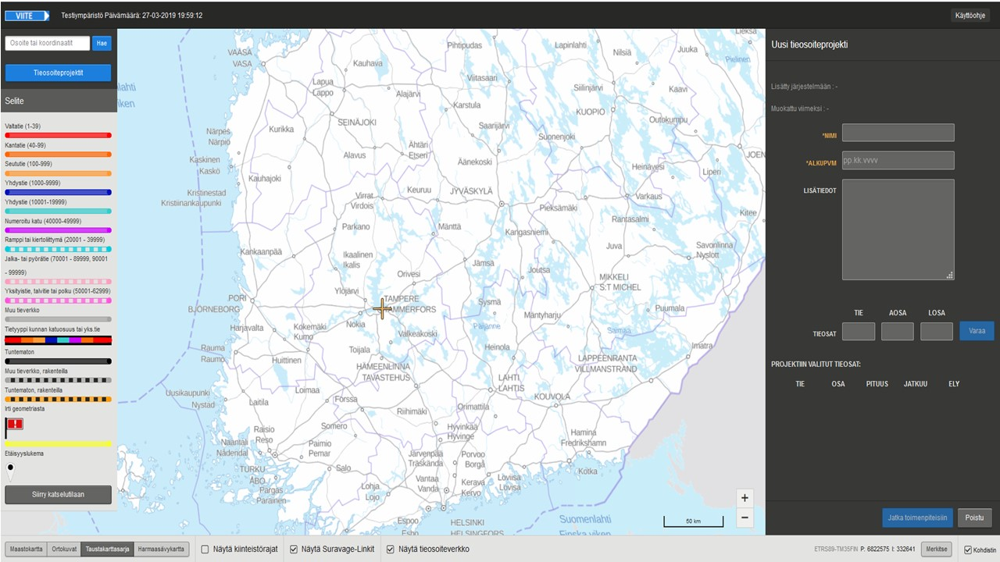

_Tieosoiteprojektin perustietojen lomake._

Pakollisia tietoja ovat nimi ja projektin muutosten voimaantulopäivämäärä, jotka on merkattu lomakkeelle oranssilla (3). Projektiin ei tarvitse varata yhtään tieosaa. Lisätiedot-kenttään käyttäjä voi halutessaan tehdä muistiinpanoja tieosoiteprojektista. Tiedot tallentuvat painamalla Jatka toimenpiteisiin -painiketta (4). Poistu-painike (NUMERO)sulkee projektin tietoja tallentamatta.

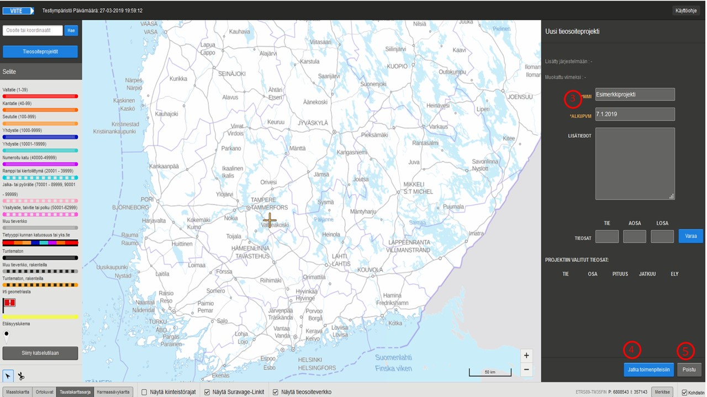

_Tieosoiteprojektin perustietojen täyttäminen._

Projektin tieosat lisätään täydentämällä niiden tiedot kenttiin TIE, AOSA sekä LOSA ja painamalla painiketta Varaa (5). __Kaikki kentät tulee täyttää, jos haluaa varata tieosan!__ 

Varaa-painikkeen klikkauksen jälkeen tieosan tiedot tulevat näkyviin lomakkeelle.

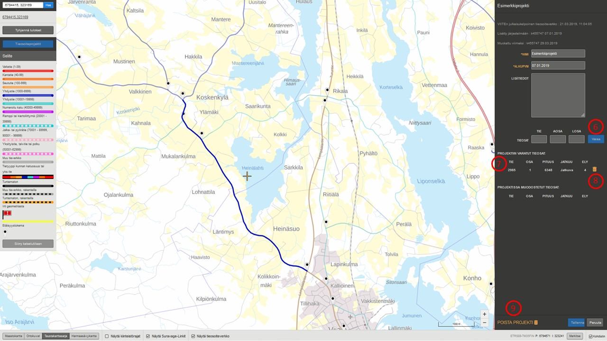

_Tieosan tiedot lomakkeella Lisää-painikkeen painamisen jälkeen._

Tieosoiteprojekti tallentuu automaattisesti painikkeesta Jatka toimenpiteisiin, jolloin tiedot tallentuvat tietokantaan ja sovellus siirtyy toimenpidenäytölle. Varaamisen yhteydessä Viite kohdistaa kartan varatun tieosan alkuun. Poistu-painikkeesta projekti suljetaan ja käyttäjältä varmistetaan, halutaanko tallentamattomat muutokset tallentaa. Projektiin pääsee palaamaan Tieosoiteprojektit-listan kautta. 

Käyttäjä voi poistaa varattuja tieosia klikkaamalla Roskakori-kuvaketta valitsemansa tieosan kohdalla Projektiin varatut tieosat -listalla. Mikäli tieosille ei ole tehty muutoksia, vaan ne on vain varattu projektiin, varaus poistetaan projektista. Jos tieosille on tehty muutoksia, Viite pyytää käyttäjää vahvistamaan poiston.

Keskeneräisen projektin voi poistaa Poista projekti –painikkeella, jolloin projekti ja sen varaamat aihiot ja tehdyt muutokset poistetaan. Viite pyytää käyttäjää vahvistamaan poiston. 

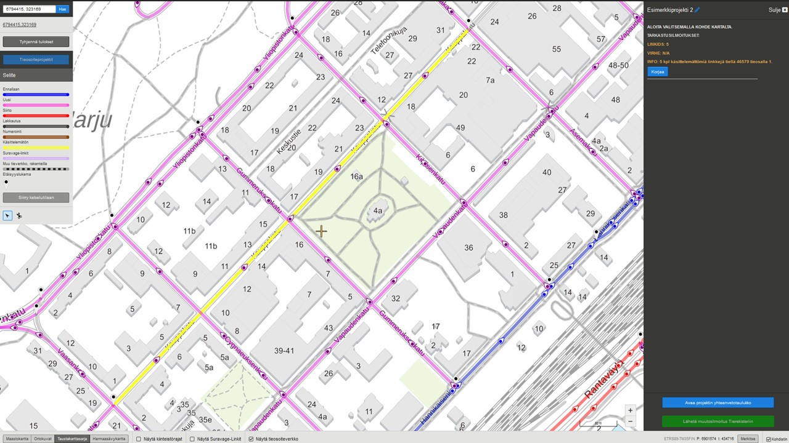

_Kun tieosa on varattu projektiin, Viite kohdistaa kartan siten että tieosa näkyy kartalla kokonaisuudessaan._  

Varauksen yhteydessä järjestelmä tekee varattaville tieosille tarkistukset:

- Onko varattava tieosa olemassa projektin voimaantulopäivänä
- Onko varattava tieosa vapaana vai onko se jo varattu toiseen projektiin

Virheellisistä varausyrityksistä järjestelmä antaa virheilmoituksen.  __Käyttäjän tulee huomioida, että varauksen yhteydessä kaikki kentät (TIE, AOSA, LOSA) tulee täyttää, tai käyttäjä saa virheilmoituksen!__

6.1 Tieosoiteprojektit-lista ja projektin avaaminen
--------------------------

Tieosoiteprojektit-listalla näkyvät kaikkien käyttäjien projektit. Projektit on järjestetty ELY-koodien mukaiseen järjestykseen pienimmästä suurimpaan ja niiden sisällä projektin nimen ja käyttäjätunnuksen mukaiseen järjestykseen. 

Järjestystä voi muuttaa sarakkeiden nuolipainikkeilla. Käyttäjä-sarakkeen suodatinpainikkeella saa valittua listalle omat projektinsa. Toisen käyttäjän projektit suodatetaan kirjoittamalla ko. käyttäjän tunnus avautuvaan syötekenttään.

Viety tierekisteriin -tilaiset projektit näytetään listalla vuorokauden ajan niiden viennistä tierekisteriin. Kaikki tierekisteriin viedyt projektit saa näkyviin klikkaamalla listan alareunassa olevaa valintaruutua, ja vastaavasti ne saa pois näkyvistä poistamalla valinnan.

Tallennetun tieosoiteprojektin saa auki Tieosoiteprojektit-listalta painamalla Avaa-painiketta. Avaamisen yhteydessä sovellus kohdistaa kartan paikkaan, jossa käyttäjä on viimeksi tallentanut toimenpiteen. Mikäli toimenpiteitä ei ole tehty, karttanäkymä rajautuu siten, että kaikki varatut aihiot näkyvät karttanäkymässä.

Tieosoiteprojektit-lista suljetaan yläpalkin oikeassa kulmassa olevasta X-painikkeesta.

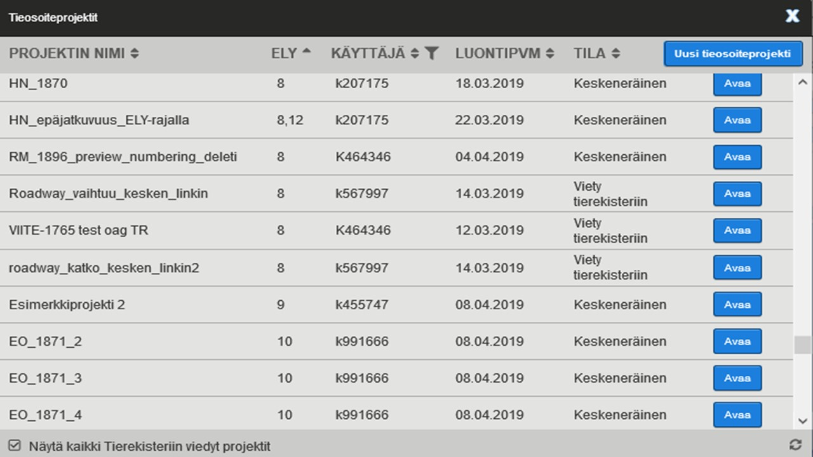

_Tieosoiteprojektit-listaus._

#7. Muutosilmoitusten tekeminen tieosoiteprojektissa
--------------------------

Tieosoiteprojektissa on mahdollista tehdä seuraavia muutosilmoituksia:

- lakkautus (tieosoitteen lakkautus) 
- uusi (lisätään uusi tieosoite osoitteettomalle linkille) 
- ennallaan (osa tieosoitteesta säilyy ennallaan, kun osaa siitä muutetaan)
- siirto (tieosan alkuetäisyys- ja loppuetäisyysarvot päivitetään, kun muulle osalle tieosaa tehdään muutos)
- numeroinnin muutos (kokonaisen tieosan tienumeron ja/tai tieosanumeron voi muuttaa manuaalisesti) 
- kääntö (tieosoitteen kasvusuunnan kääntö)
- etäisyyslukeman muutos (etäisyyslukeman loppuarvon voi syöttää tieosalle manuaalisesti)
- ELY-koodin, jatkuvuuden ja tietyypin muutos

Tieosoiteprojektissa muutostoimenpiteitä pääsee tekemään klikkaamalla Jatka toimenpiteisiin -painiketta tieosoitemuutosprojektin perustietojen lomakkeella. Tämän jälkeen sovellus muuttaa varatut tieosat muokattaviksi kohteiksi ja ne näkyvät avautuvassa karttanäkymässä keltaisella korostettuina (1). Mikäli toimenpiteenä lisätään uusi tieosoite eikä tieosia ole varattu projektiin, kartalta ei valikoidu mitään ennen käyttäjän tekemää valintaa. 

Projektitilassa voi valita kartalta klikkaamalla projektiin tieosia, tuntemattomia tielinkkejä, muun tieverkon linkkejä tai suunnitelmalinkkejä (suravage-linkkejä). Suunnitelmalinkit saa pois piirrosta ja piirtoon sivun alapalkissa olevasta valintaruudusta. Ne ovat oletuksena piirrossa. Tieverkon tieosoitetietoja voi katsella kartalla viemällä hiiren tieosoitelinkin päälle. Tällöin tielinkin infolaatikko tulee näkyviin.

Projektin nimen vieressä on sininen kynäikoni (2), josta pääsee projektin perustietojen lomakkeelle muokkaamaan projektin tietoja. Lisäksi oikeassa yläkulmassa on Sulje-painike (3), josta pääsee Viitteen alkutilaan.

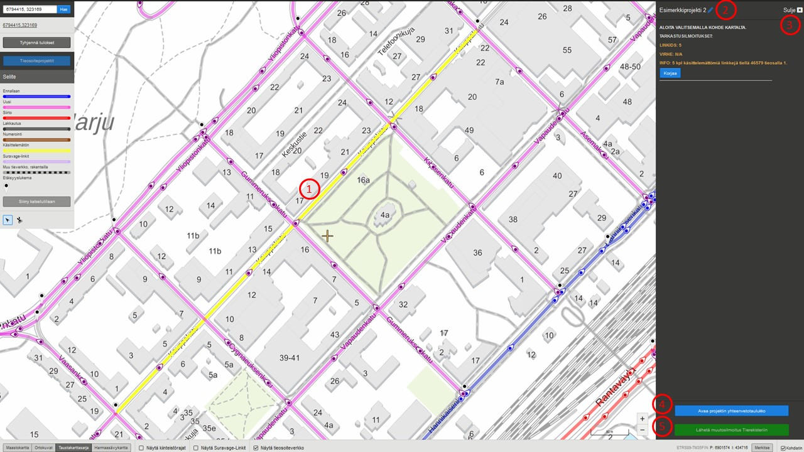

_Projektissa muokattavissa olevat varatut tieosat näkyvät kartalla keltaisella värillä ja suuntanuolet ovat tien alkuperäisen tieluokan värin mukaiset (siniset). Projektin nimi on "Esimerkki-projekti", joka näkyy oikeassa yläkulmassa._

Projektin muutosilmoitukset tallentuvat projektin yhteenvetotaulukkoon, jonka voi avata toimenpidenäkymässä Avaa projektin yhteenvetotaulukko -painikkeesta (4). Yhteenvetotaulukon toiminta on kuvattu tarkemmin luvussa 7.2. Lisäksi kaikkien projektien muutostiedot voidaan lähettää Tierekisteriin klikkaamalla vihreää Lähetä muutosilmoitus Tierekisteriin -painiketta (5). Muutosilmoituksen lähettäminen on kuvattu luvussa 7.4. 

Kun keltaista, muokattavaa kohdetta klikataan kerran kartalla, muuttuu valittu osuus vihreäksi ja oikeaan reunaan tulee pudotusvalikko, josta voi valita kohteelle tehtävän muutosilmoituksen (esim. lakkautus). Kerran klikkaamalla valitaan kartalta homogeeninen jakso (= sama tienumero, tieosanumero, ajoratakoodi, tietyyppi ja jatkuvuus). Kaksoisklikkaus tai Ctrl+klikkaus valitsee yhden tieosoitesegmentin verran (tielinkin mittainen osuus). Kun halutaan valita vain osa tieosan linkeistä, kaksois- tai Ctrl+klikataan ensimmäistä linkkiä ja seuraavat linkit lisätään valintaan Ctrl+klikkauksella samalta tieosalta. Samalla tavalla voi myös poistaa yksittäisiä linkkejä valinnasta. 

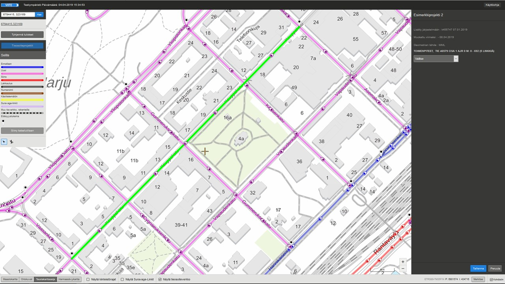

_Kun keltaista, muokattavissa olevaa kohdetta klikataan, muuttuu tieosa vihreäksi ja oikeaan laitaan tulee näkyviin valikko, jossa on tieosoitemuutosprojektin mahdolliset muutosilmoitukset._

Muutokset tallennetaan oikean alakulman Tallenna-painikkeesta. Ennen tallennusta muutokset voi perua Peruuta-painikkeesta, jolloin Viite palaa edeltävään vaiheeseen.

Jos käyttäjä on jo tehnyt projektissa muutoksia tieosoitteille, ne tulevat näkyviin lomakkeelle klikatessa kyseistä tielinkkiä, jolle muutokset on tehty. Esimerkiksi, mikäli tieosalle on toteutettu Lakkautus, tieosaa valittaessa tiedot sen lakkautuksesta ilmestyvät lomakkeelle ja tieosalle on mahdollista tehdä toinen toimenpide. Mahdolliset uudet toimenpidevaihtoehdot kunkin toimenpiteen tallentamisen jälkeen, on kuvattu seuraavissa luvuissa, joissa kerrotaan kunkin toimenpiteen tekemisestä tarkemmin. 

Selite projektitilassa on erilainen kuin katselutilassa. Projektitilan selite kuvaa linkkiverkkoon tehdyt toimenpiteet, kun taas katselutilan selite kuvaa tieluokitusta.

7.1 Muutosilmoitusten kuvaukset
--------------------------

7.1.1 Lakkautus
--------------------------
Kun halutaan lakkauttaa joko tieosia, tieosa tai osa tieosasta, ko. osat pitää ensin varata projektiin. Varaaminen tehdään luvussa 6 esitetyllä tavalla syöttämällä projektitietojen lomakkeelle haluttu tienumero ja tieosa sekä painamalla Lisää-painiketta.

Tämän jälkeen klikataan Jatka toimenpiteisiin -painiketta, jolla siirrytään toimenpidelomakkeelle tekemään tieosoitemuutosta. Toimenpidelomakkeella valitaan kartalta projektiin varattu tieosa, -osat tai tarvittavat linkit valitusta tieosasta. Ne muuttuvat valittuina vihreiksi. (Shift+kaksoisklikkaus-painalluksella voi lisätä yksittäisiä linkkejä valintaan tai poistaa yksittäisiä linkkejä valinnasta.) Toimenpide-lomakkeelle tulee tiedot valituista linkeistä sekä pudotusvalikko, josta valitaan Lakkautus. Tämän jälkeen tallennetaan muutos projektiin. Lakkautettu linkki tulee näkyviin mustalla ja sen tiedot päivittyvät yhteenvetotaulukkoon, jonka voi avata sinisestä Avaa projektin yhteenvetotaulukko -painikkeesta. Yhteenvetotaulukon toiminta on kuvattu luvussa 7.2. Mikäli on lakkautettu vain osa tieosan linkeistä, tulee tieosan muut kuin lakkautetut linkit käsitellä joko Ennallaan- tai Siirto-toimenpiteillä tilanteesta riippuen. Kun tarvittavat muutokset projektissa on tehty, muutostiedot voi lähettää Tierekisteriin painamalla Lähetä muutosilmoitus Tierekisteriin -painiketta. 

7.1.2 Uusi
--------------------------

Toimenpiteellä määritetään uusi tieosoite tieosoitteettomille linkeille. Tieosoitteettomia muun tieverkon linkkejä, jotka piirtyvät kartalle harmaina tai tuntemattomia mustia linkkejä, joissa on kysymysmerkkisymboli tai suravage-linkkejä, voi valita kerta- tai kaksoisklikkauksella, kuten muitakin tielinkkejä. Kaksoisklikkaus valitsee yhden tielinkin ja Ctrl+klikkauksella voi lisätä tai poistaa valintaan linkkejä yksi kerrallaan. Kertaklikkaus valitsee homogeenisen jakson, jossa käytetään VVH:n tienumeroa ja tieosanumeroa. Tienumeron tai tieosanumeron puuttuessa valinnassa käytetään tienimeä.

Valitut tielinkit näkyvät kartalla vihreällä korostettuna. Kun valitaan Toimenpiteet-pudotusvalikosta 'Uusi' (1) lomakkeelle avautuvat kentät uuden tieosoitteen tiedoille (2). Jos valitulla tieosuudella on jo olemassa VVH:ssa tienumero ja tieosanumero, ne esitäyttyvät kenttiin automattisesti.

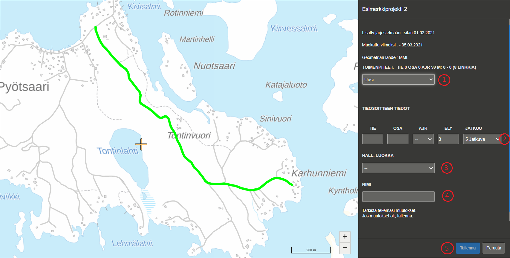

_Kun valitaan toimenpidevalikosta Uusi, oikeaan laitaan ilmestyy näkyviin kentät uuden tieosoitteen syöttämistä varten._ 

Tietyyppiä voi muokata pudotusvalikosta (3). Jatkuu-arvo määräytyy ensimmäisellä tallennuskerralla automaattisesti jatkuvaksi (5 Jatkuva). Muutokset tallennetaan Tallenna-painikkeella (4). Ennen tallennusta muutokset voi perua Peruuta-painikkeesta. 

Huom: Mikäli jatkuvuutta täytyy muokata, esimerkiksi tien lopussa, käyttäjä klikkaa tieosan lopusta aktiiviseksi viimeisen tieosan "Uusi"-toimenpiteellä käsitellyn linkin, jossa tien loppu sijaitsee. Lomakkeelle tulee tiedot linkin osoitteesta ja sille tehdystä toimenpiteestä. Nyt linkin jatkuvuuskoodin muokkaaminen on mahdollista ja oikea koodi, esimerkiksi "1 Tien loppu", valitaan pudotusvalikosta ja tallennetaan. Päivitetty tieto näkyy myös yhteenvetotaulukossa tallennuksen jälkeen.   

Käyttöliittymä varoittaa virheilmoituksella, jos uusi tieosoite on jo olemassa projektin alkupäivänä tai se on varattuna toisessa tieosoiteprojektissa.

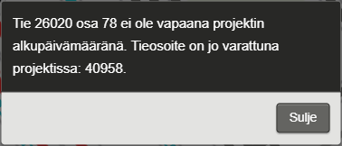

_Tieosoite on jo olemassa projektin alkupäivänä._

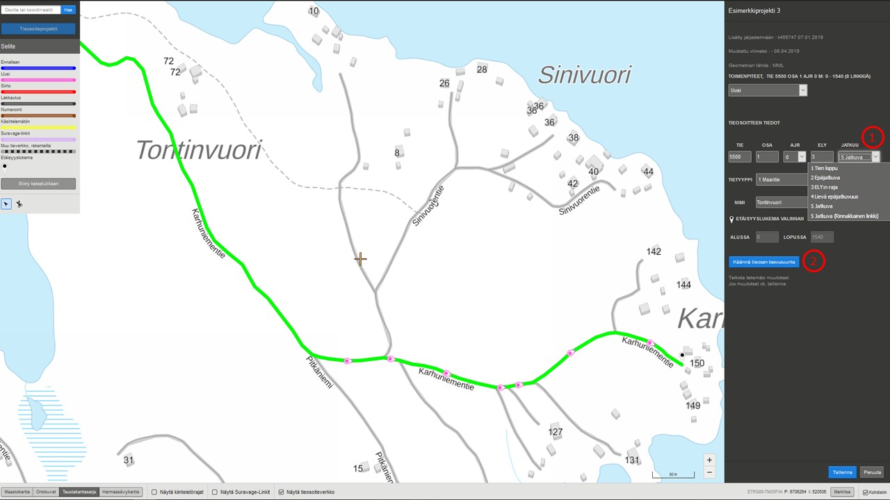

_Valittuna olevan uuden tieosoitteen kasvusuunta vaihtuu lomakkeen Käännä tieosan kasvusuunta -painikkeesta._

Uuden tieosoitteen linkit piirtyvät kartalle pinkillä (2). Tieosan alku- ja loppupisteisiin sijoitetaan automaattisesti etäisyyslukema-symbolit. Viite laskee uudelle tieosuudelle automaattisesti myös linkkien m-arvot käyttäen VVH:n tietoja. Uudelle tieosoitteelle määrittyy aluksi satunnainen kasvusuunta, joka näkyy kartalla pinkkien nuolien suunnasta.

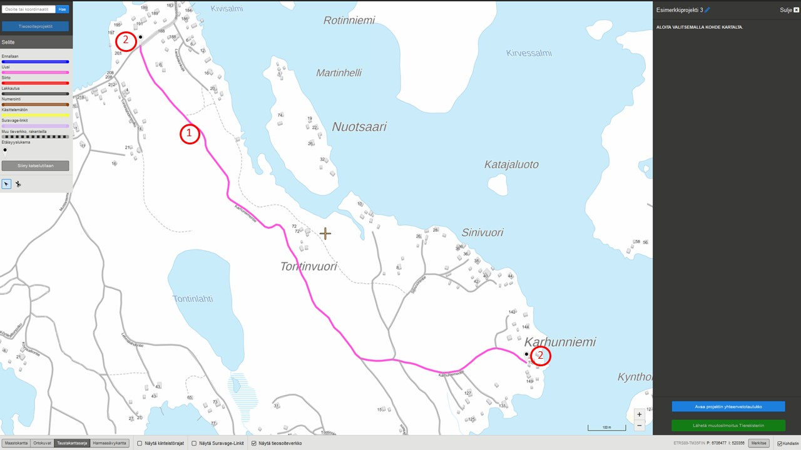

_Uuden tieosoitteen linkit piirtyvät kartalle pinkillä. Tieosan voi valita klikkaamalla, jolloin se korostuu vihreällä._

Tallennettuun tieosoitteeseen voi jatkaa uusien linkkien lisäämistä vaiheittain. Ensin valitaan tallennetun tieosan jatkeeksi seuraava linkki ja sitten valitaan lomakkeelta toimenpide Uusi ja annetaan linkeille sama tieosoite (TIE= tienumero, OSA=tieosanumero, AJR=ajoratakoodi). ELY- ja Jatkuu-arvot Viite täyttää automaattisesti. ELY-koodi määräytyy tielinkin kuntakoodin perustella VVH:sta. Tallennetaan lisäykset. Projektin voi myös tallentaa, sulkea ja jatkaa lisäystä samaan tieosoitteeseen myöhemmin. Kasvusuunta lisätylle osuudelle määräytyy aiemmin osoitteistettujen linkkien mukaan ja sitä voi edelleen kääntää Käännä kasvusuunta-painikkeella. M-arvot päivittyvät koko tieosalle, jolle on annettu sama tieosoite.

Tieosoitteen voi antaa Viitteessä myös ns. Suravage-linkeille (SuRavaGe = Suunniteltu rakentamisvaiheen geometria). Suravage-tiet näkyvät Viitteessä vaaleanpunaisella värillä ja niissä näkyy myös tieosoitteen kasvusuuntanuolet. 

__Uuden kiertoliittymän alkupaikan muuttaminen__

Jos Uusi-toimenpiteellä tieosoitteistetulla kiertoliittymän; linkeillä on VVH:ssa (esim. suravage-linkit) tienumero, kiertoliittymän voi ns. "pikaosoitteistaa". Pikaosoitteistaminen tapahtuu kertaamalla kiertoliittymän alkukohdaksi haluttua linkkiä. Tällöin koko kiertoliittymän linkit tulevat valituiksi. Uusi toimenpide asettaa alkukohdaksi klikatun linkin.

Muussa tapauksessa kiertoliittymän alkukohta asetataan manuaalisesti kahdessa vaiheessa. 1. Valitaan alkupaikka kaksoisklikkaamalla kiertoliittymän linkkiä tieosoitteen haluttuun alkupaikkaan. Valitulle linkille annetaan Uusi-toimenpiteellä tieosoite. 2. Kiertoliittymän loput linkit valitaan Ctrl + klikkaamalla ja annetaan nille sama tieosoite.    

Tieosoiteprojektissa Uusi-toimenpiteellä jo tieosoitteistetun kiertoliittymän alkupaikka muutetaan palauttamalla kiertoliittymä ensin tieosoitteettomaksi ja osoitteistamalla se uudelleen. Valitse tieosoitteistettu kiertoliittymä ja käytä toimenpidettä "Palautus aihioksi tai tieosoitteettomaksi". Toimenpiteen jälkeen kiertoliittymän voi tieosoitteistaa uudelleen halutusta alkupaikasta aloittaen.

7.1.3 Ennallaan
--------------------------
Tieosan linkkien tieosoitteen voi säilyttää ennallaan esimerkiksi silloin, kun osalle tieosaa halutaan tehdä tieosoitemuutoksia ja osan säilyvän ennallaan. Tällöin tieosa käsitellään toimenpiteellä Ennallaan. Toimenpide tehdään varaamalla ensin projektitietojen formilla projektiin muokattava tieosa tai -osat. Seuraavaksi siirrytään toimenpidenäytölle Jatka toimenpiteisiin -painikkeella. Valittu tieosa tai sen tietyt linkit valitaan kartalta, jolloin ne muuttuvat vihreiksi, ja lomakkeelle ilmestyy pudotusvalikko. Valikosta valitaan toimenpide Ennallaan ja tallennetaan muutokset.   

7.1.4 Siirto
--------------------------
Siirto-toimenpide tehdään tieosalle uusien m-arvojen laskemiseksi. Siirtoa käytetään, kun osa tieosan linkeistä käsitellään jollain muulla toimenpiteellä ja loppujen linkkien m-arvot täytyy laskea uudelleen. Esimerkkinä osalle tieosan linkeistä voidaan tehdä lakkautus, lisätä uusia linkkejä ja pitää osa linkeistä ennallaan. Siirto tehdään tieosoiteprojektiin varatulle tieosalle (varaaminen kuvattu luvussa 6) siten, että tieosalle on ensin tehty muita toimenpiteitä, kuten lakkautus, uusi tai numerointi. Linkit, joille siirto tehdään, valitaan kaksoisklikkaamalla ensimmäinen haluttu linkki ja lisäämällä valintaan Ctrl+klikkaamalla linkkejä. Sitten valitaan toimenpidevalikosta siirto ja tallennetaan. Siirretyt linkit muuttuvat toimenpiteen tallennuksen jälkeen punaiseksi. Muutokset näkyvät projektin yhteenvetotaulukossa.   

7.1.5 Numeroinnin muutos
--------------------------
Tieosoitteen numeroinnin muutoksella tarkoitetaan Viitteessä tienumeron ja/tai tieosanumeron muuttamista. 
Projektiin varataan tarvittava(t) tieosa(t), kuten luvussa 6 on kuvattu. Varaamisen jälkeen siirrytään toimenpidelomakkeelle Jatka toimenpiteisiin -painikkeella. Valitaan muokattava, keltaisella näkyvä varattu tieosa klikkaamalla kartalta. Tieosa muuttuu vihreäksi. Viite poimii tällöin koko tieosan mukaan valintaan, vaikkei se näkyisi kokonaisuudessaan karttanäkymässä ja käyttäjälle tulee tästä ilmoitus. Mikäli on tarpeen muuttaa vain tietyn linkin numerointia tieosalla, tehdään valinta kaksoisklikkauksella halutun linkin päältä. Jos valitaan lisää yksittäisiä linkkejä, tehdään se Ctrl+klikkaamalla. Toimenpide-lomakkeelle syötetään uusi numerointi (tienumero ja/tai tieosanumero) ja tallennetaan muutokset. Numeroitu osuus muuttuu tallennettaessa ruskeaksi.

Koska numeroinnin muutos kohdistuu koko tieosaan, muita toimenpiteitä ei tallennuksen jälkeen tarvitse tehdä. 

7.1.6 Kääntö
--------------------------
Tieosoitteen kasvusuunnan voi kääntää Viitteessä joko esimerkiksi siirron tai numeroinnin yhteydessä. Kääntö tapahtuu joko automaattisesti tai tietyissä tilanteissa käyttäjä tekee sen manuaalisesti.  

_Automaattinen kääntö siirron yhteydessä:_

Kun siirretään tieosa (osittain tai kokonaan) toiselle tieosalle, jolla on eri tieosoitteen kasvusuunta, Viite päättelee siirron yhteydessä kasvusuunnan siirrettäville linkeille. 

Alla olevassa kuvasarjassa on tehty siirto ja kääntö osalle tieosaa. Projektiin on varattu tie 459 osa 1 ja tie 14 osa 1 (näkyvät kartalla keltaisella). Osa tien 14 linkeistä halutaan siirtää tielle 459 osalle 1 (lännen suuntaan), jolloin siirrettävät linkit valitaan kartalta. Lomakkeelta valitaan muutosilmoitus Siirto (1). Annetaan kohtaan TIE arvoksi kohdetien numero 459. Muut tiedot säilyvät tässä tapauksessa samana, mutta myös tieosaa, tietyyppiä ja jatkuvuuskoodia tulee tarvittaessa muuttaa. Tallennetaan muutokset.(2) Kohde muuttuu siirretyksi ja tieosoitteen kasvusuunta päivittyy vastaamaan tien 459 kasvusuuntaa (3). 

Tämän jälkeen siirtoon ja kääntöön voi valita lisää linkkejä tieltä 14 tai jättää loput ennalleen. Jälkimmäisessä tilanteessa loput projektiin valitut keltaiset aihiot tulee aina käsitellä, jotta muutosilmoitukset voi lähettää Tierekisteriin. Tässä tapauksessa, mikäli muuta ei tehdä, tulee tie 459 osa 1 valita kartalta ja tehdä sille muutosilmoitus Siirto ja painaa Tallenna. Samoin tehdään tielle 14 osalle 1. Ilmoitusten yhteenvetotaulukko avataan ja mikäli tiedot ovat valmiit, voi ne lähettää Tierekisteriin vihreästä painikkeesta.  

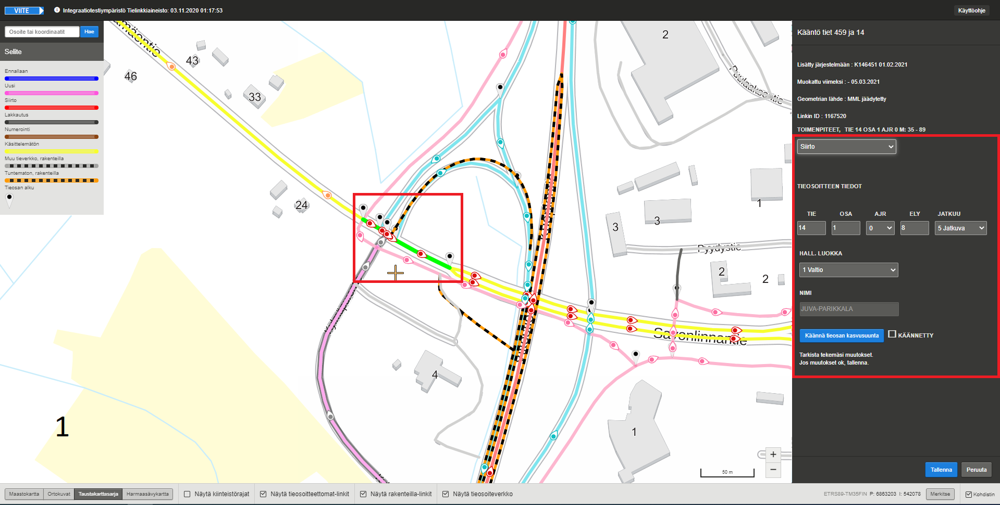

_Kuvasarjassa siirretään osa tiestä 14 tielle 459. Tieosoitteiden kasvusuunnat teillä ovat vastakkaiset, jolloin siirrossa tien 14 kasvusuunta kääntyy._

_Manuaalinen kääntö siirron ja numeroinnin yhteydessä:_

Manuaalista kääntöä varten Viitteessä on Käännä kasvusuunta -painike. Painike aktivoituu lomakkeelle kun käyttäjä on tehnyt varaamalleen aihiolle toimenpiteen ja tallentanut sen. Kun käsiteltyä aihiota (on tehty muutosilmoitus siirto tai numerointi) klikataan kartalla, lomakkeella näkyvät tehty ilmoitus ja sen tiedot sekä Käännä kasvusuunta -painike. Kun sitä klikataan sekä tallennetaan, kasvusuunta kääntyy ja yhteenvetotauluun tulee tieto käännöstä oman sarakkeeseen Kääntö (rasti ruudussa). 
	
_Kaksiajorataisen osuuden kääntö_

Kun käännetään tieosan kaksiajoratainen osuus, se tehdään edellä kuvatulla tavalla siirron tai numeroinnin yhteydessä yksi ajorata kerrallaan. Kartalta valitaan haluttu ajorata ja lomakkeelta joko siirto tai numerointi. Määritetään uusi ajoratakoodi sekä muut tarvittavat tieosoitemuutostiedot lomakkeelle ja tallennetaan. Mikäli tieosoitteen kasvusuunta ei automaattisesti käänny (esim. kun käsitellään yhtä tieosaa), tehdään kääntö manuaalisesti Käännä kasvusuunta -painikkeella. Yhteenvetotaulussa Kääntö-sarake sekä muutosilmoituksen rivit päivittyvät. 
 
 
7.1.7 Etäisyyslukeman muutos
--------------------------
Tieosoiteprojektissa uudelle tieosoitteistettavalle tieosalle on mahdollista asettaa käyttäjän antama tieosan loppuetäisyyslukema. Ensin valitaan haluttu tieosa kartalta, jonka jälkeen lomakkeelle ilmestyy kenttä, johon loppuetäisyyden voi muuttaa. Muutettu arvo huomioidaan lomakkeella punaisella huutomerkillä. 

7.1.8 Suunnitelmalinkkien tieosoitteistaminen ja sen jakaminen saksi-työkalulla
--------------------------

__Saksi-työkalun käyttö suunnitelmalinkin jakamiseen__

Saksi-työkalulla voi jakaa suunnitelmalinkin kahteen osaan. Työkalua hyödynnetään, kun linkin osat halutaan käsitellä eri toimenpiteillä. Ensin valitaan saksi-työkalu selitteen alaosasta. Sitten ristikursorilla klikataan kartalta tielinkin kohdasta, josta tie jaetaan. Suunnitelmalinkki jakaantuu tällöin A ja B osaan. Sivun oikeaan reunaan avautuu A ja B osille lomake, johon eri toimenpiteet määritellään ja tehdään tallennus.
Kun osioiden toimenpiteet on tallennettu, suunnitelmalinkin alla sijaitseva nykylinkki tarvittavilta osin lakkautuu automaattisesti oikeasta leikkauskohdasta ja se näkyy jatkossa C-osana lomakkeella. 

7.1.9 Useiden muutosten tekeminen samalle tieosalle
--------------------------

7.1.10 ELY-koodin, jatkuvuuden ja tietyypin muutos
--------------------------
Viitteessä voi muokata ELY-koodia, jatkuvuutta ja tietyyppiä. Näitä muutoksia voi tehdä esimerkiksi Ennallaan-muutosilmoituksella, jolloin lomakkeelle tulee pudotusvalikot ELYlle, jatkuvuudelle ja tietyypille. Uudet arvot annetaan valitulle aihiolle ja tallennetaan. Jatkuvuus koodi näytetään valinnan viimeiseltä linkiltä ja muutokset kohdistuvat myös viimeiseen linkkiin. Tietyypin ja ja ELY-koodin muutos kohdistuu kaikille valituille linkeille. Ennallaan toimenpiteen lisäksi näitä arvoja voi muokata aina, kun ne ovat eri muutosilmoituksen yhteydessä lomakkeella muokattavissa. 

Huom! Jatkuvuuskoodia 5 - jatkuva on valittavissa kaksi eri vaihtoehtoa. Jatkuvuuskoodi 5 - jatkuva (rinnakkainen tielinkki) käytetään kaksiajorataisella tiellä osoittamaan rinnakkainen linkki silloin, kun toisella ajoradalalla on lievä epäjatkuvuuslievissä, eikä automaatio ole löytänyt oikeaa linkkiparia. Jatkuvuuskoodi 4 - lievä epäjatkuvuus annetaan normaalisti toisen ajoradan epäjatkuvuuskohtaan. Viite antaa automaattisesti kalibrointipisteet molemmille ajoradoille. Jos rinnakkaisen ajoradan kalibrointipiste ei ole halutussa kohdassa, valitaan haluttu rinnakkainen linkki ja annettaan sille jatkuvuuskoodiksi 5 - jatkuva (rinnakkainen linkki). Tällöin kalibrointipiste tulee kyseisen linkin loppuun, ja ajoratojen AET- ja LET-arvot saadaan täsmättyä lievään epäjatkuvuuskohtaan.

7.2 Muutosilmoitusten tarkastelu taulukkonäkymässä
--------------------------

Projektin muutosilmoitusten näkymässä on mahdollista tarkastella ilmoitusten yhteenvetotaulukkoa. Avaa projektin yhteenvetotaulukko -painiketta (1) klikkaamalla avautuu taulukkonäkymä, joka kertoo projektissa olevien tieosoitteiden vanhan ja uuden tilanteen sekä tehdyn muutosilmoituksen. Taulukossa rivit on järjestetty suurimasta pienimpään tieosoitteen mukaan (tie, tieosa, alkuetäisyys, ajorata), jotta saman tien tieosuudet ovat taulukossa peräkkäin suurimmasta pienimpään. Yhteenvetotaulukon AET- ja LET-arvot päivittyvät oikein vasta, kun kaikki tieosan aihiot on käsitelty. Muutosilmoitusten tekojärjestyksellä ei ole vaikutusta lopulliseen yhteenvetotaulukkoon.

Taulukon rivien tietoja voi kopioida maalaamalla halutut tiedot hiirellä ja kopioimalla ne. 

Taulukon saa suurennettua ja pienennettyä sekä suljettua taulukon oikeasta yläkulmasta (2). Taulukon voi pitää auki muokatessa ja muutokset päivittyvät taulukkoon tallennettaessa. Viite-sovelluksen voi esimerkisi venyttää kahdelle näytölle, joista toisella voi tarkastella muutostaulukkoa ja toisella käyttää karttanäkymää. Taulukkoa voi liikuttaa tarraamalla osoittimella yläpalkista. Yhteenvetotaulukko ei välttämättä näy oikeanlaisena, jos selaimen zoom-taso on liian suuri. Ongelma korjaantuu palauttamalla selaimen zoom-taso normaaliksi (Firefox/Chrome Ctrl+0).

_Taulukon avaus ja muutosilmoitustalukon näkymä._

7.3 Tarkastukset
--------------------------

Viite-sovellus tekee tieosoiteprojektissa automaattisia tarkastuksia jotka auttavat käyttäjää valmistelemaan muutosilmoituksen Tierekisterin vaatimaan muotoon. Tarkistukset ovat projektissa jatkuvasti päällä ja reagoivat projektin tilan muutoksiin.  Avatun projektin tarkistusilmoitukset ilmestyvät käyttäjälle projektissa oikealle tarkistusnäkymään "Jatka toimenpiteisiin"-napin painalluksen jälkeen. Tarkistusilmoituksia voi olla samanaikaisesti auki useita. Tieosoiteprojektin voi lähettää Tierekisteriin, kun se läpäisee kaikki tarkistukset eikä oikeassa reunassa näy enää yhtään tarkistusilmoitusta.

_Tarkistusilmoitukset näkyvät projektissa oikealla._

Tarkistusilmoitus koostuu seuraavista kentistä:

|Kenttä|Kuvaus|
|------|------|
|Linkids|Tarkistuksen kohteena oleva yksittäisen tielinkin ID. Vaihtoehtoisesti linkkien lukumäärä jos tarkistusilmoitus koskee useampaa linkkiä.|
|Virhe|Kuvaus tarkistuksen ongelmatilanteesta|
|Info|Mahdollisia lisäohjeita tarkistuksen virhetilanteen korjaamiseksi.|

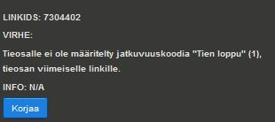

_Tielinkki 6634188 on tieosan viimeinen linkki mutta siltä puuttuu jatkuvuuskoodi Tien loppu._ 

Karttanäkymä kohdistuu tarkistusilmoituksen kohteena olevan tielinkin keskikohtaan painamalla Korjaa-painiketta. Painamalla Korjaa-nappia uudestaan kohdistus siirtyy seuraavaan tielinkkiin, jos sama tarkistus kohdistuu useampaan linkkiin. Käyttäjä voi nyt valita tarkistusilmoituksen kohteena olevan tielinkin ja tehdä sille tarkistuksen korjaavan toimenpiteen. 

####Tieosoiteprojektissa tehtävät tarkastukset:####

Tieosoiteprojektiin kohdistuvat tarkistukset:

- Uusi tieosa ei saa olla varattuna jossakin toisessa tieosoiteprojektissa
- Tieosoitteen kasvusuunta ei saa muuttua kesken tien
- Tieosoitteellinen tie ei saa haarautua muuten kuin ajoratakoodivaihdoksessa
- Ajoratojen 1 ja 2 tulee kattaa samaa osoitealue
- Tieosoitteelta ei saa puuttua tieosoiteväliä (katkoa m-arvoissa)

Jatkuvuuden tarkistukset:

- Tieosan sisällä jatkuvissa kohdissa (aukkopaikka alle 0,1 m), jatkuvuuskoodin tulee olla 5 (jatkuva)

- Tieosan sisällä epäjatkuvuuskohdissa (aukkopaikka yli 0,1 m) jatkuvuuskoodi tulee olla 4 (lievä epäjatkuvuus). 
Tieosan sisäisen epäjatkuvuuden pituudelle ei ole asetettu ylärajaa.

- Tieosan lopussa tulee olla jatkuvuuskoodi 2 (epäjatkuva) tai 4 (lievä epäjatkuvuus), jos ennen tien seuraavaa tieosaa on epäjatkuvuuskohta. Seuraavaa tieosaa ei ole välttämättä valittu projektiin, joten tarkistus huomioi myös projektin ulkopuoliset tieosat.

- Tieosoitteen viimeisellä (suurin tieosanumero) tieosalla tulee olla jatkuuvuuskoodi 1 (tien loppu)

- Jos tieosoitteen viimeinen tieosa lakkautetaan kokonaan, tien edellisellä tieosalla tulee olla jatkuvuuskoodi 1 (tien loppu). Tätä tieosaa ei ole välttämättä valittu projektiin, joten tarkistus ulottuu myös projektin ulkopuolisiin tieosiin.

- Jos tieosan seuraava tieosa on eri ELY-koodilla, jatkuvuuskoodin tulee olla tieosan lopussa 3 (ELY-raja).

7.4 Muutosilmoitusten lähettäminen Tierekisteriin
--------------------------

Muutosilmoitus viedään Tierekisteriin avaamalle ensin yhteenvetotaulukko klikkaamalla oikean alakulman sinistä Avaa projektin yhteenvetotaulukko -painiketta. Kun projektilla ei ole enää korjaamattomia tarkistusilmoituksia, aktivoituu vihreä Lähetä muutosilmoitus Tierekisteriin -painike. Painikkeen painamisen jälkeen sovellus ilmoittaa muutosilmoituksen tekemisestä Muutosilmoitus lähetetty Tierekisteriin -viestillä.

_Muutosilmoituspainike oikeassa alakulmassa._

Kun muutosilmoitus on lähetetty, muuttuu projektilistauksessa ko. projektin Tila-tieto statukselle Lähetetty tierekisteriin. Viite-sovellus tarkistaa minuutin välein Tierekisteristä, onko muutos käsitelty Tierekisterissä loppuun asti. Kun tämä on tehty onnistuneesti, muuttuu Tila-tieto statukselle Viety tierekisteriin. Tällöin tieosoiteprojekti on viety onnistuneesti Tierekisteriin ja se on valmis. Mikäli muutosilmoitus ei ole mennyt läpi Tierekisterissä, tilaksi päivittyy Virhe tierekisterissä ja listalle tulee oranssi Avaa uudelleen -painike. Tarkemmin virheen tiedot pääsee tarkistamaan viemällä hiiren Virhe tierekisterissä -tekstin päälle, jolloin virheen infolaatikko tulee näkyviin. Virhe korjataan avaamalla projekti oranssista painikkeesta ja tekemällä tarvittavat muokkaukset sekä lähettämällä ilmoitukset uudelleen Tierekisteriin.  

Projektia ei voi muokata, kun sen tila on joko Lähetetty tierekisteriin, Tierekisterissä käsittelyssä tai Viety tierekisteriin.

|Tieosoiteprojektin tila|Selitys|
|-|-|
|Keskeneräinen|Projekti on työn alla ja sitä ei ole vielä lähetetty tierekisteriin.|
|Lähetetty tierekisteriin|Projekti on lähetetty tierekisteriin.|
|Tierekisterissä käsittelyssä|Projekti on tierekisterissä käsittelyssä. Tierekisteri käsittelee projektin sisältämiä muutosilmoituksia.|
|Viety tierekisteriin|Projekti on hyväksytty tierekisterissä. Muutokset näkyvät myös Viite-sovelluksessa.|
|Virhe tierekisterissä|Tierekisteri ei hyväksynyt projektia. Tierekisterin tarkempi virheilmoitus tulee näkyviin viemällä osoittimen "Virhe tierekisterissä"-tekstin päälle. Projektin voi avata uudelleen.|
|Virhetilanne Viiteessä|Projekti on lähetty Tierekisteriin ja se on Tierekisterin hyväksymä, mutta projektin tiedot eivät piirry Viite-sovelluksessa.| 

_Tilatietoja Tieosoiteprojektit-listassa._
