Viite-sovelluksen käyttöohje
======================================================
Viite
-----------------------

Viite on Väylän tieosoitejärjestelmän ylläpitosovellus. Viitteellä hallitaan tieosoitejärjestelmän muutoksia ja se tarjoaa ajantasaisen kuvauksen tiestöstä <!--Digiroadin (VVH:n) ajantasaisella--> VVH:n jäädytetyllä linkkigeometrialla.

Linkin https://extranet.vayla.fi/group/extranet/etusivu alta Väylän extranetista löytyy Viite, Viite-sovelluksen yleiskuvaus, linkki tähän ohjeeseen ja tieto järjestelmäpäälliköstä. 

__Huom! Suosittelemme käyttämään selaimena Chromea tai Firefoxia.__

__Huom! Käyttöohjeen kuvia voi klikata isommaksi, jolloin tekstit erottuvat paremmin.__

1 Miten päästä alkuun
-----------------------

Viite-sovelluksen käyttöä varten tarvitaan Väylän tunnukset (A-, U-, LX-, K- tai L-alkuinen). Mikäli sinulla ei ole Väylän tunnuksia, pyydä ne yhteyshenkilöltäsi Väylästä.

Kaikilla Väylän tunnuksilla on pääsy Viite-sovellukseen katselukäyttäjänä.   
Tietojen muokkausoikeuksista päättää Viitteen järjestelmäpäällikkö.

Viite-sovellukseen kirjaudutaan osoitteessa: <a href="https://viite.vaylapilvi.fi" target="_blank"> https://viite.vaylapilvi.fi </a>.

_Kuva 1.1: Kirjautuminen Viite-sovellukseen Väylän tunnuksella._

Kirjautumisen jälkeen avautuu Viitteen karttakäyttöliittymä katselutilassa. Muokkausoikeudellisen käyttäjän karttakäyttöliittymän zoomitaso ja kartan keskityskohta voivat olla erilaiset kuin katselukäyttäjän näkymässä.

_Kuva 1.2: Karttanäkymä kirjautumisen jälkeen._

Oikeudet on rajattu käyttäjän roolin mukaan:

- Ilman erikseen annettuja oikeuksia Väylän tunnuksilla pääsee katselemaan kaikkia tieosoitteita
- <!--Tieosoiteprojektit, Tiennimen ylläpito sekä Solmut ja liittymät -painikkeet näkyvät vain käyttäjille,--> Tieosoitetietojen muutokset onnistuvat vain muokkausoikeuksilla.

Jos kirjautumisen jälkeen karttakäyttöliittymän katselutila ei avaudu, ei kyseisellä tunnuksella ole pääsyä Väylän extranetiin. Tällöin tulee ottaa yhteyttä Väylässä tai ELYssä omaan yhteyshenkilöön.

1.1 Mistä saada opastusta
--------------------------

Viite-sovelluksen käytössä avustaa sovellustoimittaja, <viite.kehitys@vayla.fi>.

#### Ongelmatilanteet

Sovelluksen toimiessa virheellisesti (esim. kaikki aineistot eivät lataudu oikein), menettele seuraavasti:

- Lataa sivu uudelleen näppäimistön F5-painikkeella
- Tarkista, että selaimestasi on käytössä ajan tasalla oleva versio, ja selaimesi on Chrome tai Mozilla Firefox 
- Jos edellä olevat eivät korjaa ongelmaa, ota yhteyttä <viite.kehitys@vayla.fi>.

Tämä ohje käsittelee pääasiassa vain Viite-sovelluksen käyttöä, ei niinkään tieosoitejärjestelmää.
Tarkemmat tiedot tieosoitejärjestelmästä löydät täältä: https://vayla.fi/documents/25230764/35411009/tieosoitejärjestelmä.pdf

2 Perustietoja Viite-sovelluksesta
--------------------------

2.1 Tiedon rakentuminen Viite-sovelluksessa
--------------------------

Viite-sovelluksessa tieosoiteverkko piirretään VVH:n tarjoaman Maanmittauslaitoksen keskilinja-aineiston päälle. 
Viite käyttää keskilinja-aineistosta ns. jäädytettyä versiota, joka päivitetään noin puolivuosittain. Maanmittauslaitoksen keskilinja-aineisto muodostuu tielinkeistä. Tielinkki on tien, kadun, kevyen liikenteen väylän tai lauttayhteyden keskilinjageometrian pienin yksikkö. Tieosoiteverkko piirtyy geometrian päälle tieosoitesegmentteinä _lineaarisen referoinnin_ avulla. 

Tielinkki on Viite-sovelluksen lineaarinen viitekehys, jonka geometriaan sidotaan tieosoitesegmentit. Kukin tieosoitesegmentti tietää, mille tielinkille se kuuluu (tielinkin ID), sekä kohdan, josta se alkaa ja loppuu kyseisellä tielinkillä. Tieosoitesegmentit ovat siten tielinkin mittaisia tai niitä lyhyempiä tieosoitteen osuuksia. Käyttöliittymässä kuitenkin pienin valittavissa oleva osuus on tielinkin mittainen (ks. luvut 5.1 ja 7.1).

Kullakin tieosoitesegmentillä on lisäksi tiettyjä sille annettuja ominaisuustietoja, kuten tienumero, tieosanumero ja ajoratakoodi. Tieosoitesegmenttien ominaisuustiedoista on kerrottu tarkemmin luvussa 5.2.

_Kuva 2.1: Tieosoitesegmenttejä (1) ja muita tielinkkejä (2) Viitteen karttaikkunassa._

Tieosoitesegmentit (eli tieosoitteistetut tielinkit, 1) piirretään Viite-sovelluksessa kartalle erilaisin värein (ks. luku 5). 
Muut, tieosoiteverkkoon kuulumattomat tielinkit (2), piirretään kartalle harmaalla värillä tai mustaraitaisena katkoviivana. 
Harmaalla piirretään esimerkiksi (tieosoitteettomat) kuntien omistamat tiet, ajopolut tai ajotiet. 
Mustaraitaisilla katkoviivoilla piirretään rakenteilla olevat, mutta toistaiseksi tieosoitteistamattomat tiet, jotka ovat tulossa tieosoitteistettaviksi valmistumisensa aikoihin.

Palautteet geometrian/tielinkkien virheistä voi laittaa Maanmittauslaitokselle, <maasto@maanmittauslaitos.fi>. Mukaan liitetään selvitys virheestä ja sen sijainnista (esim. kuvakaappaus).

3 Automatiikka Viite-sovelluksessa
--------------------------
Viite-sovelluksessa on muutamia automatiikan tekemiä yleistyksiä tai korjauksia. Automatiikka ei muuta mitään sellaisia tietoja, jotka muuttaisivat varsinaisesti tieosoitteita. Automatiikan tekemät muutokset liittyvät siihen, että tieosoiteverkkoa ylläpidetään keskilinjageometrian päällä, ja tuon keskilinjageometrian ylläpidosta vastaa Maanmittauslaitos. Tietyt automaattiset toimenpiteet helpottavat tieosoiteverkon ylläpitäjää varsinaisessa tieosoiteverkon hallinnassa.

__Huom! Automatiikka ei koskaan muuta tieosan mitattua pituutta. Arvot tieosien ja ajoratojen vaihtumiskohdissa pysyvät aina ennallaan automatiikan tekemien korjausten yhteydessä.__

3.1 Tieosoitesegmenttien yhdistely tielinkin mittaisiksi osuuksiksi
--------------------------

Käyttäjän valitessa kartalla kohteita kaksoisklikkaamalla (ks. luku 5.1), on pienin valittava yksikkö tielinkin mittainen osuus tieosoiteverkosta, koska tielinkki on pienin mahdollinen yksikkö Maanmittauslaitoksen ylläpitämällä linkkiverkolla.

Tätä varten järjestelmä tekee automaattista yhdistelyä:

- Ne kohteet, joiden tielinkin ID, tie, tieosa, ajorata ja alkupäivämäärä ovat samoja (yhtenevä tieosoitehistoria), on yhdistetty tietokannassa yhdeksi tielinkin mittaiseksi tieosoitesegmentiksi
- Ne kohteet, joiden tielinkin ID, tie, tieosa, ajorata ovat samoja, mutta alkupäivämäärä ei ole sama (erilainen tieosoitehistoria), ovat tietokannassa edelleen erillisiä kohteita, mutta käyttöliittymässä ne ovat valittavissa vain tielinkin mittaisena osuutena. Tällä varmistetaan, että käyttöliittymä toimii käyttäjän kannalta loogisesti.  Tielinkin mittainen osuus on aina valittavissa, mutta tieosoitehistoria säilytetään tietokantatasolla.

<!-- Kappale 3.2 kommentoitu pois; Viitteessä käytössä nyt puolivuosittain jäädytettävä rajapinta, ei jatkuvasti päivittyvää geometriaa.
3.2 Tieosoitesegmenttien automaattinen korjaus jatkuvasti päivittyvällä linkkigeometrialla
--------------------------

Viite-sovellus päivittää automaattisesti tieosoitesegmentit takaisin ajantasaiselle keskilinjalle, kun Maanmittauslaitos on tehnyt pieniä tarkennuksia keskilinjageometriaan. Tässä luvussa on kuvattu tapaukset, joissa Viite-sovellus osaa tehdä korjaukset automaattisesti. Ne tapaukset, joissa korjaus ei tapahdu automaattisesti, segmentit irtoavat geometriasta ja ne on korjattava manuaalisesti operaattorin toimesta.

Automatiikka tekee korjaukset, kun

1. __Tielinkki pitenee tai lyhenee alle metrin:__ Viite-sovellus lyhentää/pidentää tieosoitesegmenttiä automaattisesti muutoksen verran.
2. __Maanmittauslaitos yhdistelee tielinkkejä, esimerkiksi poistamalla tonttiliittymiä maanteiden varsilta:__ Tieosoitesegmentit siirretään uudelle geometrialle automaattisesti Väyläverkon hallinnan (VVH) tarjoaman tielinkkien muutosrajapinnan avulla.
-->

4 Karttanäkymän toiminnot
--------------------------

_Kuva 4.1: Karttanäkymä._

#### Kartan liikuttaminen

Karttaa liikutetaan ns. raahaamalla, eli pitämällä hiiren vasenta painiketta pohjassa ja liikuttamalla samalla hiirtä.

#### Hakukenttä

Käyttöliittymässä on kartan keskitystä varten hakukenttä (1), jossa voi hakea kohteita koordinaateilla, tieosoitteella, katuosoitteella, MTKID:llä ja Linkin ID:llä. Haku suoritetaan kirjoittamalla hakuehto hakukenttään ja klikkaamalla Hae. Hakutulos tulee listaan hakukentän alle. Hakutuloslistassa ylimpänä on maantieteellisesti kartan nykyistä keskipistettä lähimpänä oleva kohde, tai katuosoitehaun tapauksessa tulokset ovat aakkosjärjestyksessä. Mikäli hakutuloksia on vain yksi, keskittyy kartta automaattisesti haettuun kohteeseen. Jos hakutuloksia on useampi kuin yksi, täytyy listalta valita tulos, johon kartan halutaan keskittyvän. Tyhjennä tulokset -painike tyhjentää hakutuloslistan.

Koordinaateilla haku: Koordinaatit syötetään muodossa "pohjoinen (7 merkkiä), itä (6 merkkiä)". Koordinaattien tulee olla ETRS89-TM35FIN -koordinaattijärjestelmässä (esim. 6975061, 535628).

Tieosoitteella haku: Tieosoitteesta hakukenttään voi syöttää joko tienumeron (esim. 2), tienumero + tieosanumeroyhdistelmän (esim. 2 1) tai tienumero + tieosanumero + etäisyys –yhdistelmän (esim. 2 1 350). 

Katuosoitteella haku: Katuosoitteesta hakukenttään voi syöttää koko osoitteen tai sen osan (esim. "Mannerheimintie", "Mannerheimintie, Helsinki", "Mannerheimintie 10, Helsinki", tai myös "Mannerheimintie 10").

Linkin ID:llä haku toimii myös selaimen osoitekentän kautta. Ks. tarkemmin 5.3.

#### Taustakartat

Taustakartaksi voi valita vasemman alakulman painikkeista (2) maastokartan, ortokuvat, taustakarttasarjan tai harmaasävykartan. Käytössä oleva harmaasävykartta ei tällä hetkellä ole kovin käyttökelpoinen.

#### Näytettävät tiedot

Käyttäjä voi halutessaan valita, näytetäänkö kartalla kiinteistörajat, tieosoitteettomat linkit, rakenteilla-linkit tai tieosoiteverkko symboleineen (3). Valinnat saa päälle ja päältä pois valintaruutuja klikkaamalla toisistaan riippumatta. Muut kuin Näytä kiinteistörajat -valinnat ovat automaattisesti päällä. 
Tieosoiteverkon symboleita ovat suuntanuolet ja tieosien päätepisteet (tai yleisemmin kalibrointipisteet).

#### Mittakaavataso ja mittakaava

Käytössä oleva mittakaava näkyy kartan oikeassa alakulmassa (4). Kartan mittakaavatasoa muutetaan joko hiiren rullalla, kaksoisklikkaamalla (zoom in), Shift+piirto -toiminnolla (alue) tai mittakaavapainikkeista (5). Mittakaavapainikkeita käyttämällä kartan keskitys säilyy. Hiiren rullalla tai kaksoisklikkaamalla kartan keskitys siirtyy hiiren kohdistimen keskikohtaan. Shift+piirto -toimintoa (alue) käyttäen kartta keskittyy valitun alueen keskipisteesen.

#### Kohdistin

Kohdistin (6) ilmaisee kartan keskipisteen. Kohdistimen koordinaatit näkyvät karttaikkunan oikeassa alakulmassa (7). Kun karttaa liikuttaa, keskipiste muuttuu ja koordinaatit päivittyvät. Oikean alakulman valinnan (9) avulla kohdistimen saa myös halutessaan piilotettua kartalta.

#### Merkitse piste kartalla

Merkitse-painike (8) merkitsee sinisen pisteen kartan keskipisteeseen. Merkki poistuu vain, kun merkitään uusi piste kartalta.

5 Tieosoiteverkon katselu
--------------------------

Geometrialtaan yleistetty tieosoiteverkko (linkit piirretään pelkkien päätepisteiden perusteella) tulee näkyviin, kun zoomaa tasolle, jonka mittakaavajanassa on lukema 5 km. Tästä tasosta ja sitä lähempää piirretään kartalle valtatiet, kantatiet, seututiet, yhdystiet ja numeroidut kadut. Yleistämätön tieverkko piirtyy mittakaavajanan lukemalla 2 km. 100 metriä (100 metrin mittakaavajanoja on kaksi kappaletta) suuremmilla mittakaavatasoilla tulevat näkyviin kaikki tieverkon kohteet. Tieverkon latautuminen karttanäytölle voi kestää jonkin aikaa. 

Tieosoiteverkko on värikoodattu tienumeroiden mukaan. Vasemman yläkulman selitteessä on kerrottu kutakin värikoodia vastaavat tienumerot. 
Lisäksi kartalle merkitään tieosien alkupisteet. Tieverkon suunta näkyy kartalla pisaran mallisena nuolena. Nuolen kärki osoittaa tieosoitteen kasvusuuntaan.

Kartalla näkyvä tieosoiteverkko on uusimman tieosoitteen mukainen verkko, jossa näkyvät tieosoitteiden viimeisimmät muutokset. Näiden muutosten alkupäivämäärä voi olla tulevaisuudessa, joten kartalla ei näy ns. tämän päivän tilanne.

_Kuva 5.1: Tieosoiteverkon piirtyminen kartalle, kun mittakaavajanassa on 2 km._

_Kuva 5.2: Tieosoiteverkon piirtyminen kartalle, kun mittakaavajanassa on 100 m._

Tieosoitteelliset kadut ja yksityistiet (hallinnollinen luokka kunta tai yksityinen) erottuvat kartalla muista tieosoitesegmenteistä siten, että niiden ympärillä on musta reunaviiva.

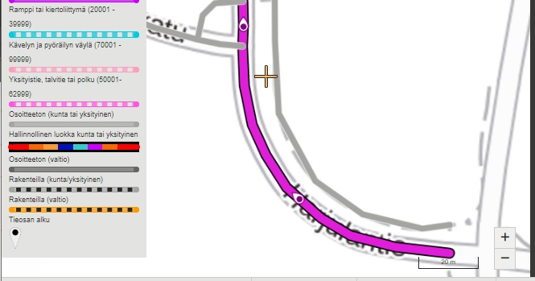

_Kuva 5.3: Tieosoitteellinen katu, merkattuna mustalla reunaviivalla tienumeron värityksen lisäksi._

Kun hiiren kohdistimen vie tieosoitteistetun tieosuuden päälle, tulee kartalle näkyviin infolaatikko, joka kertoo kyseisen tieosoitesegmentin tienumeron, tieosanumeron, ajoratakoodin, alku- ja loppuetäisyyden sekä hallinnollisen luokan.

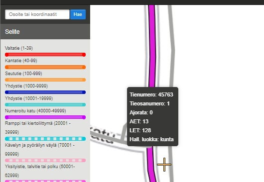

_Kuva 5.4: Infolaatikko, kun hiiren kohdistin on viety tieosoitesegmentin päälle._

5.1 Kohteiden valinta
--------------------------

Kohteita voi valita kartalta klikkaamalla, tuplaklikkaamalla ja ctrl+klikkaamalla. 

Kertaklikkauksella sovellus valitsee klikatun tieosan, eli tielinkit joilla on sama tienumero ja tieosanumero. Valittu tieosa korostuu kartalla (1), ja sen tiedot tulevat näkyviin karttaikkunan oikean reunan ominaisuustietonäkymään (2).

_Kuva 5.5: Kokonaisen tieosan valinta._

Kaksoisklikkaus valitsee yhden tielinkin mittaisen osuuden tieosoitteesta. Valittu osuus korostuu kartalla (3), ja sen tiedot tulevat näkyviin karttaikkunan oikean reunan ominaisuustietonäkymään (4).

_Kuva 5.6: Tielinkin mittaisen osuuden valinta._

Ctrl+klik eli monivalinta. Ctrl-nappula pohjassa linkkejä klikkailemalla voit valita vapaasti kaikenlaisia tielinkkejä samaan valintaan.
Voit esim. poimia tieosoitteistettuja ja tieosoitteistamattomia linkkejä samaan valintaan approksimoidaksesi tulevia tiepituuksia. 
Monivalituille linkeille ominaisuustiedoissa näytetään vain karkeamman tason tiedot.

_Kuva 5.7: Tielinkkien monivalinta._

5.2 Tieosoitteiden ominaisuustiedot
--------------------------

Valituista tielinkeistä näytetään seuraavat ominaisuustiedot:

|Ominaisuustieto   | Kuvaus|
|------------------|-------|
|Muokattu viimeksi*| Muokkaajan käyttäjätunnus ja tiedon muokkaushetki.      |
|Linkkien lukumäärä| Niiden tielinkkien lukumäärä, joihin valinta kohdistuu. |
|Geometrian lähde  | Lähde, josta linkin geometriatieto on peräisin. MML_jäädytetty, MML, Täydentävä tai Suravage. |
|Kunta             | Geometrialinkkiin liittyvä kuntatieto.                  |
|Linkin ID         | Geometrialinkin yksilöivä id. Näytetään, jos valittuna on yksittäinen linkki. |
|Geometrian pituus/Geometrioiden yhteenlaskettu pituus| Valittujen tielinkkien yhteispituus. Lasketaan kaikkien linkkien tiedoista.|
|Tien nimi         | Viitteessä tielle annettu tien nimi, tai listaus valinnan tiennimistä.        |
|Tienumero         | Tieosoiteverkon mukainen tienumero, tai listaus valinnan tienumeroista.       |
|Tieosanumero      | Tieosoiteverkon mukainen tieosanumero.                                        |
|Ajorata           | Tieosoiteverkon mukainen ajoratakoodi, tai listaus valinnan ajoratakoodeista. |
|Alkuetäisyys**    | Tieosoiteverkon etäisyyslukemien avulla laskettu linkin alkuetäisyys.         |
|Loppuetäisyys**   | Tieosoiteverkon etäisyyslukemien avulla laskettu linkin loppuetäisyys.        |
|Yhteenlaskettu pituus   | Valinnan mukaisten tieosoitteistettujen tielinkkien tieosoitevälien yhteispituus. |
|ELY                     | Tien hallinnoinnista vastaava ELY, tai listaus valinnan ELYistä.                  |
|Hallinnollinen luokka*3 | Tien ylläpidosta vastaava taho (Valtio/Kunta/Yksityinen). Linkin hallinnollinen luokka, tai listaus valinnan hallinnollisista luokista. Lähtöaineistona Maanmittauslaitoksen hallinnollinen luokka -tieto. |
|Jatkuvuus               | Tieosoiteverkon mukainen jatkuvuustieto, tai listaus valinnan jatkuvuuskoodeista. |

*) Muokattu viimeksi -tiedoissa vvh_modified tarkoittaa, että muutos on tullut Maanmittauslaitokselta joko geometriaan tai geometrian ominaisuustietoihin. Muokattu viimeksi -päivät ovat kaikki vähintään 29.10.2015, koska tuolloin on tehty Maanmittauslaitoksen geometrioista alkulataus VVH:n tietokantaan.

**) Tieosoiteverkon kalibrointipisteet (tieosan alku- ja loppupisteet sekä ajoratakoodin vaihtuminen) määrittelevät mitatut alku- ja loppuetäisyydet. Kalibrointipisteiden välillä alku- ja loppuetäisyydet lasketaan tieosoitesegmenttikohtaisesti Viite-sovelluksessa.

*3) Viitteessä luovuttiin Tietyypistä ja se korvattiin Hallinnollisella luokalla 3/2021.
Palautteet hallinnollisen luokan virheistä voi toimittaa Maanmittauslaitokselle osoitteeseen maasto@maanmittauslaitos.fi lomakkeella https://vayla.sharefile.eu/d-sf43c30c2582a42cfac1744748dad608f (Hallinnollisten muutosten ilmoituspohja.xls). Mukaan selvitys virheestä ja sen sijainnista (kuvakaappaus tms.).

5.3 Kohdistaminen tieosoitteeseen tielinkin ID:n avulla
--------------------------

Kun kohdetta klikkaa tai tuplaklikkaa kartalla, tulee selaimen osoiteriville näkyviin tielinkin ID. Tuplaklikattaessa ID on valitun linkin id, klikattaessa joku valitun tieosan linkkien ID:istä. Osoiterivillä olevan URL:n avulla voi myös kohdistaa käyttöliittymässä ko. tielinkkiin. URL:n voi lähettää toiselle henkilölle, jolloin tämä pääsee käyttöliittymässä samaan paikkaan.

Esimerkiksi: https://viite.vaylapilvi.fi/#linkProperty/1204420 näkyy kuvassa osoiterivillä (5). 1204420 on tielinkin ID.

_Kuva 5.7: Kohdistaminen tielinkin ID:llä._

6 Tieosoiteprojekti
--------------------------
Tieosoitteita muokataan Viite-sovelluksessa tieosoiteprojektien kautta. 
Tieosoiteprojektit määrittävät tieosoitemuutoksille voimaantulopäivämäärän, ja varmistavat, että kullekin tieosalle tehtävät muutokset talletuvat tieosoitteistoon yksikäsitteisessä kronologisessa järjestyksessä. 

6.1 Uusi tieosoiteprojekti
--------------------------

Uuden tieosoiteprojektin tekeminen aloitetaan klikkaamalla painiketta Tieosoiteprojektit (1) ja avautuvasta ikkunasta painiketta Uusi tieosoiteprojekti (2).
Käyttäjä, jolla ei ole Viitteen muokkausoikeuksia, ei pääse tekemään tieosoiteprojektia.

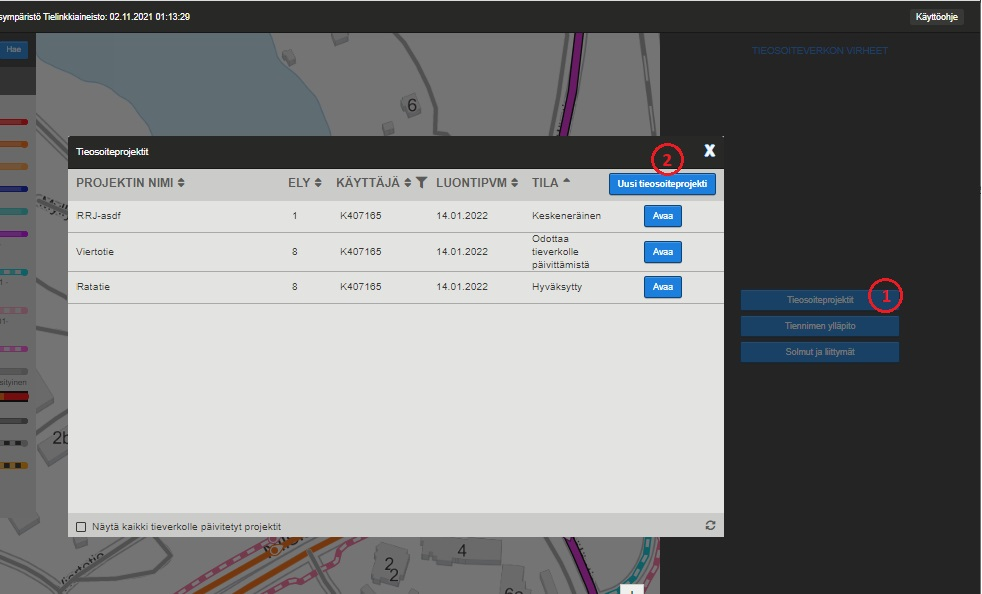

_Kuva 6.1: Tieosoiteprojektit-painike ja Uusi tieosoiteprojekti -painike._

### Projektin perustietolomake
Näytön oikeaan reunaan avautuu lomake tieosoiteprojektin perustietojen täydentämistä varten. Jos käyttäjä on ollut katselutilassa, sovellus siirtyy tässä vaiheessa automaattisesti muokkaustilaan. 

Projektin pakollisia tietoja ovat nimi (\*NIMI) ja projektin muutosten voimaantulopäivämäärä (\*ALKUPVM), jotka erottaa lomakkeella oranssista väristä (3). Lisätiedot-kenttään käyttäjä voi halutessaan tehdä muistiinpanoja tieosoiteprojektista. Tieosien varaamisesta seuraavaksi erikseen, mutta projektin voi luoda myös varaamatta yhtään tieosaa.

_Jatka toimenpiteisiin_ -painikkeesta (4) sovellus siirtyy toimenpidenäytölle. Tällöin myös tieosoiteprojekti tallentuu automaattisesti, eli projektin tiedot tallentuvat tietokantaan. 
_Poistu_-painikkeesta (5) projekti suljetaan ja käyttäjältä varmistetaan, halutaanko tallentamattomat muutokset tallentaa. (Projektiin pääsee palaamaan Tieosoiteprojektit-listan kautta.) 

_Kuva 6.2: Tieosoiteprojektin perustietojen täyttäminen._

### Tieosien varaaminen projektiin
Projektissa muokattavat tieosat lisätään projektiin täydentämällä niiden tienumero ja tieosanumeroväli kenttiin TIE, AOSA sekä LOSA ja painamalla painiketta Varaa (6).

Varauksen yhteydessä järjestelmä tekee varattaville tieosille tarkastukset:

- Varattavan tieosan täytyy olla olemassa projektin voimaantulopäivänä
- Varattavan tieosan on oltava vapaana. Tieosa voi olla varattuna vain yhteen projektiin kerrallaan. 

Jos varaus ei onnistu, Viite näyttää käyttäjälle virheilmoituksen. Virheilmoitus annetaan myös, jos tieosan kentät on täytetty puutteellisesti.

Varaa-painikkeen klikkauksen jälkeen, varauksen onnistuessa, tieosan tiedot tulevat näkyviin lomakkeelle (7).

Käyttäjä voi poistaa tieosan varauksen klikkaamalla Roskakori-kuvaketta (8) valitsemansa tieosan kohdalla Projektiin valitut tieosat -listalla. <!--Mikäli poistettavalle tieosalle ei ole tehty muutoksia, vaan se on vain varattu projektiin,--> Tieosan varaus poistetaan tällöin projektista. <!--Jos tieosalle on tehty muutoksia,--> Viite pyytää käyttäjää ensin vahvistamaan poiston.

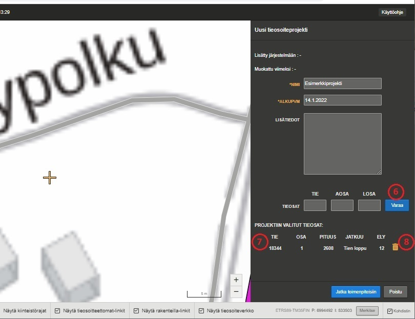

_Kuva 6.3: Tieosan tiedot projektilomakkeella Varaa-painikkeen painamisen jälkeen._

### Toimenpidenäytöstä lyhyesti

Projektitietolomakkeen _Jatka toimenpiteisiin_ -painikkeen kautta pääsee toimenpidenäytölle.
Toimenpidenäytöllä tehdään tieosoitteiston muutokset. 
Uuden projektin luonnin yhteydessä Viite kohdistaa kartan siten, että varatut tieosat mahtuvat kartalle. 
Myöhemmin, palattaessa muokkaamaan projektia, käyttäjä palautetaan siihen kohtaan kartalla, jossa viimeksi on tallennettu toimenpide.

_Kuva 6.4: Kun tieosat on varattu projektiin, Viite kohdistaa kartan varattuihin tieosiin._  

### Projektin perustietojen muokkaaminen
Toimenpidenäytöltä käyttäjä pääsee takaisin muokkaamaan projektin perustietoja klikkaamalla projektin nimen vierestä löytyvää kynäikonia (9).
Projektin perustietojen muokkausnäkymässä käyttäjä voi muokata aiemmin esiteltyjen kenttien tietoja, sekä lisäksi poistaa projektissa uutena muodostettuja tieosia (Uusi-toimenpide, 7.1) klikkaamalla Roskakori-kuvaketta (10) valitsemiensa tieosien kohdalla. Ne löytyvät Projektissa muodostetut tieosat -listalta. Käyttäjää pyydetään tässäkin vahvistamaan poisto.  

Keskeneräisen projektin voi poistaa Viitteestä Poista projekti –painikkeella (11), jolloin sekä koko projekti että kaikki sen tieosavaraukset ja kaikki tehdyt muutokset poistetaan. Viite pyytää käyttäjää vahvistamaan projektin poiston. 

_Kuva 6.5: Projektin tietojen muokkaustilassa voi muokata projektia luotaessa annettuja tietoja, sekä lisäksi poistaa projektissa uutena muodotettuja tieosoitteita, ja myös poistaa koko keskeneräisen projektin._  

6.2 Olemassa oleva tieosoiteprojekti
--------------------------

Tieosoiteprojektit-listalla näkyvät kaikkien käyttäjien keskeneräiset sekä juuri hyväksytyt projektit. Projektit on järjestetty projektin tilan mukaiseen järjestykseen siten, että mahdolliset virheelliset projektit näkyvät listalla ensimmäisinä. 
Järjestystä voi muuttaa sarakkeiden nuolipainikkeilla. 

Käyttäjä-sarakkeen suodatinpainikkeella (12) saa valittua listalle omat projektit, ja toisen käyttäjän projektit saa valittua kirjoittamalla samalla avautuneeseen syöttökenttään (13) ko. käyttäjän tunnus.

Hyväksytty -tilaiset projektit näytetään listalla niiden tieverkolle päivityksen jälkeen vuorokauden ajan. Aiempia tieverkolle päivitettyjä projekteja saa näkyviin klikkaamalla listaikkunan alareunassa olevaa valintaruutua (14), ja vastaavasti ne saa pois näkyvistä poistamalla valinta.
Jos projektin tila on Hyväksytty, projektia ei voi muokata, vaan ainoastaan avata.

Listan tiedot päivittyvät automaattisesti minuutin välein. Klikkaamalla listaikkunan oikeassa alakulmassa olevaa Päivitä lista -painiketta (15) päivitetään projektien nykytilat listalle välittömästi.

Tallennetun tieosoiteprojektin saa auki Tieosoiteprojektit-listalta painamalla Avaa-painiketta. <!-- Toim. huom. esim. "Muokkaa" ja "Katsele" olisivat käyttäjän kannalta selkeämmät nappien tekstit. --> Avaamisen yhteydessä sovellus kohdistaa kartan paikkaan, jossa käyttäjä on viimeksi tallentanut toimenpiteen tässä projektissa. Mikäli toimenpiteitä ei ole tehty, karttanäkymä rajautuu siten, että kaikki tieosoiteprojektiin varatut tieosat näkyvät karttanäkymässä.

Tieosoiteprojektit-lista suljetaan listaikkunan oikeassa yläkulmassa olevasta rastipainikkeesta.

_Kuva 6.6: Tieosoiteprojektit-lista toimintoineen._

7 Toimenpiteiden (nk. muutosilmoitusten) tekeminen tieosoiteprojektissa
--------------------------

Tieosoiteprojektissa on mahdollista tehdä tieverkon tiedoille seuraavia toimenpiteitä:

- lakkautus (tieosoitteen lakkautus) 
- uusi (annetaan osoitteettomalle linkille tieosoite) 
- ennallaan (hallinnollinen toimenpide, jossa osoitteistus ei muutu.*)
- siirto (tieosan tieosoitteistus (tienumero, tieosanumero, etäisyydet tai ajorata) muuttuu)
- numeroinnin muutos (kokonaisen tieosan tienumeron ja/tai tieosanumeron voi muuttaa manuaalisesti) 
- kääntö (tieosoitteen kasvusuunnan kääntö, siirto- tai numerointi-toimenpiteen yhteydessä)
  - HUOM. Kääntö-toimenpide otetaan toistaiseksi pois käytöstä (tilanne 2022-04) Velhon tuen puuttuessa vielä.
<!-- - etäisyyslukeman muutos (etäisyyslukeman loppuarvon voi syöttää tieosalle manuaalisesti) -->

*vain hallinnollisia tietoja (ELY-koodin, jatkuvuuden ja hallinnollisen luokan muutokset) muutetaan, tai osoitteistus pysyy ennallaan (tieosan alussa) vaikka osaa saman tieosan osoitteistosta muutetaan (tieosan lopussa)

Tieosoiteprojektin muutostoimenpiteitä pääsee tekemään klikkaamalla _Jatka toimenpiteisiin_ -painiketta projektin perustietojen lomakkeella. Tämän jälkeen sovellus muuttaa varatut tieosat muokattaviksi kohteiksi ja ne näkyvät avautuvassa karttanäkymässä keltaisella korostettuina aihioina (1).
Kartalta ei valikoidu mitään ennen käyttäjän tekemää valintaa, mikäli toimenpiteenä on vain uuden tieosoitteen lisäys, eikä tieosia ole varattu projektiin. 

Projektitilassa voi kartalta klikkaamalla valita jo projektiin varattuja tieosia, tieosoitteettomia tielinkkejä tai rakenteilla olevia linkkejä projektissa muokattavaksi. Tieosoitteistetut, tieosoitteettomat ja rakenteilla olevat linkit saa pois piirrosta ja piirtoon sivun alapalkissa olevista valintaruuduista. Kaikki ovat oletuksena piirrossa. 
Tieverkon tieosoitetietoja voi katsella kartalla viemällä hiiren tieosoitelinkin päälle. Tällöin tielinkin infolaatikko tulee näkyviin.

Projektin nimen vieressä on sininen kynäkuvake (2), josta pääsee projektin perustietojen lomakkeelle muokkaamaan projektin tietoja. Lisäksi oikeassa yläkulmassa on _Sulje_-painike (3), josta pääsee takaisin Viitteen katselutilaan.

Projektin nimen alapuolella näkyvät projektin tarkastusilmoitukset (4). Tarkastusilmoitukset auttavat käyttäjää havaitsemaan vielä käsittelyn tarpeessa olevia linkkejä, sekä loogisia virheitä jo käsitellyistä linkeistä.

_Kuva 7.1: Projektissa muokattavissa olevat varatut tieosat näkyvät kartalla keltaisella värillä piirrettyinä aihioina. Suuntanuolet ovat tien alkuperäisen tieluokan värin mukaiset._

Kun keltaista, muokattavaa kohdetta klikataan kerran kartalla, muuttuu valittu osuus valinnan merkkinä vihreäksi, ja oikeaan reunaan tulee pudotusvalikko, josta voi valita kohteelle tehtävän muutosilmoituksen (esim. lakkautus). Kertaklikkauksella voi kartalta valita ns. homogeenisen jakson (= sama tienumero, tieosanumero, ajoratakoodi, hallinnollinen luokka ja jatkuvuus). Kaksoisklikkaus tai Ctrl+klikkaus valitsee yhden tieosoitesegmentin verran (tielinkin mittainen osuus). Kun halutaan valita vain osa tieosan linkeistä, kaksois- tai Ctrl+klikataan jotakin mukaan haluttavaa linkkiä ja seuraavat linkit lisätään valintaan Ctrl+klikkauksella samalta tieosalta. Samalla tavalla voi myös poistaa yksittäisiä linkkejä valinnasta. 

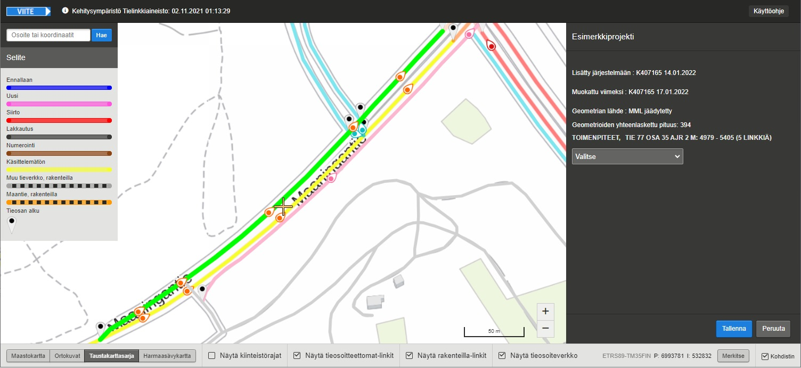

_Kuva 7.2: Aihion valinta käsittelyyn. Kun keltaista aihiota klikataan, muuttuu valittu tieosa vihreäksi, ja oikeaan laitaan tulee näkyviin valikko, jossa ovat valittavissa tieosoitemuutosprojektin mahdolliset muutosilmoitukset._

Tieosoitteiden suunta- ja etäisyyslaskennat tehdään kaikkien linkkien käsittelyn jälkeen _Päivitä etäisyyslukemat_ -napista (5).
Onnistuneen etäisyyslukemien päivityksen jälkeen kaikilla linkeillä on m-arvot ja suuntanuolet. Tarkista silmämääräisesti niiden oikeellisuus. 
Mikäli laskenta törmäsi loogiseen virheeseen, listataan käyttäjälle tarkatusilmoitukset havaituista ongelmista.  
Mikäli laskennassa ei havaittu puutteita tai virheitä, voi käyttäjä seuraavaksi avata nyt aktivoituneesta _Avaa projektin yhteenvetotaulukko_-napista(6) yhteenvetotaulukon.
Projektissa tehdyt toimenpiteet näkyvät yhteenvetotaulukossa listana, josta käyttäjä näkee kootusti kaikki muutokset ja lisäykset, joita tieosille on projektissa tehty (4). 
Yhteenvetotaulukon toiminta on kuvattu tarkemmin luvussa 7.2. Lisäksi kaikki projektin muutostiedot voidaan hyväksyä tieverkolle klikkaamalla vihreää _Hyväksy tieosoitemuutokset_ -painiketta (5). Muutosilmoituksen lähettäminen on kuvattu luvussa 7.4. 

Muutokset tallennetaan oikean alakulman _Tallenna_-painikkeesta. Ennen tallennusta muutokset voi perua _Peruuta_-painikkeesta, jolloin Viite palaa edeltävään vaiheeseen.

Jos käyttäjä on jo tehnyt projektissa muutoksia tieosoitteille, ne tulevat näkyviin lomakkeelle klikattaessa kyseistä tielinkkiä. Jos esimerkiksi tieosalle on toteutettu Lakkautus, tieosaa valittaessa tiedot sen lakkautuksesta ilmestyvät lomakkeelle, ja tieosalle on mahdollista tehdä toinen toimenpide. Mahdolliset uudet toimenpidevaihtoehdot kunkin toimenpiteen tallentamisen jälkeen on kuvattu tarkemmin seuraavissa luvuissa. 

Kartalla näkyvien teiden väritys on projektitilassa erilainen kuin katselutilassa. 
Projektiin varaamattomien teiden perusvärit vastaavat katselutilaa, mutta projektiin varattujen teiden osalta väritys vastaa kyseiselle tien osalle tehtyä toimenpidettä. 
Projektitilan selite kuvaa linkkiverkkoon tehdyt toimenpiteet, kun taas katselutilan selite kuvaa tieluokitusta.

7.1 Toimenpiteiden kuvaukset
--------------------------
### Yleistä toimenpiteiden tekoprosessista
#### Toimenpiteiden tekemisen esiehdot
Uusi-toimenpidettä lukuunottamatta käsiteltävä tieosa tai käsiteltävät tieosat täytyy ensin varata tieosoiteprojektiin (Ks. 6.1, kohta _Tieosien varaaminen projektiin_).
Kaikki toimenpiteet tehdään toimenpidenäkymässä, jonne päästään _Jatka toimenpiteisiin_ -painikkeesta projektin luonti- tai muokkausnäkymästä käsin.   
Muut toimenpiteet kuin Uusi: Projektiin varatut mutta vielä käsittelemättömät tieosat näkyvät kartalla keltaisina aihioina. Valitse kartalta aihio tai aihiot, joille haluat tehdä toimenpiteen.   
Uusi-toimenpide: valitse kartalta tieosoitteistamaton tai rakenteilla oleva tieosuus, jonka haluat osoitteistaa.   
Valittuina tielinkit muuttuvat vihreiksi. Ctrl+klikkauksella lisätä tai poistaa yksittäisiä linkkejä valinnasta.   
Oikeaan reunaan, toimenpidelomakkeelle, tulevat tiedot valituista linkeistä, sekä pudotusvalikko, josta kulloinkin tehtävissä olevat toimenpiteet voi valita.

#### Toimenpiteiden teon jälkeen
Varsinaisen toimenpiteen teon jälkeen osoitteiston m-arvot, sekä uusi- ja kääntötoimenpiteiden tapauksessa myöskään tielinkkien suunnat, eivät ole vielä välttämättä laskettu oikein.
Kaikkien projektin toimenpiteiden teon jälkeen täytyy projektin muokkaaman tieosoiteverkon tiedot laskea _Päivitä etäisyyslukemat_-nappia klikkaamalla. 
Tällöin Viite laskee linkeille suunnat, ja päivittää etäisyyslukemat vastaamaan uutta tilannetta toimenpiteiden jälkeen. 
Etäisyyslukemien laskenta voi tässä yhteydessä löytää toimenpiteistä korjattavaa, jolloin käyttäjälle näytetään lista validointivirheistä, eikä projektin teossa pääse eteenpäin, ennen kuin toimenpiteet on korjattu virheettömiksi.
Kun etäisyyslukemien päivityksen yhteydessä ei havaita enää enempää ongelmia, käyttäjä päästetään tarkastelemaan projektin yhteenvetotaulukoa (ks. luku 7.3), ja sen jälkeen hyväksymään projektin toimenpiteitä tieosoiteverkolle (luku 7.4).

7.1.1 Lakkautus
--------------------------

Lakkautus-toimenpiteellä lopetetaan tielinkkien tieosoitteistuksen voimassaolo.   

Toimenpidelomakkeen pudotusvalikosta valitaan Lakkautus (1). Tämän jälkeen muutos tallennetaan projektiin (_Tallenna-_). Lakkautetut linkit näkyvät tämän jälkeen kartalla mustina (2).
Mikäli on lakkautettu vain osa tieosan linkeistä, tulee tieosan muut kuin lakkautetut linkit käsitellä joko Ennallaan- tai Siirto-toimenpiteillä tilanteesta riippuen. 

7.1.2 Uusi
--------------------------
Uusi-toimenpiteellä määritetään tieosoitteisto tieosoitteettomille tielinkeille.   

Tieosoitteettomia linkkejä (piirtyvät kartalle harmaina) tai rakenteilla olevia linkkejä (piirtyvät kartalle katkoviivoina) voi toimenpidenäkymässä valita kerta- kaksois- tai Ctrl+klik-klikkauksilla kuten tieosoitteellisiakin tielinkkejä. 
Kaksoisklikkaus valitsee yhden tielinkin. Ctrl+klikkauksella voi lisätä tai poistaa valintaan linkkejä yksi kerrallaan. 
Kertaklikkaus valitsee ns. homogeenisen jakson, jonka määrittämiseen käytetään VVH:n tielinkin tienumeroa ja tieosanumeroa. Tienumeron tai tieosanumeron puuttuessa valinnassa käytetään tienimeä.

Toimenpidelomakkeen pudotusvalikosta valitaan Uusi (1). Lomakkeelle avautuvat kentät uuden tieosoitteen tietoja varten (2). 
Jos valitulla tieosuudella on jo olemassa VVH:ssa tienumero ja tieosanumero, ne esitäyttyvät kenttiin automaattisesti.
Linkkien Hallinnollista luokkaa voi muokata pudotusvalikosta (3). Tien nimi (4) on pakollinen tieto, kun tien numero on pienempi kuin 70000. 
Uudelle tieosoitukselle voi antaa mitatut alku- ja loppuetäisyydet _Alussa_- ja _Lopussa_ -kenttiin (5).
Tien kasvusuunnan voi kääntää _Käännä tieosan kasvusuunta_-napista (6), mutta tästä toiminnosta on enemmän hyötyä sen jälkeen, kun etäisyyslukemien laskemisen jälkeen tien alkuperäinen satunnainen kasvusuunta tulee näkyviin.
Uuden tieosoitteistuksen tiedot tallennetaan _Tallenna_-painikkeesta (7). Ennen tallennusta muutokset voi perua _Peruuta_-painikkeesta. 
Tallennuksen jälkeen uuden tieosoitteen linkit piirtyvät kartalle pinkillä (8). 

_Kuva 7.3: Kun valitaan toimenpide Uusi, oikeaan laitaan tulee näkyviin kentät uuden tieosoitteen syöttämistä varten._ Uuden tieosoitteen linkit piirtyvät kartalle pinkillä. 

Jos syötetty uusi tieosoite on jo olemassa tieosoiteverkolla projektin alkupäivänä tai se on varattuna toisessa tieosoiteprojektissa, tieosoitetta ei voi tallentaa, vaan käyttäjä saa tästä ilmoituksen.

_Kuva 7.4: Tieosoite on jo olemassa projektin alkupäivänä._

Tallennettuun tieosoitteeseen voi jatkaa uusien linkkien lisäämistä vaiheittain. Ensin valitaan tallennetun tieosan jatkeeksi seuraava linkki. Sitten valitaan lomakkeelta toimenpide Uusi, annetaan linkille sama tieosoite (TIE= tienumero, OSA=tieosanumero, AJR=ajoratakoodi) ja tallennetaan. Viite täyttää automaattisesti ELY-koodin, joka määräytyy tielinkin kuntakoodin perustella VVH:sta. 

Projektin voi myös tallentaa ja sulkea ja jatkaa lisäystä samaan tieosoitteeseen myöhemmin. Kasvusuunta lisätylle osuudelle määräytyy aiemmin osoitteistettujen linkkien mukaan ja sitä voi edelleen muuttaa "Käännä kasvusuunta" -painikkeella. Etäisyysarvot (M-arvot) päivittyvät koko tieosalle, jolle on annettu sama tieosoite.

__Uuden kiertoliittymän alkupaikan muuttaminen__

Jos Uusi-toimenpiteellä tieosoitteistetuilla kiertoliittymän linkeillä on VVH:ssa (esim. Suravage-linkit) tienumero, kiertoliittymän voi ns. "pikaosoitteistaa". 
Pikaosoitteistaminen tapahtuu klikkaamalla kiertoliittymän alkukohdaksi haluttua linkkiä. Tällöin koko kiertoliittymän linkit tulevat valituiksi. Uusi toimenpide asettaa alkukohdaksi klikatun linkin.

Muussa tapauksessa kiertoliittymän alkukohta asetetaan manuaalisesti kahdessa vaiheessa:
1. Valitaan alkupaikka kaksoisklikkaamalla kiertoliittymän linkkiä tieosoitteen haluttuun alkupaikkaan. Valitulle linkille annetaan Uusi-toimenpiteellä tieosoite. 
2. Kiertoliittymän loput linkit valitaan Ctrl+klikkaamalla ja annetaan niille sama tieosoite.    

Tieosoiteprojektissa Uusi-toimenpiteellä jo tieosoitteistetun kiertoliittymän alkupaikka muutetaan palauttamalla kiertoliittymä ensin tieosoitteettomaksi ja osoitteistamalla se uudelleen. Valitse tieosoitteistettu kiertoliittymä ja käytä toimenpidettä *Palautus aihioksi tai tieosoitteettomaksi*. Toimenpiteen jälkeen kiertoliittymän voi tieosoitteistaa uudelleen halutusta alkupaikasta aloittaen.

7.1.3 Ennallaan
--------------------------
Ennallaan-toimenpiteellä ilmoitetaan sellaiset muutokset, jotka eivät vaikuta valittujen tielinkkien tieosoitteeseen.

Tieosan linkkien tieosoitteen voi säilyttää ennallaan esimerkiksi silloin, kun osalle tieosaa halutaan tehdä tieosoitemuutoksia ja osan halutaan säilyvän ennallaan. 
Tieosoite pysyy muuttumattomana myös silloin, jos vain hallinnollistyyppisiä tietoja (ELY, Hallinnollinen luokka, tien jatkuvuus, tien nimi) muutetaan.

Toimenpidelomakkeen pudotusvalikosta valitaan Ennallaan, tehdään tarvittaessa halutut hallinnollisten tietojen muutokset, ja lopuksi tallennetaan _Tallenna_-painikkeesta.
Ennallaan-toimenpiteellä käsitelty linkki näkyy toimenpidenäkymässä sinisenä.

Huom. Jos muutat hallinnollista luokkaa, huomioi, että Digiroadin tiedot tarvitsevat projektin tieverkolle päivityksen jälkeen myös muutoksia.

7.1.4 Siirto
--------------------------
Siirto-toimenpide tehdään tielinkeille uusien etäisyysarvojen (m-arvojen) laskemiseksi, tai tieosoitenumeroinnin (tienumero, tieosanumero, ajoratakoodi) muuttumisen vuoksi.   

Siirtoa käytetään, kun osa tieosan linkeistä käsitellään jollain muulla toimenpiteellä (lakkautus, uusi, numerointi), ja loppujen linkkien m-arvot täytyy laskea uudelleen. 
Osalle tieosan linkeistä voidaan tehdä lakkautus, lisätä tielle uusia linkkejä ja pitää osa linkeistä ennallaan.

Toimenpidelomakkeen pudotusvalikosta valitaan Siirto, tarvittaessa muutetaan tieosoitteistuksen tiedot, ja lopuksi siirtotoimenpide tallennetaan _Tallenna_-painikkeesta.
Siirretyt linkit muuttuvat toimenpidenäkymässä punaisiksi. 

Huom. Jos muutat hallinnollista luokkaa, huomioi, että Digiroadin tiedot tarvitsevat projektin tieverkolle päivityksen jälkeen myös muutoksia.

7.1.5 Numerointi
--------------------------
Tieosoitteen numeroinnin muutoksella tarkoitetaan Viitteessä kokonaisen tieosan tieosoitteistuksen (tienumero, tieosanumero) muuttamista yhdellä kertaa. 

Toimenpidenäytöltä riittää valita mikä tahansa osuus uudelleen numeroitavalta tieosalta. Yksikin linkki riittää. Valittu linkki/linkit muuttuu vihreäksi. 
Toimenpidelomakkeen pudotusvalikosta valitaan Numerointi. Viite poimii koko tieosan mukaan valintaan, ja käyttäjälle tulee tästä ilmoitus. 
Vaihdetaan tieosoitteen tietoihin uusi tieosanumerointi ja tarvittaessa muut tiedot, ja lopuksi numerointitoimenpide tallennetaan _Tallenna_-painikkeesta.
Koko tieosan linkit muuttuvat toimenpidenäkymässä ruskeiksi. 
Koska numeroinnin muutos kohdistuu koko tieosaan, muita toimenpiteitä ei tallennuksen jälkeen kyseiselle tieosalle tarvitse tehdä. 

Mikäli on tarpeen muuttaa vain tietyn linkin numerointia tieosalla, tehdään tämä operaatio Siirto-toimenpiteenä. 

7.1.6 Kääntö
--------------------------
Tieosoitteen kasvusuunnan voi kääntää Viitteessä joko esimerkiksi siirron tai numeroinnin yhteydessä. 
Kääntö tapahtuu joko automaattisesti, tai tietyissä tilanteissa käyttäjä tekee käännön manuaalisesti.  

#### Automaattinen kääntö siirron yhteydessä

Kun siirretään tieosa (osittain tai kokonaan) toiselle tieosalle, jolla on eri tieosoitteen kasvusuunta, Viite päättelee siirron yhteydessä kasvusuunnan siirrettäville linkeille automaattisesti, ja siis kääntää siirrettävät linkit automaattisesti. 

Alla olevassa kuvasarjassa on tehty esimerkinomaisesti siirto ja kääntö osalle tieosaa siten, että tieosan alku siirtyy toisen tieosan alkuosaksi. Projektiin on varattu tie 459, osa 1 ja tie 14, osa 1 (näkyvät kartalla keltaisella). 
Osa tien 14 linkeistä halutaan siirtää tielle 459 osalle 1 (lännen suuntaan), jolloin siirrettävät linkit valitaan kartalta. 
Lomakkeelta valitaan muutosilmoitus Siirto (1). Annetaan kohtaan TIE arvoksi kohdetien numero 459. 
Muut tiedot säilyvät tässä esimerkissä ennallaan, mutta myös tieosaa, hallinnollista luokkaa ja jatkuvuuskoodia tulee tarvittaessa muuttaa. 
Tallennetaan muutokset (2).   
Tämän jälkeen siirtoon ja kääntöön voi valita lisää linkkejä tieltä 14 tai jättää loput vanhoille tieosilleen. 
Mikäli muuta ei tehdä, tulee sekä tieosan 459/1 että tieosan 14/1 loput linkit käsitellä Siirto-toimenpiteellä.

Etäisyyslukemien laskennan (_Päivitä etäisyyslukemat_ -nappi) jälkeen kohde muuttuu siirretyksi ja tieosoitteen kasvusuunta päivittyy vastaamaan tien 459 kasvusuuntaa (3). 

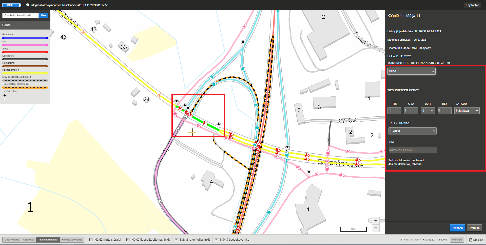

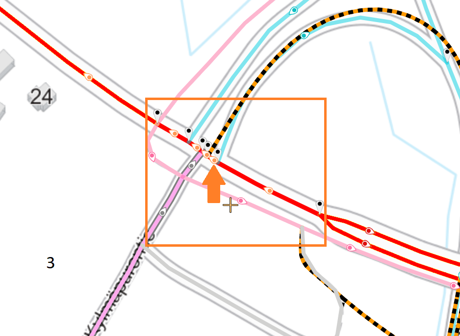

_Kuva 7.7: Kuvasarjassa siirretään osa tiestä 14 tielle 459. Tieosoitteiden kasvusuunnat teillä ovat vastakkaiset, jolloin siirrossa tieltä 14 siirrettyjen linkkien kasvusuunta kääntyy._

#### Tieosan manuaalinen kääntö

Manuaalista kääntöä varten Viitteessä on _Käännä kasvusuunta_ -painike. Painike aktivoituu lomakkeelle, kun käyttäjä on tehnyt varaamalleen aihiolle siirto- tai numerointi-toimenpiteen ja tallentanut sen. Kun näin käsiteltyä aihiota klikataan kartalla, lomakkeella näkyvät tehty ilmoitus ja sen tiedot sekä _Käännä kasvusuunta_ -painike. Kun sitä klikataan ja sen jälkeen tallennetaan, tieosan kasvusuunta kääntyy.

Manuaalinen kääntö koskee aina koko tieosaa. Sen vuoksi manuaalista kääntöä ei voi suorittaa, jos joku tieosan linkeistä on käsitelty toimenpiteellä Ennallaan.

_Kuva 7.8: Manuaalinen kääntö siirron tai numeroinnin yhteydessä_

#### Kaksiajorataisen osuuden kääntö

_!Tämä ohjeen osio saattaa olla vanhentunut!_   
Kun käännetään tieosan kaksiajoratainen osuus, se tehdään edellä kuvatulla tavalla siirron tai numeroinnin yhteydessä yksi ajorata kerrallaan. Kartalta valitaan haluttu ajorata ja lomakkeelta joko siirto tai numerointi. Määritetään uusi ajoratakoodi sekä muut tarvittavat tieosoitemuutostiedot lomakkeelle ja tallennetaan. Mikäli tieosoitteen kasvusuunta ei automaattisesti käänny (esim. kun käsitellään yhtä tieosaa), tehdään kääntö manuaalisesti _Käännä kasvusuunta_ -painikkeella.   
_!Tämä ohjeen osio saattaa olla vanhentunut!_

<!-- Kenttien olemassaolo mainittu Uusi-toimenpiteen yhteydessä. Käytön detaljit vaativat selvennystä.
7.1.7 Etäisyyslukeman muutos
--------------------------
Tieosoiteprojektissa uudelle tieosoitteistettavalle tieosalle on mahdollista asettaa käyttäjän antama tieosan loppuetäisyyslukema. Ensin valitaan haluttu tieosa kartalta, jonka jälkeen lomakkeelle ilmestyy kenttä, johon loppuetäisyyden voi muuttaa. Muutettu arvo huomioidaan lomakkeella punaisella huutomerkillä.
-->

7.1.7 ELY-koodin, jatkuvuuden ja hallinnollisen luokan muutos
--------------------------
Viitteessä voi muokata ELY-koodia, jatkuvuutta ja hallinnollista luokkaa. Näitä muutoksia voi tehdä esimerkiksi Ennallaan-toimenpiteellä, jolloin lomakkeelle tulee pudotusvalikot ELYlle, jatkuvuudelle ja hallinnolliselle luokalle. Uudet arvot annetaan valitulle aihiolle ja tallennetaan. Jatkuvuus-koodi näytetään valinnan viimeiseltä linkiltä ja myös muutokset kohdistuvat viimeiseen linkkiin. Hallinnollisen luokan ja ELY-koodin muutos kohdistuu kaikkiin valittuihin linkkeihin. Ennallaan-toimenpiteen lisäksi näitä arvoja voi muokata aina, kun ne ovat muutosilmoituksen yhteydessä lomakkeella muokattavissa. 

<!-- "5 Jatkuva (Rinnakkainen linkki)"-valinta ei ole enää käytössä AWS-versioon siirryttäessä.
Huom! Jatkuvuuskoodia 5 on valittavissa kaksi eri vaihtoehtoa. Koodia _5 Jatkuva (Rinnakkainen linkki)_ käytetään kaksiajorataisella tiellä osoittamaan rinnakkainen linkki silloin, kun toisella ajoradalla on lievä epäjatkuvuus, eikä automaatio ole löytänyt oikeaa linkkiparia. Jatkuvuuskoodi _4 Lievä epäjatkuvuus_ annetaan normaalisti toisen ajoradan epäjatkuvuuskohtaan. Viite antaa automaattisesti kalibrointipisteet molemmille ajoradoille. Jos rinnakkaisen ajoradan kalibrointipiste ei ole halutussa kohdassa, valitaan haluttu rinnakkainen linkki ja annetaan sille koodiksi _5 Jatkuva (Rinnakkainen linkki)_. Tällöin kalibrointipiste tulee kyseisen linkin loppuun, ja ajoratojen AET- ja LET-arvot saadaan täsmättyä lievään epäjatkuvuuskohtaan.
-->

7.2 Tarkastukset
--------------------------

Viite-sovellus tekee tieosoiteprojektissa automaattisia tarkastuksia, jotka auttavat käyttäjää valmistelemaan tieosoiteverkon muutokset hyväksyttävään muotoon. Tarkastukset ovat projektissa jatkuvasti päällä ja reagoivat projektin tilan muutoksiin. 
Avatun projektin tarkastusilmoitukset tulevat esiin "Jatka toimenpiteisiin" -painikkeen klikkauksen jälkeen, kun Viite on saanut käytyä läpi projektin senhetkisen tilan. 

Ensisijaisesti näytetään tiedot projektissa vielä käsittelemättömistä tieosoiteprojektille varatuista linkeistä. Nämä näytetään oranssilla värillä.
Kun kaikki projektiin varatut linkit on käsitelty jollain toimenpiteellä, näytetään muut Viiteen havaitsemat ongelmat tieverkolla. 

_Kuva 7.9: Tarkastusilmoitukset näkyvät projektissa oikealla._

Tarkastusilmoitus koostuu seuraavista kentistä:

|Kenttä|Kuvaus|
|------|------|
|Linkids|Tarkastuksen kohteena oleva yksittäisen tielinkin ID. Vaihtoehtoisesti linkkien lukumäärä, jos tarkastusilmoitus koskee useampaa linkkiä.|
|Virhe  |Kuvaus tarkastuksen havaitsemasta ongelmatilanteesta.|
|Info   |Mahdollisia lisäohjeita tarkastuksen virhetilanteen korjaamiseksi.|

_Kuva 7.10: Tielinkki 7304402 näyttää olevan tieosan viimeinen linkki, mutta sen jatkuvuuskoodi on joku muu kuin _Tien loppu_._ 

Painamalla _Korjaa_-painiketta karttanäkymä kohdistuu tarkastusilmoituksen kohteena olevan tielinkin keskikohtaan. Klikkaamalla painiketta uudestaan kohdistus siirtyy seuraavaan tielinkkiin, jos sama tarkastus kohdistuu useampaan linkkiin. Käyttäjä voi valita tarkastusilmoituksen kohteena olevan tielinkin ja tehdä sille korjaavan toimenpiteen. 

#### Tieosoiteprojektissa tehtävät tarkastukset:

Tieosoiteprojektiin kohdistuvat tarkastukset:

- Kaikille projektiin varatuille tielinkeille tulee tehdä jokin toimenpide
- Uusi tieosa ei saa olla varattuna jossakin toisessa tieosoiteprojektissa
- Tieosoitteen kasvusuunta ei saa muuttua kesken tien
- Tieosoitteellinen tie ei saa haarautua muuten kuin ajoratakoodin vaihtuessa
- Ajoratojen 1 ja 2 tulee kattaa samaa osoitealue
- Tieosoitteelta ei saa puuttua tieosoiteväliä (katkoa m-arvoissa)

Jatkuvuuden tarkastukset:

- Tieosan sisällä jatkuvissa kohdissa (aukkopaikka alle 0,1 m), jatkuvuuskoodin tulee olla _5 Jatkuva_.
- Tieosan sisällä epäjatkuvuuskohdissa (aukkopaikka yli 0,1 m) jatkuvuuskoodi tulee olla _4 Lievä epäjatkuvuus_. Tieosan sisäisen epäjatkuvuuden pituudelle ei ole asetettu ylärajaa.
- Tieosan lopussa tulee olla jatkuvuuskoodi _2 Epäjatkuva_ tai _4 Lievä epäjatkuvuus_, jos ennen tien seuraavaa tieosaa on epäjatkuvuuskohta. Seuraavaa tieosaa ei ole välttämättä valittu projektiin, joten tarkastus huomioi myös projektin ulkopuoliset tieosat.
- Tieosoitteen viimeisellä (suurin tieosanumero) tieosalla tulee olla jatkuvuuskoodi _1 Tien loppu_.
- Jos tieosoitteen viimeinen tieosa lakkautetaan kokonaan, tien edellisellä tieosalla tulee olla jatkuvuuskoodi _1 Tien loppu_. Tätä tieosaa ei ole välttämättä valittu projektiin ja siksi tarkastus ulottuu myös projektin ulkopuolisiin tieosiin.
- Jos tieosan seuraava tieosa on eri ELY-koodilla, jatkuvuuskoodin tulee olla tieosan lopussa _3 ELYn raja_.

7.3 Yhteenvetotaulukko: Muutosilmoitusten tarkastelu taulukkonäkymässä
--------------------------
Kun projektilla ei ole enää korjaamattomia tarkastusilmoituksia, kaikki projektin aihiot on käsitelty, validointivirheitä ei enää ole, ja etäisyyslukemat on päivitetty onnistuneesti, pääset avaamaan projektin yhteenvetotaulukon.   
Projektin yhteenvetotaulukossa näet kerralla kaikki projektissa tehdyt toimenpiteet, ja tässä vaiheessa on hyvä tarkistaa, että kaikki tehdyt muutokset näyttävät siltä miltä pitääkin. 
_Avaa projektin yhteenvetotaulukko_ -painikkeesta (1) avautuu taulukkonäkymä, joka kertoo projektissa olevien tieosoitteiden vanhan ja uuden tilanteen Viiteessä. 
Taulukossa rivit on järjestetty suurimmasta pienimpään tieosoitteen mukaan (tie, tieosa). Rivien järjestystä voi muokata nuolipainikkeilla (2). 

Taulukon rivien tietoja voi kopioida maalaamalla halutut tiedot hiirellä ja kopioimalla ne (esim. hiiren oikean napin takaa valikosta, tai ctrl+c). 

Taulukon kokoa saa muutettua taulukon yläkulmassa olevasta _Suurenna_-painikkeesta (3).
<!-- MITÄHÄN IHMETTÄ TÄLLÄ HAETAAN? :
Viite-sovelluksen voi venyttää kahdelle näytölle, joista toisella voi tarkastella muutostaulukkoa ja toisella käyttää karttanäkymää.--> 
Taulukkoa voi liikuttaa tarraamalla osoittimella yläpalkista. Yhteenvetotaulukko ei välttämättä näy oikeanlaisena, jos selaimen zoom-taso on liian suuri. 
Ongelma korjaantuu palauttamalla selaimen zoom-taso normaaliksi (Firefox/Chrome Ctrl+0). 

Taulukon saa pois näkyvistä Sulje-painikkeesta (4).

_Kuva 7.11: Muutosilmoitustaulukko toimintoineen._

7.4 Muutosilmoitusten hyväksyminen tieosoiteverkolle
----------------------------------------------------

Kun Yhteenvetotaulukossa listattavat toimenpiteet näyttävät oikeilta, voi muutokset hyväksyttää tieverkolle.
_Hyväksy tieosoitemuutokset_-nappi aktivoituu yhteenvetotaulukon ollessa auki. 
Painikkeen painamisen jälkeen sovellus ilmoittaa muutosten tieverkolle tallentamisesta "Muutoksia viedään tieosoiteverkolle" -viestillä.

Huom. Aiemmin muutokset vietiin prosessin tässä vaiheessa Viiteestä Tierekisteriin. Tierekisterin poistuttua tieverkon muutostiedot jäävät vain Viiteeseen, josta muut sovellukset niitä tarvitessaan hakevat.

_Kuva 7.13: Muutosten hyväksymispainike oikeassa alakulmassa._

Kun muutokset on lähetetty hyväksyttäväksi tieverkolle, muuttuu projektin tilatiedoksi *Päivitetään tieverkolle*. Viite-sovellus tarkistaa minuutin välein, onko tietojen päivitys tieosoiteverkolle saatu jo vietyä loppuun saakka.
Kun muutos on käsitelty onnistuneesti, tieosoiteprojektin tilaksi vaihtuu *Hyväksytty*, ja tieosoiteprojekti on nyt valmis. 
Mikäli muutosten tieverkolle viemisessä havaittiin vielä jokin ongelma, tilaksi päivittyy *Virhe Viite-sovelluksessa* ja listalle tulee oranssi "Avaa uudelleen" -painike. Viemällä hiiren *Virhe Viite-sovelluksessa* -tekstin päälle virheen infolaatikko tulee näkyviin. 
Virhe korjataan avaamalla projekti, ja tekemällä tarvittavat muokkaukset, minkä jälkeen korjatut muutokset täytyy uudelleen hyväksyttää tieverkolle.  

Tässä koostettuna tieosoiteprojektin tilat:

|Tieosoiteprojektin tila|Selite|
|------|------|
|Keskeneräinen|Projekti on työn alla ja sitä ei ole vielä hyväksytty tieverkolle.|
|Odottaa tieverkolle päivittämistä|Viiteen tieverkolle hyväksymisen prosessi ei ole vielä ottanut tieosoiteprojektia käsittelyyn.|
|Päivitetään tieverkolle|Projekti on Viiteen käsittelyssä. Viite vie projektin sisältämiä muutosilmoituksia tieverkolle.|
|Hyväksytty|Projekti on hyväksytty Viiteessä. Muutokset näkyvät myös Viite-sovelluksessa.|
|Virhe Viite-sovelluksessa |Viite ei hyväksynyt projektia. Tarkempi virheilmoitus tulee näkyviin viemällä osoittimen "Virhe Viite-sovelluksessa"-tekstin päälle. Projektin voi avata uudelleen.|
|Poistettu projekti|Projekti on poistettu ennen tieverkolle hyväksymistä.| 

8 Tienimien ylläpito
--------------------------

Viiteessä teillä, joiden tienumero on pienempi kuin 70 000, tienimi on pakollinen tieto. Tienimi annetaan toimenpidelomakkeella uutta tietä osoitteistettaessa.

Jos annettu tienimi täytyy vaihtaa tai sitä pitää muokata esim. kirjoitusvirheen vuoksi, käytetään _Tiennimen ylläpito_ -työkalua, joka avataan alkutilasta (karttakäyttöliittymän katselutilasta) Tieosoiteprojektit-painikkeen alta näytön oikeasta reunasta (kuva 6.1).

Muokattavat tienimet haetaan tienumeron perusteella kirjoittamalla tien numero lomakkeen syöttökenttään (1) (kuva 8.1). Tiennimen ylläpito -ikkuna suljetaan klikkaamalla oikeasta yläkulmasta löytyvästä rastista (2).

 

_Kuva 8.1: Tienimen ylläpito -työkalun lomake._

8.1 Tien nimen muokkaaminen, kun tiellä on jo nimi
--------------------------

Kun tienumero on kirjoitettu syöttökenttään, ja on painettu _Hae_-painiketta, hakutulokset listautuvat hakukentän alapuolelle otsikkorivien alle (1). Listalla näkyvät tien aiemmat nimet alku- ja loppupäivämäärineen. Voimassa oleva nimi on listassa alimpana (2). Sitä voi muokata (syöttökenttä on valkoinen). Rivin lopussa on [+] –painike (3), jos haettu tie on voimassa oleva. Voimassa olevalla nimellä ei ole loppupäivämäärää (4). Hakukenttä ei tyhjene, mutta uuden haun voi tehdä kirjoittamalla uuden tienumeron hakukenttään ja painamalla jälleen _Hae_.

_Kuva 8.2: Listaus tienimistä ja uudelleenhaku._

Jos tie on lakkautettu, tien nimi näkyy harmaana (kuva 8.3) eikä [+] -painiketta ole. 

_Kuva 8.3: Lakkautettu tie. Tien nimeä ei voi enää muuttaa._

Voimassa olevaa nimeä voi muokata suoraan "Tien nimi" -kentässä (2) (Kuva 8.2). Tallenna-painike (5) aktivoituu, kun nimeä muokataan. Tallennuksen jälkeen tulee ilmoitus jo olemasta olevasta nimestä (kuva 8.4). Kun nimeä muokkaa, se ei saa uutta loppupäivämäärää eikä uutta riviä muodostu listalle.

_Kuva 8.4: Varmistusilmoitus tienimen muuttamisesta._ 

8.2 Uuden tienimen antaminen tielle, jolla on jo nimi
--------------------------

Tielle on mahdollista antaa uusi nimi esimerkiksi tien alku- tai loppupaikkakunnan muuttuessa. Uusi nimi annetaan painamalla voimassa olevan nimen perässä olevaa [+] -painiketta (3) (kuva 8.2) . Lomakkeelle ilmestyy uusi rivi (1), johon tiedot syötetään (kuva 8.5). Tielle annetaan uusi nimi (2), joka voi olla enintään 50 merkkiä pitkä, sekä alkupäivämäärä (3). Alkupäivämäärä voi olla aikaisintaan edellistä alkupäivämäärää seuraava päivä.
Edellinen nimi saa loppupäivämääräksi (4) automaattisesti uuden nimen alkupäivämäärän. Jos uutta nimeä ei halutakaan tallentaa, painetaan [-]-painiketta (5), jolloin alin rivi poistuu. Uusi nimi tallennetaan Tallenna-painikkeella. Viite varmistaa, halutaanko tielle varmasti antaa uusi nimi. 

_Kuva 8.5: Uuden tienimen antaminen_ 

Kun käyttäjä on tallentanut uuden nimen, muuttuu [-] -painike [+] -painikkeeksi ja vain "Tien nimi" -kenttää on mahdollista muokata (Ks. tien nimen muokkaaminen, kun tiellä on nimi). 

_Kuva 8.6: Uusi nimi on tallennettu onnistuneesti. Loppupvm-kenttä ei ole aktiivinen, mutta tienimeä voi muuttaa. Uuden nimen voi tallentaa [+]-painikkeella._

Kirjoitusvirheiden karsimiseksi Viitteessä on päivämäärärajaus. Nimen alkupäivämäärä voi olla enintään 5 vuoden kuluttua nimenantopäivämäärästä. Toisin sanoen, jos käyttäjä antaa 1.3.2019 tielle uuden nimen, voi tien alkupäivämäärä olla viimeistään 28.2.2024.

9 Solmut ja liittymät
--------------------------

9.1 Solmujen ja liittymien ylläpitoprosessit
--------------------------

9.1.1 Tieosoitemuutosprojekti
--------------------------

Tieosoiteprojekteissa tehdyistä muutoksista Viite tunnistaa uudet tien tai tieosan alku- tai loppupisteet sekä hallinnollisen luokan vaihtumiskohdat. Näihin se luo solmukohta-aihiot. Tieosoitemuutoksista Viite tunnistaa myös uudet liittymät, joihin Viite luo liittymäaihiot liittymäkohtineen. 

Viite tunnistaa myös tieosoitemuutoksien yhteydessä tarpeettomaksi jäävät solmut, solmukohdat ja liittymät, jotka se päättää automaattisesti. 

Viite myös päivittää nykyisten solmujen solmukohtia ja nykyisten liittymien liittymäkohtia tieosoitemuutoksien mukaisesti.

9.1.2 Solmut ja liittymät 
--------------------------
 
Käyttäjä liittää solmukohta- ja liittymäaihiot solmuun. Tarvittaessa käyttäjä luo liittämisen yhteydessä uuden solmun. Jos jollakin solmun tieosalla ei ole solmukohtaa, järjestelmä laskee solmuun liitettyjen liittymien perusteella näille solmun tieosille solmukohdat.

Käyttäjä voi liittää samaan solmuun useita saman tieosan solmukohtia. Käyttäjä voi myös irrottaa solmukohdan tai liittymän solmusta. Liittymien perusteella laskettuja solmukohtia käyttäjä ei voi irrottaa solmusta, ainoastaan tien tai tieosan alku- tai loppupisteen sekä hallinnollisen luokan vaihtumiskohdan solmukohdat voi irrottaa solmusta. Irrotetettu solmukohta tai liittymä muuttuu takaisin aihioksi, jonka käyttäjä voi liittää toiseen solmuun.

Jos käyttäjä liittää liittymäaihion solmuun tai irrottaa liittymän solmusta, järjestelmä päivittää liittymien perusteella lasketut solmukohdat.

Jos käyttäjä liittää solmuun solmukohta-aihion, järjestelmä poistaa ko. tieosalta liittymien perusteella lasketun solmukohdan.

Jos käyttäjä irrottaa solmusta solmukohdan, järjestelmä laskee liittymien perusteella solmukohdat niille tieosille, joilla ei ole enää  tien tai tieosan alku- tai loppupisteen sekä hallinnollisen luokan vaihtumiskohdan solmukohtia.

9.2 Solmujen ja liittymien ylläpitotyökalu
--------------------------

_Solmut ja liittymät_-työkalu avataan klikkaamalla karttanäkymän oikeassa reunassa sijaitsevaa Solmut ja liittymät -painiketta.

_Kuva 9.1: Solmut ja liittymät -työkalun avaaminen._ 

Avautuneessa näkymässä solmut esitetään kartalla vinoneliösymboleina. Solmutyyppien selitteet (1) löytyvät vasemmasta reunasta. Sieltä löytyvät myös liittymä-, liittymäaihio- ja solmukohta-aihiosymboleiden selitteet (2) sekä muokkausoikeuksilla käytettävissä oleva työkalu solmun valintaan (3). 

Näkymän oikeassa reunassa on solmujen hakutoiminto (4). Hakutoiminnosta tarkemmin luvussa 9.3 (Solmujen haku).

Hakutoiminnon alapuolella näytetään listat käsittelemättömistä liittymä- ja solmukohta-aihioista (5). Näistä tarkemmin kappaleessa 9.4 (Lista liittymä- ja solmukohta-aihioista).

Työkalusta poistutaan klikkaamalla oikean yläkulman Sulje-painiketta. (6)

_Kuva 9.2: Solmut ja liittymät -työkalu._ 

Kun hiiren vie kartalla jonkin solmun päälle, tulee näkyviin infolaatikko (7), joka kertoo kyseisen solmun nimen ja solmutyypin.

Solmun liittymät tulevat näkyviin, kun zoomaa tasolle, jonka mittakaavajanassa on lukema 100 m. Liittymät esitetään sinisillä, numeroiduilla liittymäsymboleilla. Viemällä hiiren liittymän päälle käyttäjä saa esiin infolaatikon (8), jossa näytetään ko. liittymän tieosoite ja sen solmun nimi, johon liittymä on liitetty.

_Kuva 9.3: Solmun ja liittymän infolaatikot._ 

9.3 Solmujen haku
--------------------------

Solmujen tietoja voi hakea joko pelkän tienumeron, tai tienumeron ja tieosien (AOSA, LOSA) perusteella (1). Käyttäjä syöttää haluamansa arvot kenttiin, painaa _Hae solmut_ -painiketta (2) ja Viite listaa hakua vastaavat solmut formille.

_Kuva 9.3: Solmujen hakutulos._

Jos käyttäjä täyttää vain tienumeron, listataan kaikkien kyseisellä tiellä olevien solmujen tiedot. Jos käyttäjä antaa tienumeron ja tieosan, listataan kaikki kyseisen tieosan solmut. Jos käyttäjä on antanut sekä tieosien alku- että loppuosa-arvon, tuodaan näiden ja näiden välisten tieosien solmujen tiedot. Mikäli käyttäjä antaa tiedon vain AOSA- tai LOSA-kenttään, tulkitaan haun kohdistuvan vain sille tieosalle.
Haun jälkeen karttanäkymä zoomataan niin, että kaikki haetut solmut mahtuvat näytölle.

Lomakkeella näytetään solmuista seuraavat tiedot:
- tieosoite muodossa tie/osa/etäisyys ja solmun nimi
- solmutyyppi
- solmunumero

Lista järjestetään solmujen tieosoitteiden mukaisessa järjestyksessä pienimmästä suurimpaan.

Solmun tieosoiteriviä klikkaamalla voi zoomata kartalla kyseiseen solmuun (3).

Jos solmulla on samalle tienumerolle kaksi solmukohtaa, niistä käytetään solmukohdan jälkeen olevaa tieosoitetta. Jos solmukohdan tieosoite on hakualueen ulkopuolella, sitä ei näytetä tuloslistauksessa.

Tien viimeinen solmu näytetään aina, samoin ennen epäjatkuvuuskohtaa edeltävä solmu, kun tie jatkuu toisen solmun jälkeen.
Mikäli käyttäjän antama hakuehto tuottaa vastaukseksi yli 50 solmua, Viite antaa ilmoituksen: "Hakusi palauttaa yli 50 kohdetta, rajaa hakua pienemmäksi." Haun tuloksia ei listata.

_Tyhjennä tulokset_ -painike tyhjentää hakutuloslistan.

9.4 Lista liittymä- ja solmukohta-aihioista
--------------------------

Lomakkeella näytetään käyttäjän ELYn/ELYjen mukainen lista liittymä- ja solmukohta-aihioista kasvavassa tieosoitejärjestyksessä. Yhdestä liittymäkohdasta listataan yksi, pienimmällä tienumerolla oleva linkki. Tieosan vaihtumiskohdassa listataan alkavan tieosan 0-kohta.

Liittymäaihion osoite näytetään muodossa tie/ajr/osa/aet ja solmukohta-aihion osoite muodossa tie/osa/aet.  Osoite on linkki, jota klikkaamalla zoomataan kartalla kyseiseen kohtaan ja päästään käsittelemään aihiota. 

9.5 Nykyisen solmun tietojen katselu/muokkaaminen
--------------------------

Kun käyttäjä klikkaa vasemmassa reunassa sijaitsevaa _Solmun valinta_ -työkalua, muokkaustoiminto aktivoituu ja painikkeen tausta muuttuu vaaleansiniseksi aktivoitumisen merkiksi.  Tämän jälkeen käyttäjä valitsee kartalta solmun, jonka tietoja haluaa katsella tai muokata, ja formille avautuu tiedot solmusta (1), solmukohdista (2) ja liittymistä (3).

_Kuva 9.4: Solmun tiedot, solmukohdat ja liittymät._ 

Valinnan jälkeen muut kuin käyttäjän valitsema solmu ja sen liittymät näkyvät kartalla himmennettyinä.

_Solmun valinta_ -painike inaktivoituu tietojen tallennuksen tai peruutuksen jälkeen. 

#### Solmun tiedot

Lomakkeen nimikentässä voi muokata solmun nimeä. Solmun tyypin saa muutettua valitsemalla uuden tyypin pudotusvalikosta. Kun solmutyyppi on valittu, päivitetylle solmutyypille valitaan uusi alkupäivämäärä. Virheellisen solmutyypin voi korjata ilman päivämäärämuutosta.

Lopuksi käyttäjä voi tallentaa muutokset tai peruuttaa ne (4).
Tallenna-nappi on epäaktiivinen, kunnes solmulle on tehty joku muutos.

#### Solmun solmukohtien katselu

Solmun solmukohdista näytetään tienumero, tieosa, etäisyyslukema ja ennen/jälkeen-arvo (5). Solmukohtien tietoja ei voi muokata. 

Solmukohtatietorivin alussa on valintalaatikko solmukohdan irrotusta varten (6). Laskennallisia solmukohtia ei voi irrottaa, ja niiden riveiltä valintalaatikko puuttuu. 

_Kuva 9.5: Solmun solmukohdat._ 

#### Solmun liittymien katselu ja liittymänumeron muokkaus

Liittymistä näytetään liittymänumero, tienumero, ajorata, tieosa, etäisyyslukema ja ennen/jälkeen-arvo (7). Ennen/jälkeen-arvo kertoo, onko kyseistä riviä vastaava tielinkki tien kulkusuunnassa liittymää ennen vai sen jälkeen. Liittymät näytetään numerojärjestyksessä (8), liittymäkohdat allekkain tieosoitejärjestyksessä.

Käyttäjä voi muokata liittymänumeroa kirjoittamalla uuden liittymänumeron vanhan numeron tilalle (9). Solmulla ei voi olla useita samalla numerolla olevia liittymiä. Viite estää tällaisen tallennuksen. Tallennus on estetty myös silloin, jos liittymänumero(ita) puuttuu.

_Kuva 9.6: Solmun liittymät._ 

#### Solmun ja liittymien irrotus solmusta

Irrotettava solmukohta ja/tai liittymä valitaan klikkaamalla rivin alussa olevaa valintaruutua. Käyttäjä voi perua valintansa klikkaamalla valintaruutua uudestaan. 

_Kuva 9.7: Varmistus valinnan perumisesta_ 

Viite valitsee automaattisesti kaikki samassa kohdassa sijaitsevat solmukohdat ja liittymät irrotettaviksi. Käyttäjää pyydetään vahvistamaan irrotus (10).  

_Kuva 9.8: Solmukohtien ja liittymien irrotus_ 

_Kuva 9.9: Tilanne solmukohdan ja liittymien irrotuksen jälkeen_ 

Kun käyttäjä on valinnut irrotettavat liittymät ja solmukohdat, ja tallentanut muutokset, ko. solmukohdat/liittymät poistuvat näkyvistä (11) kartalta ja liittymänumero poistuu (12) formilta.

Nykyisen solmun muutokset tallennetaan _Tallenna_-painikeella tai peruutetaan _Peruuta_-painikkeella.
Tallennuksen jälkeen irrotetut liittymä- ja solmukohdat näkyvät kartalla aihioina.

_Kuva 9.9: Tallennuksen jälkeen irrotetut solmukohdat ja liittymät näkyvät kartalla aihioina._ 

9.6 Aihioiden liittäminen solmuun
--------------------------

#### Aihioiden liittäminen uuteen solmuun

Uusi solmu luodaan aihioiden käsittelyn yhteydessä. Käyttäjä valitsee liittymä- tai solmukohta-aihion joko suoraan kartalta (1) (huom. solmun valinta-työkalu ei toimi tähän) tai aihiolistalta ja klikkaa _Luo uusi solmu, johon haluat liittää aihiot_ -painiketta (2). Hiiren kursori muuttuu tällöin nuolesta ristiksi, jolla klikkaamalla haluttuun paikkaan kartalla solmu asetetaan klikattuun paikkaan (3).

Solmun sijaintia voi muokata raahaamalla sitä hiirellä. Siirtämisestä lisää kappaleessa 9.7 (Solmun sijainnin muokkaaminen).

_Kuva 9.10: Aihion liittäminen uuteen solmuun_ 

Tämän jälkeen formille avautuu solmun tiedot. Käyttäjä antaa solmulle nimen, solmutyypin sekä alkupäivämäärän (4). Solmukohta-aihion symboli poistuu karttanäkymästä heti, kun solmun tietoja päivitetään. Liittymäaihiolle käyttäjä antaa liittymänumeron (5), jolloin liittymäaihiosymboli muuttuu liittymäsymboliksi karttanäkymässä. Karttanäkymä päivittyy automaattisesti vastaamaan formin tilannetta aina kun formin tietoja muutetaan, mutta tiedot tallentuvat vasta tallennuksen yhteydessä. Tallenna-painike (6) aktivoituu, kun kaikki pakolliset tiedot on annettu. Tallennuksen jälkeen Viite luo uuden solmun ja formi palautuu Solmut ja liittymät -näytön alkutilaan.

#### Aihioiden liittäminen nykyiseen solmuun

Aihion (7) valinnan jälkeen käyttäjä voi liittää aihion nykyiseen solmuun  “Valitse kartalta solmu, johon haluat liittää aihiot” -painikkeella (8).

_Kuva 9.11: Aihion liittäminen nykyiseen solmuun_ 

Painikkeen painamisen jälkeen käyttäjä valitsee kartalta solmun (9) ja klikkaa sitä hiirellä. Solmun tiedot avautuvat lomakkeelle. Aihioiden tieosoitteet näytetään lomakkeella keltaisina riveinä.

Käyttäjä antaa liittymäaihiolle liittymänumeron (10), jolloin liittymäaihiosymboli muuttuu liittymäsymboliksi karttanäkymässä. Tarvittaessa käyttäjä voi muokata solmun nimeä ja solmutyyppiä (11). Jos aihion liittämisen jälkeen käyttäjä muuttaa solmutyyppiä, tulee käyttäjän asettaa solmulle uusi alkupäivämäärä.

Tallenna-painike aktivoituu, kun kaikki pakolliset tiedot on annettu. Tallennuksen jälkeen solmukohta-aihio poistuu ja formi palautuu Solmut ja liittymät -näytön alkutilaan. 

9.7 Solmun sijainnin muokkaaminen
--------------------------

Siirrettävä solmu valitaan _Solmun valinta_ -työkalulla. Käyttäjä vetää solmun haluamaansa paikkaan hiirellä. Solmua voi kerralla siirtää enintään 200 metriä. Solmun saa siirrettyä yli 200 metrin päähän tekemällä sille useamman siirron. Solmun koordinaatit näkyvät formilla, josta sijainnin voi tarkistaa solmua siirrettäessä. Kun solmu on halutulla paikalla, käyttäjä tallentaa tiedot _Tallenna_-painikkeesta.  

10 Tieosoitteiden katselu -työkalu
--------------------------

Tieosoitteiden katselu -työkalu avataan klikkaamalla karttanäkymän oikeassa reunassa sijaitsevaa Tieosoitteiden katselu -painiketta.

_Kuva 10: Tieosoitteiden katselu -työkalun avaus_

10.1 Tieosoitteiden haku
--------------------------

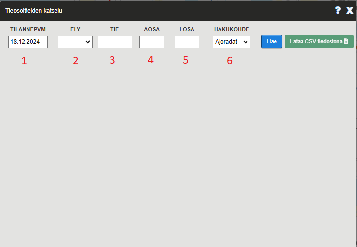

_Kuva 10.2: Tieosoitteiden hakuehdot_

#### Hakuehdot

Ajoratoja, tieosia, solmuja sekä liitymiä haettaessa pakollisia hakuehtoja ovat Tilannepvm sekä Ely TAI Tie.   
Tiennimiä on mahdollista hakea koko tieverkolta. (Haku pelkällä tilannepäivämäärällä)

(1) Tilanne pvm: Karsitaan tilanne pvm -kenttää uudemmat tiedot pois hakutuloksista   
(2) Ely: Haetaan vain annetun ELYn kohteita   
(3) Tie: Rajataan haku annetun tienumeron mukaisiin kohteisiin   
(4) Aosa: Pienin tieosanumero jolta haettavia kohteita haetaan   
(5) Losa: Suurin tieosanumero jolta haettavia kohteita haetaan

####  Haettava kohde
(6) Ajoradat: Hakee annettujen hakuehtojen mukaiset ajoradat  
(7) Tieosat: Hakee annettujen hakuehtojen mukaiset tieosat   
(8) Solmut: Hakee annettujen hakuehtojen mukaiset solmut   
(9) Liittymät: Hakee annettujen hakuehtojen mukaiset liittymät   
(10) Tiennimet: Hakee annettujen hakuehtojen mukaiset tiennimet

Huom! Haku saattaa kestää useita sekunteja haettaessa pelkästään tilannepäivämäärällä ja elyllä (Viite hakee valitut kohteet koko elyn alueelta)

Viite palauttaa hakuehtojen perusteella listan kohteita sekä näiden ominaisuustiedot. 

Hakutulokset on mahdollista ladata Excel-taulukkona klikkaamalla "Lataa Excelinä" -painiketta.

Jos hakutulos on liian suuri (>100 riviä) tarjoaa Viite pelkän Excel-latausmahdollisuuden.

10.1 Esimerkkejä eri ominaisuustietojen hakutuloksista:
--------------------------

_Kuva 10.3: Ajoradat -hakutulos_

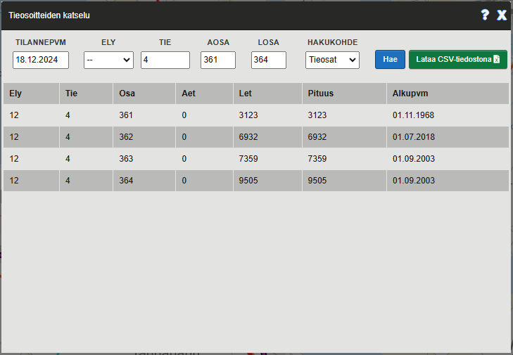

_Kuva 10.4: Tieosat -hakutulos_

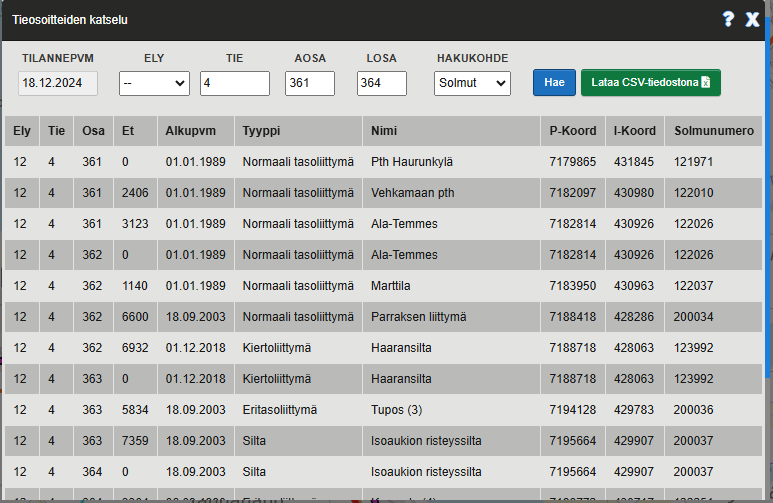

_Kuva 10.5: Solmut -hakutulos_

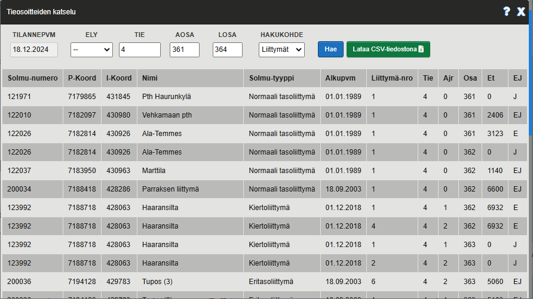

_Kuva 10.6: Liittymät -hakutulos_

_Kuva 10.7: Tiennimet -hakutulos_

_Kuva 10.8: Viite tarjoaa pelkän Excel-tiedoston latausmahdollisuuden mikäli hakutulos on liian suuri_

11 Tieosoitemuutosten katselu -työkalu
--------------------------

Tieosoitemuutosten katselu -työkalu avataan klikkaamalla karttanäkymän oikeassa reunassa sijaitsevaa Tieosoitemuutosten katselu -painiketta.

_Kuva 11: Tieosoitemuutosten katselu -työkalun avaus_

11.1 Tieosoitemuutosten haku
--------------------------

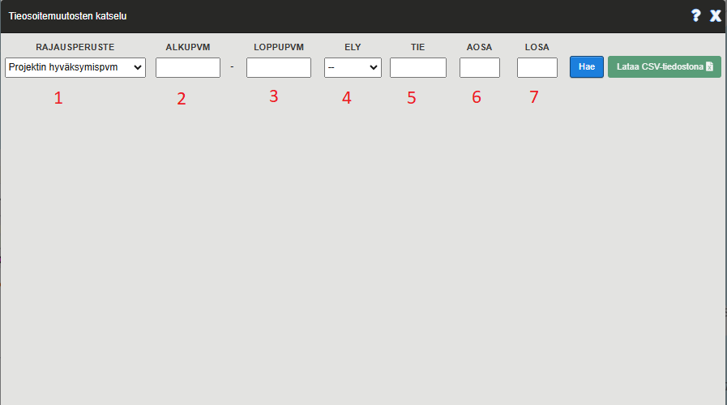

_Kuva 11.1: Tieosoitemuutosten hakuehdot_

#### Hakuehdot

Hakuehdoista alkupäivämäärä on pakollinen tieto

(1) Alkupvm: Karsitaan alkupvm -kenttää vanhemmat tieosoitemuutokset pois hakutuloksista
(2) Loppupvm: Karsitaan loppupvm -kenttää uudemmat tieosoitemuutokset pois hakutuloksista
(3) Ely: Haetaan vain annetun ELYn tieosoitemuutoksia   
(4) Tie: Rajataan haku annetun tienumeron mukaisiin tieosoitemuutoksiin  
(5) Aosa: Pienin tieosanumero jolta haettavia tieosoitemuutoksia haetaan   
(6) Losa: Suurin tieosanumero jolta haettavia tieosoitemuutoksia haetaan

####  Alku- ja loppupäivämäärän kohde
(7) Projektin hyväksymispvm: Alku- ja loppupvm kentät koskevat projetkin hyväksymispäivämäärää   
(8) Muutoksen voimaantulopvm: Alku- ja loppupvm kentät koskevat tieosoitemuutoksen voimaantulopäivämäärää

Huom! Haku saattaa kestää useita sekunteja haettaessa pelkästään alkupäivämäärällä (Viite hakee kaikki tieosoitemuutokset annetun alkupäivämäärän jälkeiseltä ajalta)

Viite palauttaa hakuehtojen perusteella listan tieosoitemuutoksia.

Hakutulokset on mahdollista ladata Excel-taulukkona klikkaamalla "Lataa Excelinä" -painiketta.

Jos hakutulos on liian suuri (>100 riviä) tarjoaa Viite pelkän Excel-latausmahdollisuuden.

11.2 Esimerkkejä tieosoitemuutosten hakutuloksista:
--------------------------

_Kuva 11.2: Hakutulos haettaessa tieosoitemuutoksia jotka ovat syntyneet projektissa jonka hyväksymispäivämäärä on myöhempi kuin 1.4.2022 ja uusi tienumero on 8_

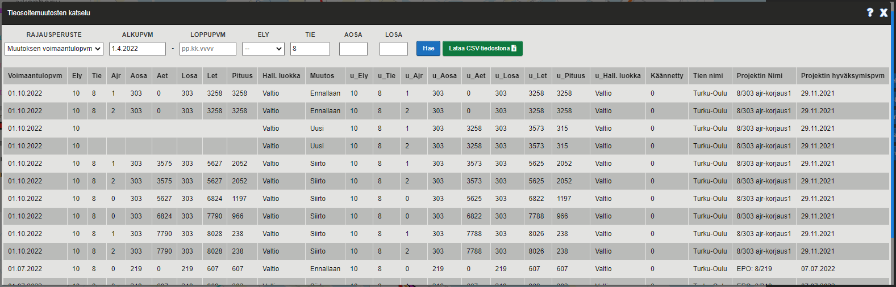

_Kuva 11.3: Hakutulos haettaessa tieosoitemuutoksia joiden voimaantulopäivämäärä on myöhempi kuin 1.4.2022 ja uusi tienumero on 8_

Ylläolevista kuvista voi huomata että samoilla parametreilla voi saada aikaiseksi eri hakutuloksia vaihtamalla päivämäärä kenttien kohdetta

_Kuva 11.4: Viite tarjoaa pelkän Excel-tiedoston latausmahdollisuuden mikäli hakutulos on liian suuri_

