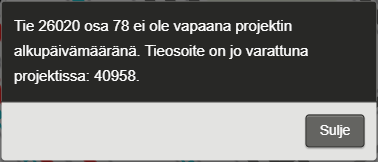

Viite-sovelluksen käyttöohje
======================================================
VIITE
-----------------------

VIITE on Liikenneviraston tieosoitejärjestelmän ylläpito-sovellus. Viitteellä hallitaan tieosoitejärjestelmän muutoksia ja se tarjoaa ajantasaisen kuvauksen tiestöstä Digiroadin (VVH:n) ajantasaisella linkkigeometrialla.

Seuraavasta linkistä pääsee Liikenneviraston extranet VIITE-sivulle (tällä hetkellä testiextranet käytössä, varsinainen extranet-osoite päivitetään myöhemmin), jossa kerrotaan Viitteen yleiskuvaus ja annetaan tiedotteita käyttäjille. Sivulla ylläpidetään myös dokumentaatiota Viitteestä. 

https://testiextranet.vayla.fi/extranet/web/fi/viite?kategoria=7457637 (testi) 

__Huom! Suosittelemme Firefoxia tai Chromea, kun sovelluksella ylläpidetään Digiroad-tietoja.__

__Huom! Käyttöohjeen kuvia voi klikata isommaksi, jolloin tekstit erottuvat paremmin.__

1. Miten päästä alkuun?
-----------------------

Viite-sovelluksen käyttöä varten tarvitaan Liikenneviraston tunnukset (A-, U-, LX-, K- tai L-alkuinen). Mikäli sinulla ei ole tunnuksia, pyydä ne yhteyshenkilöltäsi Liikennevirastosta.

Kaikilla Liikenneviraston tunnuksilla on pääsy Viite-sovellukseen.

Viite-sovellukseen kirjaudutaan osoitteessa: <a href="https://extranet.vayla.fi/viite/" target="_blank">https://extranet.vayla.fi/viite/</a>.

_Kirjautuminen Viite-sovellukseen._

Kirjautumisen jälkeen avautuu karttakäyttöliittymässä katselutila.

_Karttanäkymä kirjautumisen jälkeen._

Oikeudet on rajattu maantieteellisesti sekä käyttäjän roolin mukaan.

- Ilman erikseen annettuja oikeuksia Liikenneviraston tunnuksilla pääsee katselemaan kaikkia tieosoitteita
- Sovelluksen käyttäjällä on oikeudet muokata hänelle määriteltyjen Elyjen maantieteellisten kuntarajojen sisäpuolella olevia tieosoitteita
- Joillekin käyttäjille on voitu antaa oikeudet koko Suomen alueelle
- Tieosoiteprojektit -painike ja Siirry muokkaustilaan -painike näkyvät vain käyttäjille, joilla on oikeudet muokata tieosoitteita

Jos kirjautumisen jälkeen ei avaudu karttakäyttöliittymän katselutilaa, ei kyseisellä tunnuksella ole pääsyä Liikenneviraston extranettiin. Tällöin tulee ottaa yhteyttä Liikennevirastossa tai Elyssä omaan yhteyshenkilöön.

1.1 Mistä saada opastusta?
--------------------------

Viite-sovelluksen käytössä avustaa Janne Grekula janne.grekula@cgi.com.

####Ongelmatilanteet####

Sovelluksen toimiessa virheellisesti (esim. kaikki aineistot eivät lataudu oikein) toimi seuraavasti:

- Lataa sivu uudelleen näppäimistön F5-painikkeella.
- Tarkista, että selaimestasi on käytössä ajan tasalla oleva versio ja selaimesi on Mozilla Firefox tai Chrome
- Jos edellä olevat eivät korjaa ongelmaa, ota yhteyttä janne.grekula@cgi.com

2. Perustietoja Viite-sovelluksesta
--------------------------

2.1 Viite-sovelluksen yhteydet muihin järjestelmiin
--------------------------

_Viite-sovelluksen yhteydet muihin järjestelmiin ja palveluihin._

##Väyläverkon hallinta (VVH)##

Viite-sovelluksessa pohja-aineistona oleva geometria tulee Liikenneviraston Väyläverkon hallinnan (VVH) sovelluksessa. VVH-sovellukseen ladataan päivittäin Maanmittauslaitokselta päivitykset Maastotietokannan (MTK) keskilinja-aineistoon, jolloin myös Viite-sovelluksessa on käytössä uusi keskilinjageometria joka päivä.

##Digiroad: Ominaisuustietojen hallinta##

Molemmissa sovelluksissa on käytössä sama, Väyläverkon hallinnan tarjoama keskilinjageometria.

Lisäksi OTH-sovellus hyödyntää Viitteen tieosoitetietoja, jotka näytetään OTH:ssa tielinkin ominaisuustietona.

##Liikenneviraston Tierekisteri##

_Täydennetään myöhemmin, kun tieosoitemuutostyökalu on pidemmällä._

2.2 Tiedon rakentuminen Viite-sovelluksessa
--------------------------

Viite-sovelluksessa tieosoiteverkko piirretään VVH:n tarjoaman Maanmittauslaitoksen keskilinja-aineiston päälle. Maanmittauslaitoksen keskilinja-aineisto muodostuu tielinkeistä. Tielinkki on tien, kadun, kevyen liikenteen väylän tai lauttayhteyden keskilinjageometrian pienin yksikkö. Tieosoiteverkko piirtyy geometrian päälle tieosoitesegmentteinä _lineaarisen referoinnin_ avulla. 

Tielinkki on Viite-sovelluksen lineaarinen viitekehys, eli sen geometriaan sidotaan tieosoitesegmentit. Kukin tieosoitesegmentti tietää mille tielinkille se kuuluu (tielinkin ID) sekä kohdan, josta se alkaa ja loppuu kyseisellä tielinkillä. Tieosoitesegmentit ovat siten tielinkin mittaisia tai niitä lyhyempiä tieosoitteen osuuksia. Käyttöliittymässä kuitenkin pienin valittavissa oleva osuus on tielinkin mittainen (kts. luvut 4.1 ja 7.1).

Kullakin tieosoitesegmentillä on lisäksi tiettyjä sille annettuja ominaisuustietoja, kuten tienumero, tieosanumero ja ajoratakoodi. Tieosoitesegmenttien ominaisuustiedoista on kerrottu tarkemmin kohdassa "Tieosoitteen ominaisuustiedot".

_Tieosoitesegmenttejä (1) ja muita tielinkkejä (2) Viitteen karttaikunnassa._

Tieosoitesegmentit piirretään Viite-sovelluksessa kartalle erilaisin värein (kts. kohta 4. Tieosoiteverkon katselu). Muut tielinkit, jotka eivät kuulu tieosoiteverkkoon, piirretään kartalle harmaalla. Näitä ovat esimerkiksi tieosoitteettomat kuntien omistamat tiet, ajopolut, ajotiet jne.

Palautteet geometrian eli tielinkkien virheistä voi laittaa Maanmittauslaitokselle, maasto@maanmittauslaitos.fi. Mukaan selvitys virheestä ja sen sijainnista (esim. kuvakaappaus).

3. Karttanäkymän muokkaus
--------------------------

_Karttanäkymä._

####Kartan liikutus####

Karttaa liikutetaan raahaamalla.

####Mittakaavataso####

Kartan mittakaavatasoa muutetaan joko hiiren rullalla, tuplaklikkaamalla, Ctrl+piirto (alue) tai mittakaavapainikkeista (1). Mittakaavapainikkeita käyttämällä kartan keskitys säilyy. Hiiren rullalla, tuplaklikkaamalla tai Shift+piirto (alue) kartan keskitys siirtyy kursorin kohtaan.  Käytössä oleva mittakaavataso näkyy kartan oikeassa alakulmassa (2).

####Kohdistin####

Kohdistin (3) kertoo kartan keskipisteen. Kohdistimen koordinaatit näkyvät karttaikkunan oikeassa alakulmassa(4). Kun kartaa liikuttaa eli keskipiste muuttuu, päivittyvät koordinaatit. Oikean alakulman valinnan (5) avulla kohdistimen saa myös halutessaan piilotettua kartalta.

####Merkitse piste kartalla####

Merkitse-painike (6) merkitsee sinisen pisteen kartan keskipisteeseen. Merkki poistuu vain, kun merkitään uusi piste kartalta.

####Taustakartat####

Taustakartaksi voi valita vasemman alakulman painikkeista maastokartan, ortokuvat tai taustakarttasarjan. Käytössä on myös harmaasävykartta (tämän hetken versio ei kovin käyttökelpoinen).

####Hakukenttä####

Käyttöliittymässä on hakukenttä (8), jossa voi hakea koordinaateilla ja katuosoitteella tai tieosoitteella. Haku suoritetaan kirjoittamalla hakuehto hakukenttään ja klikkaamalla Hae. Hakutulos tulee listaan hakukentän alle. Hakutuloslistassa ylimpänä on maantieteellisesti kartan nykyistä keskipistettä lähimpänä oleva kohde. Mikäli hakutuloksia on vain yksi, keskittyy kartta automaattisesti haettuun kohteeseen. Jos hakutuloksia on useampi kuin yksi, täytyy listalta valita tulos, jolloin kartta keskittyy siihen. Tyhjennä tulokset -painike tyhjentää hakutuloslistan.

Tieosoitteella haku: Tieosoitteesta hakukenttään voi syöttää koko osoitteen tai osan siitä. Esim. 2 tai 2 1 150. (Varsinainen tieosoitehaku tieosoitteiden ylläpidon tarpeisiin toteutetaan myöhemmin)

Koordinaateilla haku: Koordinaatit syötetään muodossa "pohjoinen (7 merkkiä), itä (6 merkkiä)". Koordinaatit tulee olla ETRS89-TM35FIN -koordinaattijärjestelmässä. Esim. 6975061, 535628.

Katuosoitteella haku: Katuosoitteesta hakukenttään voi syöttää koko ositteen tai sen osan. Esim. "Mannerheimintie" tai "Mannerheimintie 10, Helsinki".

4. Tieosoiteverkon katselu
--------------------------

Geometrialtaan yleistetty tieosoiteverkko tulee näkyviin kun zoomaa tasolle jossa mittakaavajanassa on lukema 5 km. Tästä tasosta ja sitä lähempää piirretään kartalle valtatiet, kantatiet, seututiet, yhdystiet ja numeroidut kadut. Yleistämätön tieverkko piirtyy mittakaavajanan lukemalla 2 km. 100 metriä (100 metrin mittakaavajanoja on kaksi kappaletta) suuremmilla mittakaavatasoilla tulevat näkyviin kaikki tieverkon kohteet.

Tieosoiteverkko on värikoodattu tienumeroiden mukaan. Vasemman yläkulman selitteessä on kerrottu kunkin värikoodin tienumerot. Lisäksi kartalle piirtyvät etäisyyslukemasymbolit, eli ne kohdat, joissa vaihtuu tieosa tai ajoratakoodi. Tieverkon kasvusuunta näkyy kartalla pisaran mallisena nuolena.

_Mittakaavajanassa 2 km._

_Mittakaavajanassa 100 m._

Tieosoitteelliset kadut erottuvat kartalla muista tieosoitesegmenteistä siten, että niiden ympärillä on musta väritys.

_Tieosoitteellinen katu, merkattuna mustalla värityksellä tienumeron värityksen lisäksi._

Kun hiiren vie tieosoiteverkon päälle, tulee kartalle näkyviin "infolaatikko", joka kertoo kyseisen tieosoitesegmentin tienumeron, tieosanumeron, ajoratakoodin, alkuetäisyyden ja loppuetäisyyden.

_Infolaatikko, kun hiiri on viety tieosoitesegmentin päälle._

4.1 Kohteiden valinta
--------------------------
Kohteita voi valita klikkaamalla kartalta. Klikkaamalla kerran, sovellus valitsee kartalta ruudulla näkyvän osuuden kyseisestä tieosasta, eli osuuden jolla on sama tienumero, tieosanumero ja ajoratakoodi. Valittu tieosa korostuu kartalla (1), ja sen tiedot tulevat näkyviin karttaikkunan oikeaan laitaan ominaisuustietonäkymään (2).

_Tieosan valinta._

Tuplaklikkaus valitsee yhden tielinkin mittaisen osuuden tieosoitteesta. Valittu osuus korostuu kartalla (3), ja sen tiedot tulevat näkyviin karttaikkunan oikeaan laitaan ominaisuustietonäkymään (4).

_Tielinkin mittaisen osuuden valinta._

##Tieosoitteen ominaisuustiedot##

Tieosoitteilla on seuraavat ominaisuustiedot:

|Ominaisuustieto|Kuvaus|Sovellus muodostaa|
|---------------|------|----------------|
|Muokattu viimeksi*|Muokkaajan käyttäjätunnus ja tiedon muokkaushetki.|X|
|Linkkien lukumäärä|Niiden tielinkkien lukumäärä, joihin valinta  kohdistuu.|X|
|Tienumero|Tieosoiteverkon mukainen tienumero. Lähtöaineistona Tierekisterin tieosoitteet 2.1.2017.||
|Tieosanumero|Tieosoiteverkon mukainen tieosanumero. Lähtöaineistona Tierekisterin tieosoitteet 2.1.2017.||
|Ajorata|Tieosoiteverkon mukainen ajoratakoodi. Lähtöaineistona Tierekisterin tieosoitteet 2.1.2017.||
|Alkuetäisyys**|Tieosoiteverkon etäisyyslukemien avulla laskettu alkuetäisyys. Etäisyyslukeman kohdalla alkuetäisyyden lähtöaineistona on Tierekisterin tieosoitteet 2.1.2017.|X|
|Loppuetäisyys**|Tieosoiteverkon etäisyyslukemien avulla laskettu loppuetäisyys. Etäisyyslukeman kohdalla loppuetäisyyden lähtöaineistona on Tierekisterin tieosoitteet 2.1.2017.|X|
|ELY|Liikenneviraston ELY-numero.|X|
|Tietyyppi|Muodostetaan Maanmittauslaitoksen hallinnollinen luokka -tiedoista, kts. taulukko alempana. Jos valitulla tieosalla on useita tietyyppejä, ne kerrotaan ominaisuustietotaulussa pilkulla erotettuna.|X|
|Jatkuvuus|Tieosoiteverkon mukainen jatkuvuus-tieto. Lähtöaineistona Tierekisterin tieosoitteet 2.1.2017.|X|

*)Muokattu viimeksi -tiedoissa vvh_modified tarkoittaa, että muutos on tullut Maanmittauslaitokselta joko geometriaan tai geometrian ominaisuustietoihin. Muokattu viimeksi -päivät ovat kaikki vähintään 29.10.2015, koska tuolloin on tehty Maanmittauslaitoksen geometrioista alkulataus VVH:n tietokantaan.

**)Tieosoiteverkon etäisyyslukemat (tieosan alku- ja loppupisteet sekä ajoratakoodin vaihtuminen) määrittelevät mitatut alku- ja loppuetäisyydet. Etäisyyslukemien välillä alku- ja loppuetäisyydet lasketaan tieosoitesegmenttikohtaisesti Viite-sovelluksessa.

__Tietyypin muodostaminen Viite-sovelluksessa__

Järjestelmä muodostaa tietyyppi-tiedon automaattisesti Maanmittauslaitoksen aineiston pohjalta seuraavalla tavalla:

|Tietyyppi|Muodostamistapa|
|---------|---------------|
|1 Maantie|MML:n hallinnollinen luokka arvolla 1 = Valtio|
|2 Lauttaväylä maantiellä|MML:n hallinnollinen luokka arvolla 1 = Valtio ja MML:n kohdeluokka arvolla lautta/lossi|
|3 Kunnan katuosuus|MML:n hallinnollinen luokka arvolla 2 = Kunta|
|5 Yksityistie|MML:n hallinnollinen luokka arvolla 3 = Yksityinen|
|9 Ei tiedossa|MML:lla ei tiedossa hallinnollista luokkaa|

Palautteet hallinnollisen luokan virheistä voi toimittaa Maanmittauslaitokselle osoitteeseen maasto@maanmittauslaitos.fi. Mukaan selvitys virheestä ja sen sijainnista (kuvakaappaus tms.).

##Kohdistaminen tieosoitteeseen tielinkin ID:n avulla##

Kun kohdetta klikkaa kartalla, tulee selaimen osoiteriville näkyviin valitun kohteen tielinkin ID. Osoiterivillä olevan URL:n avulla voi myös kohdistaa käyttöliittymässä ko. tielinkkiin. URL:n voi esimerkiksi lähettää toiselle henkilölle sähköpostilla, jolloin hän pääsee samaan paikkaan käyttöliittymässä helposti.

Esimerkiksi: https://extranet.vayla.fi/viite/#linkProperty/799497 näkyy kuvassa osoiterivillä (5). 799497 on tielinkin ID.

_Kohdistaminen tielinkin ID:llä._

5. Tuntemattomat tieosoitesegmentit
--------------------------

Tuntemattomilla tieosoitesegmenteillä tarkoitetaan tieosoitesegmenttejä, joilla pitäisi olla tieosoite, mutta niillä ei ole sitä. Puuttuva tieosoite voi johtua esimerkiksi siitä, että Maanmittauslaitoksen tekemät geometriapäivitykset ovat aiheuttaneet tielinkki-aineistossa niin suuria muutoksia, ettei tieosoitesegmenttiä saada enää sovitettua päivittyneen tielinkin päälle.

Tuntemattomaksi tieosoitesegmentiksi katsotaan kohteet, joilta puuttuu tieosoitesegmentti ja ne ovat: 

1. Maanmittauslaitoksen hallinnollisessa luokittelussa arvolla 1 = Valtion omistama tie

	- Nämä kohteet muodostavat suurimman osan tieosoiteverkosta

1. Sellaisessa sijainnissa, että siinä on aiemmin ollut voimassaoleva tieosoite

	- Nämä kohteet ovat esimerkiksi tieosoitteellisia katuja (Maanmittauslaitoksen hallinnollinen luokka arvolla 2 = Kunnan omistama)

Tuntemattomat tieosoitesegmentit visualisoidaan kartalle mustalla viivalla ja kysymysmerkillä (1). Useimmiten tuntemattoman tieosoitesegmentin kohdalla on myös geometriasta irti oleva tieosoitesegmentti, joka tulee korjata uudelle geometrialle (kts. luvut 8 ja 9).

_Tuntemattomia tieosotiesegmenttejä._

Tuntemattomia tieosoitesegmenttejä voi valita ja tarkastella klikkailemalla samalla tavalla, kuin muitakin tieosoitesegmenttejä. Tuntemattoman tieosoitesegmentin tiedot ominaisuustietotaulussa (2) ovat puutteelliset, koska ko. kohdasta puuttuu tiedot tieosoitteesta.

_Tuntematon tieosoitesegmentti valittuna. Ominaisuustietotaulun tiedot ovat puuttelliset._

6. Rakenteilla olevat tielinkit ja niiden tieosoitteet
--------------------------

Rakenteilla olevilla kohteilla tarkoitetaan sellaisia tielinkkejä, joiden valmiusaste/status on Maanmittauslaitoksella "Rakenteilla". 

Rakenteilla olevat, tieosoitteistettavat kohteet näkyvät käyttöliittymässä oranssi-mustalla raidoituksella (1). Näillä kohteilla on hallinnollisen luokan arvo 1=Valtion omistama, mutta niiltä puuttuu tieosoite eli kohteet ovat tuntemattomia. Tuntemattomilla, rakenteilla olevilla kohteilla on myös musta kysymysmerkki-label kohteen päällä.

_Tuntematon rakenteilla oleva kohde._

Jos rakenteilla olevalle kohteelle on jo annettu tieosoite, se näkyy käyttöliittymässä kuten muutkin tieosoitteistetut tielinkit (3) ja tieosoitetiedot näkyvät myös ominaisuustietotaulussa (4).

_Pisaraliittymä on rakenteilla, mutta koska se on jo saanut tieosoiteen, se näkyy käyttöliittymässä kuten muutkin tieosoitteistetut tielinkit._

Muut rakenteilla olevat kohteet näkyvät käyttöliittymässä harmaa-mustalla raidoituksella (2). Näiden hallinnollisen luokan arvo on jotain muuta, kuin 1=Valtion omistama.

_Rakenteilla oleva kohde, jonka hallinnollisen luokan arvo on jokin muu kuin 1=Valtion omistama._

7. Automatiikka Viite-sovelluksessa
--------------------------
Viite-sovelluksessa on muutamia automatiikan tekemiä yleistyksiä tai korjauksia. Automatiikka ei muuta mitään sellaisia tietoja, jotka muuttaisivat varsinaisesti tieosoitteita. Automatiikan tekemät muutokset liittyvät siihen, että tieosoiteverkkoa ylläpidetään keskilinjageometrian päällä, ja tuon keskilinjageometrian ylläpidosta vastaa Maanmittauslaitos. Tietyt automaattiset toimenpiteet helpottavat tieosoiteverkon ylläpitäjää varsinaisessa tieosoiteverkon hallinnassa.

__Huom! Automatiikka ei koskaan muuta tieosan mitattua pituutta. Arvot tieosien ja ajoratojen vaihtumiskohdissa pysyvät aina ennallaan automatiikan tekemien korjausten yhteydessä.__

##7.1 Tieosoitesegmenttien yhdistely tielinkin mittaisiksi osuuksiksi##

Kun käyttäjä valitsee kartalla kohteita tuplaklikkaamalla (luku 4.1), on pienin valittava yksikkö tielinkin mittainen osuus tieosoiteverkosta, koska tielinkki on pienin mahdollinen yksikkö Maanmittauslaitoksen ylläpitämällä linkkiverkolla.

Tätä varten järjestelmä tekee automaattista yhdistelyä:

- Ne kohteet, joiden tielinkin ID, tie, tieosa, ajorata ja alkupäivämäärä ovat samoja (=tieosoitehistoria yhtenevä), on yhdistetty tietokannassa yhdeksi tielinkin mittaiseksi tieosoitesegmentiksi
- Ne kohteet, joiden tielinkin ID, tie, tieosa, ajorata ovat samoja, mutta alkupäivämäärä ei ole sama (=tieosoitehistoria erilainen) ovat tietokannassa edelleen erillisiä kohteita, mutta käyttöliittymässä ne ovat valittavissa vain tielinkin mittaisena osuutena. Tällä varmistetaan, että käyttöliittymä toimii käyttäjän kannalta loogisesti, eli aina on valittavissa tielinkin mittainen osuus, mutta tieosoitehistoria säilytetään tietokantatasolla.

##7.2 Tieosoitesegmenttien automaattinen korjaus jatkuvasti päivittyvällä linkkigeometrialla##

Viite-sovellus päivittää automaattisesti tieosoitesegmentit takaisin ajantasaiselle keskilinjalle, kun MML on tehnyt pieniä tarkennuksia keskilinjageometriaan. Tässä luvussa on kuvattu tapaukset, joissa Viite-sovellus osaa tehdä korjaukset automaattisesti. Ne tapaukset, joissa korjaus ei tapahdu automaattisesti, segmentit irtoavat geometriasta ja ne on korjattava manuaalisesti (luvut 8 ja 9).

Automatiikka tekee korjaukset, kun...

1. __Tielinkki pitenee tai lyhenee alle metrin:__ Viite-sovellus lyhentää/pidentää tieosoitesegmenttiä automaattisesti muutoksen verran.
1. __Maanmittauslaitos yhdistelee tielinkkejä, esimerkiksi poistamalla tonttiliittymiä maanteiden varsilta:__ Tieosoitesegmentit siirretään uudelle geometrialle automaattisesti Väyläverkon hallinnan (VVH) tarjoaman tielinkkien muutosrajapinnan avulla.

8. Geometriasta irti olevat tieosoitesegmentit
--------------------------
Geometriasta irti olevilla tieosoitesegmenteilla tarkoitetaan sellaisia segmenttejä, joiden alla oleva tielinkkien geometria on muuttunut niin paljon, että ne eivät enää sovi geometrialle. Vaikka maastossa ei tapahtuisi muutoksia, Maanmittauslaitos tekee tarkennuksia geometriaan, jolloin keskilinjan sijainti vastaa paremmin todellista maastoa.

Geometriasta irti olevien tieosoitesegmenttien määrään vaikuttaa se, kuinka suuri osa niistä on voitu korjata automatiikan avulla. Automatiikasta voi lukea käyttöohjeen luvusta 7.

Geometriasta irti olevan segmentin tunnistaa keltaisesta korostuksesta. Lisäksi jokaisella tieosoitesegmentilla on punainen huomiolippu. Segmentin voi valita huomiolippua tai keltaista korostusta klikkaamalla (1).  Valitun kohteen tiedot tulevat näkyviin ominaisuustietonäkymään. Geometriasta irti olevalla kohteella on ominaisuustietonäkymässä huomiolaatikko joka varoittaa tien geometrian muuttuneen (2).

_Geometriasta irti olevia tieosoitesegmenttejä. Segmentin tiedot saa näkyviin klikkaamalla segmentin keltaista korostetta tai punaista huomiolippua._

Jos keltaisen värin alla ei näy mustaa tieosoitesegmenttiä, tarkoittaa tämä sitä, että alla muuttuneen tielinkin ID on edelleen sama, kuin keltaisen tieosoitesegmentin tielinkin ID (muutos yli 1 metrin, mutta linkki ID säilynyt). Musta, tuntematon segmentti tulee kuitenkin näkyviin, kun käyttäjä aloittaa geometriasta irti olevan tieosoitesegmentin korjaamisen (luku 9).

Keltaisten kohteiden valinta toimii yksinkertaisemmin, kuin muiden tieosoitesegmenttien. Sekä klikkaamalla kerran että tuplaklikkaus valitsevat molemmat ruudulta näkyvän osuuden kyseisestä tieosasta, eli osuuden jolla on sama tienumero, tieosanumero ja ajoratakoodi. Tämä sen vuoksi, että kohteiden korjaaminen sujuu tehokkaammin, kun valinta tapahtuu aina koko keltaiselle osuudelle tieosasta. Kohdetta valitessa kannattaa olla huolellinen, että klikatessa osuu keltaiseen korostukseen eikä tuntemattomaan tielinkkiin (musta kohde). 

9. Geometriasta irti olevien tieosoitesegmenttien korjaaminen takaisin geometrialle
--------------------------

Geometriasta irti olevien tieosoitesegmenttien korjausta varten käyttäjän tulee siirtyä muokkaustilaan. Korjausprosessissa geometriasta irti olevat tieosoitesegmentit kiinnitetään takaisin geometriaan kertomalla niille uudet tielinkit, joihin ne kiinnittyvät. 

Yleispiirteinen korjausprosessi: ensin valitaan kartalta keltainen, geometriasta irti oleva tieosoitesegmentti. Tämän jälkeen sovellus ohjeistaa käyttäjää näytön oikean laidan ominaisuustietotaulussa jatkamaan valintoja tai painamaan Valinta valmis -painiketta. Muutokset voi tarkistaa Siirrä-painikkeen painamisen jälkeen ennen Tallennusta. 

__Korjausprosessi tarkemmin:__

__Vaihe 1__

Valitaan keltainen tieosoitesegmentti klikkaamalla keltaisesta osuudesta tai klikkaamalla punaisesta huomiolipusta. Valitun kohteen tiedot tulevat näkyviin ominaisuustietotauluun ja valittu kohde korostuu kartalla (1). 

Muokkaustilassa keltaisten, geometriasta irti olevien tieosoitesegmenttien valinnan poistaminen tehdään aina ominaisuustietotaulun oikean alalaidan Peruuta-painikkeen (2) kautta.

__Vaihe 2__

Tarkistetaan ominaisuustietotaulusta, onko kohteen vieressä lisää valittavia korjattavia tieosoitesegmenttejä (3) (tässä tapauksessa ei ole). Jos on tarpeen valita lisää kohteita, klikataan niitä ominaisuustietotaulun Valitse-painikkeista. Kun kaikki tarpeelliset valinnat on tehty, klikataan Valinta valmis -painiketta (4).

__Vaihe 3__

Kun Valinta valmis -painiketta on painettu, sovellus muuttaa piirtojärjestyksen sitten, että mustat tuntemattomat kohteet piirtyvät päälimmäiseksi. 

Seuraavaksi valitaan klikkaamalla tuntematon musta tielinkki, jolle kohde halutaan siirtää. Valinnan jälkeen sovellus muuttaa valitun tuntemattoman mustan kohteen vihreäksi, eli valituksi.

__Vaihe 4__

Tarkistetaan ominaisuustietotaulusta (6), onko kohteen vieressä lisää valittavia mustia tuntemattomia tieosoitesegmenttejä, joille valitut keltaiset tieosoitesegmentit pitäisi siirtää. Jos on tarpeen valita lisää kohteita, klikataan niitä ominaisuustietotaulun Valitse-painikkeesta.

Kaikki valitut linkit listataan ominaisuustietotaulussa (7) ja ne näkyvät kartalla vihreänä (8). Kun kaikki tarpeelliset valinnat on tehty, klikataan oranssia Siirrä-painiketta (9).

__Vaihe 5__

Siirron jälkeen sovellus pyytää (1) käyttäjää tarkastamaan tuloksen kartalta. Jos tulos on ok, painetaan Tallenna (2). Jos käyttäjä haluaa tehdä muutoksia valintoihin, painetaan Peruuta (3).

__Vaihe 6__

Korjauksen jälkeen tieosoiteverkko on eheä. Tallentamisen jälkeen tieosoitesegmenttien etäisyyslukemat ja niiden kohdalla olevat alku- ja loppuetäisyysarvot ovat säilyneet ennallaan. Kohteet ovat vain saaneet uudet tielinkit, joihin niiden lineaarilokaatio on kiinnitetty.

__Tieosoitteellisen segmentin irrotus geometriasta__

Joidenkin geometriasta irti olevien tieosoitesegmenttien korjaamistapaukset vaativat tai niiden korjaamista helpottaa jo tieosoitteellisen segmentin irrottaminen geometriasta. Tieosoitteellinen segmentti irroitetaan geometriasta valitsemalla muokkaustilassa kaksoisnäpäytyksellä linkki ja klikkaamalla ominaisuustietonäkymään ilmestyvää "Irrota geometriasta"-nappia.

_Kaikki geometriasta irrallaan olevat segmentit voidaan käsitellä kerralla jos lyhyt tieosoitteellinen tielinkki irrotetaan ensin geometriasta._

9.1 Siirron epäonnistuminen
--------------------------

Jos vaiheen 4 siirto ei onnistu, sovellus ilmoittaa tästä käyttäjälle. Tällöin taustajärjestelmä ei osaa siirtää tieosoitesegmenttejä uudelle geometrialle, eikä siirron tietoja tallenneta tietokantaan. Nämä kohteet voi jättää toistaiseksi korjaamatta, ja käyttäjän tulisi ilmoittaa niistä järjestelmätukeen, jotta sovelluksen toimintaa voidaan kehittää.

_Ilmoitus siirron epäonnistumisesta._

Epäonnistuneen siirron jälkeen työskentelyä voi jatkaa toisella kohteella klikkaamalla Peruuta-painiketta kaksi kertaa.

10. Tieosoiteprojektin tekeminen
--------------------------

Uuden tieosoiteprojektin tekeminen aloitetaan klikkaamalla painiketta Tieosoiteprojektit (1) ja avautuvasta ikkunasta painiketta Uusi tieosoiteprojekti (2).

_Tieosoiteprojektit -painike ja Uusi tieosoiteprojekti -painike._

Näytön oikeaan laitaan avautuu lomake tieosoiteprojektin perustietojen täydentämiseen. Jos käyttäjä ei ole muokkaustilassa, sovellus siirtyy tässä vaiheessa automaattisesti muokkaustilaan.

_Tieosoiteprojektin perustietojen lomake._

Pakollisia tietoja ovat nimi ja projektin muutosten voimaantulopäivämäärä, jotka on merkattu lomakkeelle oranssilla (3). Projektiin ei ole pakko täydentää yhtään tieosaa. Lisätiedot -kenttään käyttäjä voi halutessaan tehdä muistiinpanoja tieosoiteprojektista. Tiedot tallentuvat painamalla Jatka toimenpiteisiin -painiketta (4). Myös Poistu-painikkeesta Viite varmistaa haluaako käyttäjä tallentaa projektiin tehdyt muutokset.

_Tieosoiteprojektin perustietojen täyttäminen._

Projektin tieosat lisätään täydentämällä niiden tiedot kenttiin tie, aosa, losa ja painamalla painiketta Varaa (5). __Kaikki kentät tulee täytää aina, kun haluaa varata tieosan!__ 

Varaa -painikkeen painamisen jälkeen tieosan tiedot tulevat näkyviin lomakkeelle.

_Tieosan tiedot lomakkeella Lisää -painikkeen painamisen jälkeen._

Tieosoiteprojekti tallentuu automaattisesti painikkeesta Jatka toimenpiteisiin, jolloin tiedot tallentuvat tietokantaan ja sovellus siirtyy toimenpidenäytölle. Varaamisen yhteydessä Viite zoomaa kartan varatun tieosan alkuun. Poistu-painikkeesta projekti suljetaan ja käyttäjältä varmistetaan, halutaanko tallentamattomat muutokset tallentaa. Projektiin pääsee palaamaan Tieosoiteprojektit -listan kautta. 

Käyttäjä voi poistaa varattuja tieosia klikkaamalla ruksia tieosan oikealla puolella, Projektiin valitut tieosat-listalta. Mikäli tieosille ei ole tehty muutoksia eli ne on pelkastään varattu projektiin, varaus poistetaan projektista. Jos tieosille on tehty muutoksia, Viite kysyy käyttäjältä varmistuksen poistosta. Tällöin kaikki muutokset menetetään.

_Kun tieosa on varattu projektiin Viite zoomaa kartan siten että tieosa näkyy kartalla kokonaisuudessaan._  

Varauksen yhteydessä järjestelmä tekee varattaville tieosille tarkistukset:

- Onko varattava tieosa olemassa projektin voimaantulopäivänä
- Onko varattava tieosa vapaana, eikä varattuna mihinkään toiseen projektiin

Virheellisistä varausyrityksistä järjestelmä antaa asianmukaisen virheilmoituksen. Alla olevassa kuvissa on erilaisista virheilmoituksista, joiden mukaan käyttäjän tulee korjata varausta. __Käyttäjän tulee huomioida, että varauksen yhteydessä kaikki kentät (TIE, AOSA, LOSA) tulee täyttää, tai käyttäjä saa virheilmoituksen!__

_Yritetty luoda samalla tieosavarauksella tie 71, osa 1 projekti uudelleen. 
Tieosa on kuitenkin jo varattuna aiemmin luotuun projektiin nimeltä "Tieosoitemuutos tie 71 osa 1"._

_Tietä ei ole olemassa._

_Tieosaa ei ole olemassa._

_Tieosaa ei ole olemassa._

_Ilmoitus, jos varattava tieosa ei ole voimassa päivänä, jolloin projekti tulee voimaan._

10.1 Olemassa olevan tieosoiteprojektin avaaminen Tieosoiteprojektit -listalta
--------------------------

Tallennetun tieosoiteprojektin saa auki Tieosoiteprojektit -listalta painamalla Avaa -painiketta. Avaamisen yhteydessä sovellus zoomaa kartan paikkaan, jossa käyttäjä on viimeimmäksi tallentanut toimenpiteen. Mikäli toimenpiteitä ei ole tehty, karttanäkymä rajautuu siten, että kaikki varatut aihiot näkyvät karttanäkymässä

Tieosoiteprojektit -listalla näkyvät kaikkien käyttäjien projektit. Projektit on järjestetty ELY-koodien mukaiseen järjestykseen ja niiden sisällä projektin nimen ja käyttäjätunnuksen mukaiseen järjestykseen. Projektin tekijän käyttäjätunnus näkyy myös projektilistauksessa.

_Tieosoiteprojektit -listaus._

11. Muutosilmoitusten tekeminen tieosoiteprojektissa
--------------------------

Tieosoiteprojektissa on mahdollista tehdä seuraavia muutosilmoituksia:

- lakkautus (tieosoitteen lakkautus) 
- uusi (lisätään uusi tieosoite osoitteettomalle linkille) 
- ennallaan (osa tieosoitteesta säilyy ennallaan, kun osaa siitä muutetaan)
- siirto (tieosan alkuetäisyys- ja loppuetäisyysarvot päivitetään, kun muulle osalle tieosaa tehdään muutos)
- numeroinnin muutos (kokonaisen tieosan tienumeron ja/tai tieosanumeron voi muuttaa manuaalisesti) 
- kääntö (tieosoitteen kasvusuunnan kääntö)
- etäisyyslukeman muutos (etäisyyslukeman loppuarvon voi syöttää tieosalle manuaalisesti)
- ELY koodin, jatkuvuuden ja tietyypin muutos

Tässä sekä seuraavissa kappaleissa kuvataan muutosilmoitusten teko Viitteessä.

Tieosoiteprojektissa muutostoimenpiteitä pääsee tekemään klikkaamalla Jatka toimenpiteisiin-painiketta tieosoitemuutosprojektin perustietojen lomakkeella. Tämän jälkeen sovellus muuttaa varatut tieosat muokattaviksi kohteiksi ja ne näkyvät avautuvassa karttanäkymässä keltaisella korostettuna (1). Mikäli toimenpiteenä lisätään uusi tieosoite, eli tieosia ei ole varattu projektiin, kartalta ei valikoidu mitään ennen käyttäjän tekemää valintaa. Tämä tarkennetaan tulevissa toimenpiteitä kuvaavissa kappaleissa.

Projektitilassa, vain projektiin varattuja tieosia, tuntemattomia tielinkkejä, muun tieverkon linkkejä tai suunnitelmalinkkejä (suravage-linkkejä), voi valita projektissa klikkaamalla kartalta. Suunnitelmalinkit saa pois piirrosta ja piirtoon sivun alapalkissa olevasta valinnasta. Ne ovat oletuksena piirrossa. Tieverkon tieosoitetietoja voi katsella kartalla viemällä hiiren tieosoitelinkin päälle. Tällöin tielinkin infolaatikko tulee näkyviin. 
Projektin nimen vieressä on sininen kynäikoni (2), josta pääsee projektin perustietojen lomakkeelle muokkaamaan projektin tietoja. Lisäksi oikeassa yläkulamssa on Poistu projektista -linkki (3), josta pääsee Viitteen alkutilaan. Viite tarkistaa haluaako käyttäjä tallentaa muutokset.

_Projektissa muokattavissa olevat varatut tieosat näkyvät kartalla keltaisella värillä ja suuntanuolet ovat tien alkuperäisen värin mukaiset (siniset). Projektin nimi on "Esimerkki-projekti", joka näkyy oikeassa yläkulmassa._

Projektin muutosilmoitukset tallentuvat projektin yhteenvetotauluun, jonka voi avata näkyviin toimenpidenäkymän alaoikeasta laidasta sinisestä painikkeesta (4). Yhteenvetotaulun toiminta on kuvattu tarkemmin kappaleessa 11.2. Lisäksi kaikkien projektien muutostiedot voidaan lähettää Tierekisteriin klikkaamalla vihreää Tee tieosoitemuutosilmoitus -painiketta (5) sivun alaoikealla. Muutosilmoituksen lähettäminen on kuvattu kappaleessa 11.3. 

Kun keltaista, muokattavaa kohdetta kertaklikkaa kartalla, muuttuu valittu osuus vihreäksi ja oikeaan laitaan tulee alasvetovalikko, josta voi valita kohteelle tehtävän muutosilmoituksen (esim. lakkautus). Kerran klikkaamalla valitaan kartalta homogeeninen jakso (= sama tienumero, tieosanumero, ajoratakoodi, tietyyppi ja jatkuvuus). Tuplaklikkaus valitsee yhden tieosoitesegmentin verran (tielinkin mittainen osuus). Kun halutaan valita vain osa tieosan linkeistä, tuplaklikataan ensimmäistä linkkiä ja seuraavat linkit lisätään valintaan CTRL+klikkauksella samalta tieosalta. Samalla tavalla voi myös poistaa yksittäisiä linkkejä valinnasta. 

_Kun keltaista, muokattavissa olevaa kohdetta klikataan, muuttuu tieosa vihreäksi ja oikeaan laitaan tulee näkyviin valikko, jossa on tieosoitemuutosprojektin mahdolliset muutosilmoitukset._

Muutokset tallennetaan oikean alakulman Tallenna-painikkeesta. Ennen tallennusta, voi muutokset perua Peruuta-painikkeesta, jolloin Viite palaa edeltävään vaiheeseen.

Jos käyttäjä on jo tehnyt projektissa muutoksia tieosoitteille, ne tulevat näkyviin lomakkeelle klikatessa kyseistä tielinkkiä, jolle muutokset on tehty. Esimerkiksi, mikäli tieosalle on toteutettu Lakkautus, tieosa valittaessa sen tiedot lakkautuksesta ilmestyvät lomakkeelle ja tieosalle on mahdollista tehdä toinen toimenpide. Mahdolliset uudet toimenpidevaihtoehdot kunkin toimenpiteen tallentamisen jälkeen, on kuvattu seuraavissa kappaleissa, joissa kerrotaan kunkin toimenpiteen tekemisestä tarkemmin. 

Selite projektitilassa on erilainen kuin katselutilassa. Projektitilan selite kuvaa linkkiverkkoon tehdyt toimenpiteet kun taas katselutilan selite kuvaa tieluokitusta.

11.1 Muutosilmoitusten kuvaukset
--------------------------

11.1.1 Lakkautus
--------------------------
Kun halutaan lakkauttaa joko tieosia, tieosa tai osa tieosasta, tulee tarvittavat tieosat varata projektiin. Varaaminen tehdään, kuten kpl 10. esitetty, eli syötetään projektitietojen lomakkeelle haluttu tienumero ja tieosa sekä painetaan Lisää-painiketta.
Tämän jälkeen Jatka toimenpiteisiin-painiketta, jolla siirrytään toimenpidelomakkeelle tekemään tieosoitemuutosta. Toimenpidelomakkeella valitaan kartalta projektiin varattu tieosa, -osat tai tarvittavat linkit valitusta tieosasta. Ne muuttuvat valittuna vihreäksi. (Shif+tuplaklikkaus-painalluksella voi lisätä yksittäisiä linkkejä valintaan tai poistaa yksittäisiä linkkejä valinasta.) Toimenpide-lomakkeelle tulee tiedot valituista linkeistä sekä pudotusvalikko, josta valitaan Lakkautus. Tämän jälkeen tallennetaan muutos projektiin. Lakkautettu linkki tulee näkyviin mustalla ja sen tiedot päivittyvät yhteenvetotaulukkoon, jonka voi avata sinisestä Avaa projektin yhteenvetotaulukko-painikkeesta. Yhteenvetotaulukon toiminta on kuvattu kappaleessa 11.2. Mikäli on lakkautettu vain osa tieosan linkeistä, tulee tieosan muut kuin lakkautetut linkit myös käsitellä joko ennallaan- tai siirto-toimenpiteillä, riippuen tilanteesta. Kun tarvittavat muutoset projektissa on tehty, muutostiedot voi lähettää Tierekisteriin painamalla Tee tieosoitemuutosilmoitus-painiketta. 

11.1.2 Uusi
--------------------------

Toimenpiteellä määritetään uusi tieosoite tieosoitteettomille linkeille. Tieosoitteettomia muun tieverkon linkkejä, jotka piirtyvät kartalle harmaina tai tuntemattomia mustia linkkejä, joissa on kysymysmerkkisymboli tai suravage-linkkejä, voi valita kerta- tai tuplaklikkauksella, kuten muitakin tielinkkejä. Tuplaklikkaus valitsee yhden tielinkin ja shit+tuplaklikkauksella voi lisätä tai poistaa valintaan linkkejä yksi kerrallaan. Kertaklikkaus valitsee homogeenisen jakson, jossa käytetään VVH:n tienumeroa ja tieosanumeroa. Tienumeron tai tieosanumeron puuttuessa valinnassa käytetään tienimeä. CTRL+klikkauksella voi lisätä aiempaan valintaan koko homogeenisen jakson.

Valitut tielinkit näkyvät kartalla vihreällä korostettuna. Kun valitaan Toimenpiteet-alasvetovalikosta 'Uusi' (1) lomakkeelle avautuvat kentät uuden tieosoitteen tiedoille (2). Jos valitulla tieosuudella on jo olemassa VVH:ssa tienumero ja tieosanumero, ne esitäyttyvät kenttiin automattisesti.

_Kun toimenpidevalikosta valitaan 'Uusi', oikeaan laitaan ilmestyy näkyviin kentät uuden tieosoitteen syöttämistä varten._ 

Tietyyppiä voi muokata pudotusvalikosta (3). Jatkuu-arvo määräytyy ensimmäisellä tallennuskerralla automaattisesti jatkuvaksi (5 Jatkuva). Muutokset tallennetaan Tallenna-painikkeella (4). Ennen tallennusta, muutokset voi perua Peruuta-painikkeesta. 

Huom: Mikäli jatkuvuutta täytyy muokata, esimerkiksi jos kyseessä on tien loppu, se tulee tehdä seuraavasti. Käyttäjän tulee klikata viimeinen "Uusi" toimenpiteellä käsitelty linkki tieosan lopusta aktiiviseksi, jossa tien loppu sijaitsee. Lomakkeelle tulee tiedot linkin osoitteesta ja sille tehdystä toimenpiteestä. Nyt linkin jatkuvuuskoodin muokkaaminen on mahdollista ja oikea koodi, esimerkiksi 1 Tien loppu, valitaan pudotusvalikosta ja tallennetaan. Päivitetty tieto näkyy myös yhteenvetotaulukossa tallennuksen jälkeen.   

Käyttöliittymä varoittaa virheilmoituksella jos uusi tieosoite on jo olemassa projektin alkupäivänä tai se on varattuna toisessa tieosoiteprojektissa.

_Tieosoite on jo olemassa projektin alkupäivänä._

_Valittuna olevan uuden tieosoitteen vaikutussuntaa vaihtuu lomakkeen 'Käännä vaikutussuunta'-nappulasta._

Uuden tieosoitteen linkit piirtyvät kartalle pinkillä (2). Tieosan alku- ja loppupisteisiin sijoitetaan automaattisesti etäisyyslukema-symbolit. Viite laskee uudelle tieosuudelle automaattisesti myös linkkien m-arvot käyttäen VVH:n tietoja. Uudelle tieosoitteelle määrittyy aluksi satunnainen kasvusuunta, joka näkyy kartalla pinkkien nuolien suunnasta.

_Uuden tieosoitteen linkit piirtyvät kartalle pinkillä. Tieosan voi valita klikkaamalla, jolloin se korostuu vihreällä._

Tallennettuun tieosoitteeseen voi jatkaa uusien linkkien lisäämistä vaiheittain. Ensin valitaan tallennetun tieosan jatkeeksi seuraava linkki ja sitten valitaan lomakkeelta toimenpide "uusi" ja annetaan linkeille sama tieosoite (TIE= tienumero, OSA=tieosanumero, AJR=ajoratakoodi). ELY ja Jatkuu arvot Viite täyttää automaattisesti. Tallennetaan lisäykset. Projektin voi myös tallentaa, sulkea ja jatkaa lisäystä samaan tieosoitteeseen myöhemmin. Kasvusuunta lisätylle osuudelle määräytyy aiemmin osoitteistettujen linkkien mukaan ja sitä voi edelleen kääntää Käännä kasvusuunta-painikkeella. M-arvot päivittyvät koko tieosalle, jolle on annettu sama tieosoite.

Tieosoitteen voi antaa Viitteessä myös ns. Suravage-linkeille (SuRavaGe = Suunniteltu rakentamisvaiheen geometria). Suravage-tiet näkyvät Viitteessä vaaleanpunaisella värillä ja niissä näkyy myös tieosoitteen kasvusuuntanuolet. 

__Uuden kiertoliittymän alkupaikan muuttaminen__

Jos Uusi-toimenpiteellä tieosoitteistetulla kiertoliittymän; linkeillä on VVH:ssa (esim. suravage-linkit) tienumero, kiertoliittymän voi ns. "pikaosoitteistaa". Pikaosoitteistaminen tapahtuu kertaamalla kiertoliittymän alkukohdaksi haluttua linkkiä. Tällöin koko kiertoliittymän linkit tulevat valituiksi. Uusi toimenpide asettaa alkukohdaksi klikatun linkin.

Muussa tapauksessa kiertoliittymän alkukohta asetataan manuaalisesti kahdessa vaiheessa. 1. Valitaan alkupaikka tuplaklikkaamalla kiertoliittymän linkkiä tieosoitteen haluttuun alkupaikkaan. Valitulle linkille annetaan Uusi-toimenpiteellä tieosoite. 2. Kiertoliittymän loput linkit valitaan CTRL + klikkaamalla ja annetaan nille sama tieosoite.    

Tieosoiteprojektissa Uusi-toimenpiteellä jo tieosoiteistetun kiertoliittymän alkupaikka muutetaan palauttamalla kiertoliittymä ensin tieosoitteettomaksi ja osoitteistamalla se uudelleen. Valitse tieosoitteistettu kiertoliittymä ja käytä toimenpidettä "Palauta aihioksi tai tieosoitteettomaksi". Toimenpiteen jälkeen kiertoliittymän voi tieosoitteistaa uudelleen halutusta alkupaikasta aloittaen.

11.1.3 Ennallaan
--------------------------
Tieosan linkkien tieosoitteen voi säilyttää ennallaan esimerkiksi silloin, kun osalle tieosaa halutaan tehdä tieosoitemuutoksia ja osan säilyvän ennallaan. Tällöin tieosa käsitellään toimenpiteellä Ennallaan. Toimenpide tehdään varaamalla ensin projektitietojen formilla projektiin muokattava tieosa tai -osat. Seuraavaksi siirrytään toimenpidenäytölle Jatka toimenpiteisiin - painikkeella. Valittu tieosa tai sen tietyt linkit valitaan kartalta, jolloin ne muuttuvat vihreiksi, ja lomakkeelle ilmestyy alasvetovalikko. Valikosta valitaan toimenpide "Ennallaan" ja tallennetaan muutokset.   

11.1.4 Siirto
--------------------------
Siirto-toimenpide tehdään tieosalle uusien m-arvojen laskemiseksi. Siirtoa käytetään, kun osa tieosan linkeistä käsitellään jollain muulla toimenpiteellä ja loppujen linkkien m-arvot täytyy laskea uudelleen. Esimerkkinä osalle tieosan linkeistä voidaan tehdä lakkautus, lisätä uusia linkkejä ja pitää osa linkeistä ennallaan. Siirto tehdään tieosoiteprojektiin varatulle tieosalle (varaaminen kuvattu kpl:ssa 10) siten, että tieosalle on ensin tehty muita toimenpiteitä, kuten lakkautus, uusi tai numerointi. Linkit, joille siirto tehdään, valitaan tuplaklikkaamalla ensimmäinen haluttu linkki ja lisäämällä valintaan CTRL + klikkaamalla linkkejä. Sitten valitaan toimenpidevalikosta siirto ja tallennetaan. Siirretyt linkit muuttuvat toimenpiteen tallennuksen jälkeen punaiseksi. Muutokset näkyvät projektin yhteenvetotaulukossa.   

11.1.5 Numeroinnnin muutos
--------------------------
Tieosoitteen numeroinnin muutoksella tarkoitetaan Viitteessä tienumeron ja/tai tieosanumeron muuttamista. 
Projektiin varataan tarvittava(t) tieosa(t), kuten kappaleessa 10 on kuvattu. Varaamisen jälkeen siirrytään toimenpidelomakkeelle Jatka toimenpiteisiin -painikkeella. Valitaan muokattava keltaisella näkyvä varattu tieosa klikkaamalla kartalta. Tieosa muuttuu vihreäksi. Viite poimii tällöin koko tieosan mukaan valintaan, vaikkei se näkyisi kokonaisuuudessaan karttanäkymässä ja käyttäjälle tulee tästä ilmoitus. Mikäli on tarpeen muuttaa vain tietyn linkin numerointia tieosalla, tehdään valinta tuplaklikkauksella halutun linkin päältä. Jos valitaan lisää yksittäisiä linkkejä, tehdään se CTRL + tuplaklikkaamalla. Toimenpide-lomakkeelle syötetään uusi numerointi (tienumero ja/tai tieosanumero) ja tallennetaan muutokset. Numeroitu osuus muuttuu tallennettaessa ruskeaksi. 
Koska numeroinnin muutos kohdistuu koko tieosaan, muita toimenpiteitä ei tallennuksen jälkeen tarvitse tehdä. 

11.1.6 Kääntö
--------------------------
Tieosoitteen kasvusuunnan voi kääntää Viittessä joko esimerkiksi siirron tai numeroinnin yhteydessä. Kääntö tapahtuu tietyissä tapauksissa automaattisesti ja tietyissä tilanteissa käyttäjä tekee käännön manuaalisesti.  

_Automaattinen kääntö siirron yhteydessä:_

Kun siirretään tieosa (osittain tai kokonaan) toiselle tieosalle, jolla on eri tieosoitteen kasvusuunta, Viite päättelee siirron yhteydessä kasvusuunnan siirrettäville linkeille. 

Alla olevassa kuvasarjassa on tehty siirto ja kääntö osalle tieosaa. Projektiin on varattu tie 459 osa 1 ja tie 14 osa 1 (näkyvät kartalla keltaisella). Osa tien 14 linkeistä halutaan siirtää tielle 459 osalle 1 (lännen suuntaan), jolloin siirrettävät linkit valitaan kartalta. Lomakkeelta valitaan "Siirto" muutosilmoitus (1). Annetaan kohtaan TIE arvoksi kohdetien numero 459. Muut tiedot säilyvät tässä tapauksessa samana, mutta myös tieosaa, tietyyppia ja jatkuvuuskoodia tulee tarvittaessa muuttaa. Tallennetaan muutokset.(2) Kohde muuttuu siirretyksi ja tieosoitteen kasvusuunta päivittyy vastaamaan tien 459 kasvusuuntaan (3). 

Tämän jälkeen siirtoon ja kääntöön voi valita lisää linkkejä tieltä 14 tai jättää loput ennalleen. Jälkimmäisessä tilanteessa loput projektiin valitut keltaiset aihiot tulee aina käsitellä jotta muutosilmoitukset voi lähettää Tierekisteriin. Tässä tapauksessa, mikäli muuta ei tehdä, tulee tie 459 osa 1 valita kartalta ja tehdä sille muutosilmoitus "Siirto" ja painaa Tallenna. Samoin tehdään tielle 14 osalle 1. Ilmoitusten yhteenvetotaulu avataan ja mikäli tiedot ovat valmiit, voi ne lähettää Tierekisteriin vihreästä painikkeesta.  

_Kuvasarjassa siirretää osa tiestä 14 tielle 459. Tieosoitteiden kasvusuunnat teillä ovat vastakkaiset, jolloin siirrossa tien 14 kasvusuunta kääntyy._

_Manuaalinen kääntö siirron ja numeroinnin yhteydessä:_

Manuaalista kääntöä varten Viitteessä on "Käännä kasvusuunta" -painike. Painike aktivoituu lomakkeelle kun käyttäjä on tehnyt varaamalleen aihiolle toimenpiteen ja tallentanut sen. Kun käsiteltyä aihiota (on tehty muutosilmoitus siirto tai numerointi) klikataan kartalla, lomakkeella näkyvät tehty ilmoitus ja sen tiedot sekä "Käännnä kasvusuunta" - painike. Kun sitä klikataan sekä tallennetaan, kasvusuunta kääntyy ja yhteenvetotauluun tulee tieto käännöstä oman sarakkeeseen "Kääntö" (rasti ruudussa). 

_Kaksiajorataisen osuuden kääntö_

Kun käännetään tieosan kaksiajoratainen osuus, se tehdään edellä kuvatulla tavalla siirron tai numeroinnin yhteydessä yksi ajorata kerrallaan. Kartalta valitaan haluttu ajorata ja lomakkeelta joko siirto tai numerointi. Määritetään uusi ajoratakoodi sekä muut tarvittavat tieosoitemuutostiedot lomakkeelle ja tallennetaan. Mikäli tieosoitteen kasvusuunta ei automaattisesti käänny (esim. kun käsitellään yhtä tieosaa), tehdään kääntö manuaalisesti "Käännä kasvusuunta" - painikkeella. Yhteenvetotaulussa "Kääntö"   
 sarake sekä muutosilmoituksen rivit päivittyvät. 
 
 
11.1.7 Etäisyyslukeman muutos
--------------------------
Tieosoiteprojektissa uudelle tieosoitteistettavalle tieosalle on mahdollista asettaa käyttäjän antama tieosan loppuetäisyyslukema. Ensin valitaan haluttu tieosa kartalta, jonka jälkeen lomakkeelle ilmestyy kenttä, johon loppuetäisyyden voi muuttaa. Muutettu arvo huomioidaan lomakkeella punaisella huutomerkillä. 

11.1.8 Suunnitelmalinkkien tieosoitteistaminen ja sen jakaminen saksi-työkalulla
--------------------------

__Saksi-työkalun käyttö suunnitelmalinkin jakamiseen__

Saksi-työkalulla voi jakaa suunnitelmalinkin kahteen osaan. Työkalua hyödynnetään, kun linkin osat halutaan käsitellä eri toimenpiteillä. Ensin valitaan saksi-työkalu selitteen alaosasta. Seitten ristikursorilla klikataan kartalta tielinkin kohdasta, josta tie jaetaan. Suunnitelmalinkki jakaantuu tällöin A ja B osaan. Sivun oikeaan reunaan avautuu A ja B osille lomake, johon eri toimenpiteet määritellään ja tehdään tallennus.
Kun osioiden toimenpiteet on tallennettu, suunnitelmalinkin alla sijaitseva nykylinkki tarvittavilta osin lakkautuu automaattisesti oikeasta leikkauskohdasta ja se näkyy jatkossa C osana lomakkeella. 

11.1.9 Useiden muutosten tekeminen samalle tieosalle
--------------------------

11.1.10 ELY koodin, jatkuvuuden ja tietyypin muutos
--------------------------
Viitteessä voi muokata ELY koodia [ELYn muokkaamista ei ole vielä toteutettu, Viite antaa arvon automaattisesti VVH:sta], jatkuvuutta ja tietyyppiä. Näitä muutoksia voi tehdä esimerkiksi Ennallaan muutosilmoituksella, jolloin lomakkeelle tulee alasvetovalikot ELYlle, jatkuvuudelle ja tietyypille. Uudet arvot annetaan valitulle aihiolle ja tallennetaan. Jatkuvuus koodi näytetään valinnan viimeiseltä linkiltä ja muutokset kohdistuvat myös viimeiseen linkkiin. Tietyypin ja ja ELY koodin muutos kohdistuu kaikille valituille linkeille. Ennallaan toimenpiteen lisäksi näitä arvoja voi muokata aina, kun ne ovat eri muutosilmoituksen yhteydessä lomakkeella muokattavissa. 

11.2 Muutosilmoitusten tarkastelu taulukkonäkymässä
--------------------------

Projektin muutosilmoitusten näkymässä on mahdollista tarkastella ilmoitusten yhteenvetotaulua. "Avaa projektin yhteenvetotaulukko" -painiketta (1) klikkaamalla avautuu taulukkonäkymä, joka kertoo projektissa olevien tieosoitteiden vanhan ja uuden tilanteen sekä tehdyn muutosilmoituksen. Taulukossa rivit on järjestetty suurimasta pienimpään tieosoitteen mukaan (tie, tieosa, alkuetäisyys, ajorata), jotta saman tien tieosuudet ovat taulukossa peräkkäin suurimmasta pienimpää. Yhteenvetotaulun AET- ja LET-arvot päivittyvät oikein vasta, kun kaikki tieosan aihiot on käsitelty. Muutosilmoitusten tekojärjestyksellä ei ole vaikutusta lopulliseen yhteenvetotauluun. 

Taulukon saa suurennettua ja pienennettyä sekä suljettua taulukon oikeasta yläkulmasta (2). Taulukon voi pitää auki muokatessa ja muutokset päivittyvät taulukkoon tallennettaessa. Viite-sovelluksen voi esimerkisi venyttää kahdelle näytölle, joista toisella voi tarkastella muutostaulukkoa ja käyttää karttanäkymää. 

_Taulukon avaus ja muutosilmoitustalukon näkymä._

11.3 Tarkastukset
--------------------------

Viite-sovellus tekee tieosoiteprojektissa automaattisia tarkastuksia jotka auttavat käyttäjää valmistelemaan tieosoiteprojektin Tierekisterin vaatimaan muotoon. Tarkistukset ovat projektissa jatkuvasti päällä ja reagoivat projektin tilan muutoksiin aina "Tallenna"-napin painalluksen jälkeen. Avatun projektin tarkistusilmoitukset ilmestyvät käyttäjälle projektissa oikealle tarkistusnäkymään "Jatka toimenpiteisiin"-napin painalluksen jälkeen. Tarkistusilmoituksia voi olla samanaikaisesti auki useita. Tieosoiteprojektin voi lähettää Tierekisteriin kun se läpäisee kaikki tarkistukset eli silloin kun oikealla ei ole yhtään tarkistusilmoitusta.

_Tarkistusilmoitukset näkyvät projektissa oikealla._

Tarkistusilmoitus koostuu seuraavista kentistä:

|Kenttä|Kuvaus|
|------|------|
|Linkids|Tarkistuksen kohteena oleva yksittäisen tielinkin ID. Vaihtoehtoisesti linkkien lukumäärä jos tarkistusilmoitus koskee useampaa linkkiä.|
|Virhe|Kuvaus tarkistuksen ongelmatilanteesta|
|Info|Mahdollisia lisäohjeita tarkistuksen virhetilanteen korjaamiseksi.|

_Tielinkki 6634188 on tieosan viimeinen linkki mutta siltä puuttuu jatkuvuuskoodi "Tien loppu"._ 

Karttanäkymä kohdistuu tarkistusilmoituksen kohteena olevan tielinkin keskikohtaan painamalla "Korjaa"-painiketta. Painamalla Korjaa-nappia uudestaan kohdistus siirtyy seuraavaan tielinkkiin jos sama tarkistus kohdistuu useampaan linkkiin. Käyttäjä voi nyt valita tarkistusilmoituksen kohteena olevan tielinkin ja tehdä sille tarkistuksen korjaavan toimenpiteen. 

####Tieosoiteprojektissa tehtävät tarkastukset:####

Tieosoiteprojektiin kohdistuvat tarkistukset:

- Uusi tieosa ei saa olla varattuna jossakin toisessa tieosoiteprojektissa.
- Tieosoitteen kasvusuunta ei saa muuttuua kesken tien.
- Tieosoitteellinen tie ei saa haarautua muuta kuin ajoratakoodivaihdoksessa.
- Ajoratojen 1 ja 2 tulee kattaa samaa osoitealue.
- Tieosoitteelta ei saa puuttua tieosoiteväliä (katkoa m-arvoissa).

Jatkuvuuden tarkistukset:

- Tieosan sisällä jatkuvissa kohdissa (aukkopaikka alle 0,1 m), jatkuvuuskoodin tulee olla 5 (jatkuva)

- Tieosan sisällä epäjatkuvuuskohdissa (aukkopaikka yli 0,1 m) jatkuvuuskoodi tulee olla 4 (lievä epäjatkuvuus). 
Tieosan sisäisen epäjatkuvuuden pituudelle ei ole asetettu ylärajaa.

- Tieosan lopussa tulee olla jatkuvuuskoodi 2 (epäjatkuva) tai 4 (lievä epäjatkuvuus), jos ennen tien seuraavaa tieosaa on epäjatkuvuuskohta. Seuraavaa tieosaa ei ole välttämättä valittu projektiin, joten tarkistus huomioi myös projektin ulkopuoliset tieosat.

- Tieosoitteen viimeisellä (suurin tieosanumero) tieosalla tulee olla jatkuuvuuskoodi 1 (tien loppu)

- Jos tieosoitteen viimeinen tieosa lakkautetaan kokonaan, niin tien edellisellä tieosalla tulee olla jatkuvuuskoodi 1 (tien loppu), tätä tieosaa ei ole välttämättä valittu projektiin, joten tarkistus ulottuu myös projektin ulkopuolisiin tieosiin.

- Jos tieosan seuraava tieosa on eri ELY-koodilla, niin jatkuvuuskoodin tulee olla tieosan lopussa 3 (ELY raja).

11.4 Muutosilmoitusten lähettäminen Tierekisteriin
--------------------------

Muutosilmoitus viedään Tierekisteriin avaamalle ensin Yhteenvetotaulukko klikkaamalla oikean alakulman sinistä Avaa yhteenvetotaulukko -painiketta. Kun projektilla ei ole enää korjaamattomia tarkistusilmoituksia, aktivoituu vihreä Tee tieosoitemuutosilmoitus -painike. Painikkeen painamisen jälkeen sovellus ilmoittaa muutosilmoituksen tekemisestä "Muutosilmoitus lähetetty Tierekisteriin." -viestillä.

_Muutosilmoituspainike oikeassa alakulmassa._

Kun muutosilmoitus on lähetetty, muuttuu projektilistauksessa ko. projektin Tila-tieto statukselle "Lähetetty tierekisteriin". Viite-sovellus tarkistaa minuutin välein Tierekisteristä, onko muutos käsitelty Tierekisterissä loppuun asti. Kun tämä on tehty onnistuneesti, muuttuu Tila-tieto statukselle "Viety tierekisteriin". Tällöin tieosoiteprojekti on viety onnistuneesti Tierekisteriin, ja se on valmis. Mikäli muutosilmoitus ei ole mennyt läpi tierekisteriin, lukee tilana "Virhe tierekisterissä" ja listalla on oranssi painike "Avaa uudelleen". Tarkemmin virheen tiedot pääsee tarkistamaan viemällä hiiren "Virhe tierekisterissä" -tekstin päälle, jolloin infolaatikko virheestä tulee näkyviin. Virhe korjataan avaamalla projekti oranssista painikkeesta ja tekemällä tarvittavat muokkaukset sekä lähettämällä ilmoitukset uudelleen tierekisteriin.  

Projektia ei voi muokata, kun sen tila on joko "Lähetetty tierekisteriin", "Tierekisterissä käsittelyssä" tai "Viety tierekisteriin."

|Tieosoiteprojektin tila|Selitys|
|-|-|
|Keskeneräinen|Projekti on työn alla ja sitä ei ole vielä lähetetty tierekisteriin.|
|Lähetetty tierekisteriin|Projekti on lähetetty tierekisteriin.|
|Tierekisterissä käsittelyssä|Projekti on tierekisterissä käsittelyssä. Tierekisteri käsittelee projektin sisältämiä muutosilmoituksia.|
|Viety tierekisteriin|Projekti on hyväksytty tierekisterissä. Muutokset näkyvät myös Viite-sovelluksessa.|
|Virhe tierekisterissä|Tierekisteri ei hyväksynyt projektia. Tierekisterin tarkempi virheilmoitus tulee näkyviin viemällä osoittimen "Virhe tierekisterissä"-tekstin päälle. Projektin voi avata uudelleen.|
|Virhetilanne Viitessa|Projekti on lähetty Tierekisteriin ja se on Tierekisterin hyväksymä, mutta projektin tiedot eivät piirry Viite-sovelluksessa.| 

_Tila-statuksia tieosoiteprojektit -listassa._

